## ADS 复习整理

> - 做B+树题目时注意问的是key value还是children


#### 1. AVL Tree

- 定义
  - 高度：空节点为 -1， 单个节点为 0
  - 平衡因子(balance factor)：左子树高度 - 右子树高度
  - AVL Tree 定义：平衡因子= -1, 0 or 1

- 操作 (自底向上找第一个出现异常的节点，若新插入的节点在异常节点的右子树的右子树，则使用RR旋转)
  - 单旋转： LL  & RR  （根据trouble node的位置判断使用哪种旋转，RR旋转其实是一次左旋）
  - 双旋转： LR & RL

- 复杂度

  - $H=O(\log N)$
  - $T(N)=O(H)=O(\log N)$


- Let $n_h$ be the minimum number of nodes in an AVL Tree of height $h$ (height of empty node is 0), then $n_h=F_{h+2}-1\ \ \ \ \ h\geq0$      ($F_0=0,F_1=1,...$  Fibonacci numbers )


### 2. 伸展树(Splay Tree)

- 目标：从空节点开始的任意$M$次连续的树操作花费至多$O(M\log N)$ 的时间

  - AVL Tree保证了单个操作花费$O(\log N)$, 而Splay Tree保证单个操作的amortized time是$O(\log N)$

- 伸展操作：被访问的节点为$X$

  Idea: For any nonroot node $X$, denote its parent by $P$ and grandparent by $G$

  - case1: $P$ is the root  -> Rotate $X$ and $P$

  - case2: $P$ is not the root

    

    - zig-zig 用了两次 single rotation（先旋转$P$，再旋转$X$）

- 删除操作

  - 访问待删除元素，得到左右子树，访问左子树最大元素使其到达根，将右子树作为左子树的右儿子

### 3. 均摊分析(Amortized Analysis)

- Aggregate analysis   

  - **initially empty** !!
  - Idea: Show that for all $n$, a sequence of $n$ operations takes **worst-case** time $T(n)$ in total. In the worst case, the average cost, or **amortized cost**, per operation is therefore $T(n)/n$

- Accounting method

  - Idea: When an operation's **amortized cost** $\hat c_i$ exceeds its **actual cost** $c_i$, we assign the difference to specific object in the data structure as **credit**. Credit can help *pay* for later operations whose amortized cost is less than their actual cost.
  - Note: For all sequences of $n$ operations, we must have $\sum\hat c_i \geq \sum \ c_i$  (credit must be positive)
  - $T_{amortized}=\frac {\sum\hat c_i}{n}$ 

- Potential method

  


### 4. Red-Black Tree

- 定义

  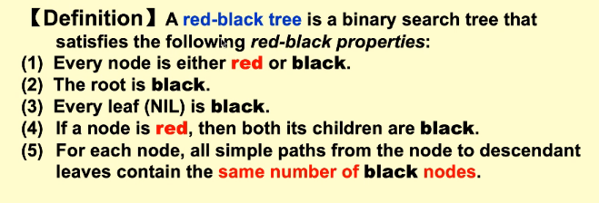

  - 黑高(balck-height)：the number of **Black** nodes on any simple path from

  - $N$个内部结点的红黑树高度不超过$2\ln(N+1)$

- 插入操作

  

  - 插入元素染红
  - 先看叔叔节点颜色，若叔叔节点是红色，则case1
  - 若叔叔节点是黑色，且新插入的节点是叔叔节点的近侄子，则case2
  - 否则case3

- 删除操作

> A red-black tree with black height $k$
>
> - The largest number of internal nodes: $2^{2k}-1$
> - The smallest number of internal nodes: $2^k-1$


### 5. B+ Tree

- B+ Tree of order $M$ 的定义
  - 根节点或含有2至M个子节点
  - 中间节点（非叶节点）有$\lceil M/2\rceil$至 M个子结点
  - 所有叶节点在同一深度上，包含数据也在$\lceil M/2\rceil$至 M个子结点之间

注意：所有中间节点的索引值都是看叶节点的(最小值)

- 插入：节点过多时递归向上分裂

- 删除：节点过少时与兄弟合并，递归向上检查

- 深度       $Depth(M,N)=O(\lceil \log _{\lceil M/2\rceil} N\rceil)$

- 复杂度

  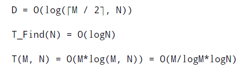

### 6. 倒排文件索引(Inverted File Index)

- 以关键字为key，（文档号，单词号）列表为值

- Distributed Indexing:  Each node contains index of a **subset** of collection

- word stemming: 还原为词根

- stop words：排除词（a, it，the等）

- 实现：搜索树；哈希

- Thresholding

  - Document: only retrieve the top x documents ranked by weight
  - Query: Sort the query terms by their frequency in ascending order; search according to only some percentage of the original query terms
  
- 搜索相关度评价

  - Data retrieval：response time & index sapce
  - Information retrieval：the relevancy of the answer set
  
  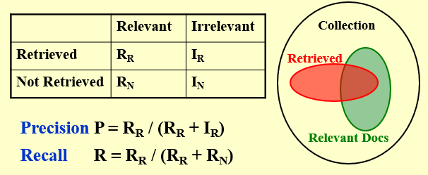


### 7. Leftist Heap

- Null Path Length(NPL)定义：到无两儿子节点的最短路径长
  
  - 计算：NPL(X)=min(NPL(Child of X)) + 1, 空节点NPL为-1
- Leftist Heap定义
  - Order Property: 任意节点都小于他的后裔
  - Struct Property：任意节点的左儿子NPL$\geq$右儿子NPL
- 性质：最短路径为右路径(一路向右)，右路径有$r$个节点，则树至少有$2^r-1$个节点
- 合并：
  - 递归法：将根元素较大的堆与根元素较小堆右儿子递归合并，合并时按需要交换左右儿子维持递归顺序
  
    ```C
    PriorityQueue Merge(PriorityQueue H1, PriorityQueue H2)
    {
    	if(H1 == NULL) return H2;
        if(H2 == NULL) return H1;
        if(H1->Element < H2->Element) return Merge1(H1, H2);
        else return Merge1(H2, H1);
    }
    
    static PriorityQueue Merge1(PriorityQueue H1, PriorityQueue H2)
    {
    	if(H1->Left == NULL) 
            H1->Left = H2;
        else{
    		H1->Right = Merge(H1->Right, H2);
            if(H1->Left->Npl < H1->Right->Npl)
                SwapChildren(H1);
            H1->Npl = H1->Right->Npl + 1;
        }
        return H1;
    }
    ```
  
  - 迭代法：
    
    - 第一步：将两棵树右路径上所有的节点（连同他们的左儿子）从小到大排序
    - 第二步：自底向上沿着右路径判断是否需要交换左右儿子
- 删除：删除根节点，合并两儿子
- 复杂度：$O(\log N)$


### 8. Skew Heap

- 一种Leftist Heap的简化形式，不存在结构限制(不保留NPL)
  - No extra space is required
  - No tests are required
- 复杂度：M次操作$O(M\log N)$，摊还时间$O(\log N)$
- 合并：除右路径上最大节点左右儿子不必交换外，其余均无条件交换

> - The result of inserting keys 1 to $2^k−1$ for any *k*>4 in order into an initially empty skew heap is always a full binary tree.
> - The right path of a skew heap can be arbitrarily long.


### 9. Binomial Queue

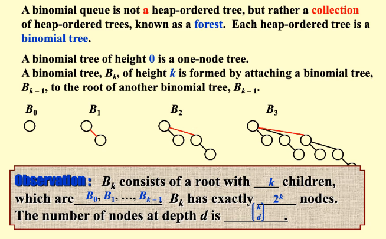

- 操作
  - FindMin
    - 遍历树根，O(log N);
    - 记录最小元，O(1)
  - Merge
    - 二进制加法进位，O(log N)
  - 插入
    - 单节点合并（Merge的特殊情况)，O(log N)，**average time是O(1)**
  - 建堆: O(N)
  - 删除最小元：删除最小元树后与其他树合并，O(log N)

- 实现
  - 利用链表实现左儿子右兄弟
    - 保证subtrees in **decreasing sizes **

- A binomial queeu of $N$ elements can be built by $N$ successive insertions in $O(N)$ time.


### 10. BackTracking

- 方法：DFS + pruning

- 模板

  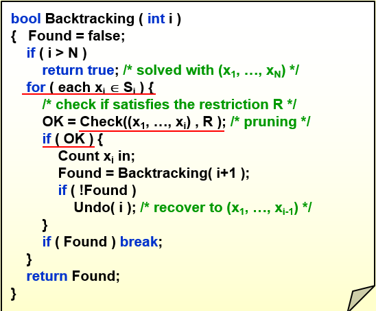


### 11. Divide and Conquer

- 概念

  - divide
  - conquer
  - combine

- 解递归方程

  - substitution method

  - recursion-tree method

  - master method

    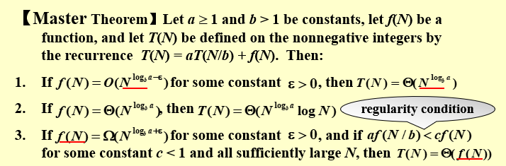


### 12. Dynamic Programming

使用表记录结果，避免不必要的递归


### 13. Greedy Algorithms

- 只有当局部最优等于全局最优时，贪心算法才能正常运作
- 贪心算法不保证得到最优结果，但通常能产生在数值上很接近最优结果的解决方案

- Huffman Algorithm

  ​	以树叶频率和为权，循环 N - 1 次，每次新建节点，从最小堆中取出两个树或节点作为左右儿子，更新权（相加）后放回

  - 时间复杂度：$O(N\log N)$
  - The length of each character is not unique


### 14. NP Completeness

- P类问题

  ​	在多项式时间（$O(n^k)$）内可以解决的问题。

- NP类问题

  - 定义1：在多项式时间内可以被证明的问题。即如果已知一个问题解的证书（certificate），那么可以证明此问题在该输入规模下能在多项式时间内解决。   $P\subseteq NP$
  - 定义2：可以被 non-deterministic Turing Machine在多项式时间内解决的问题

- NPC类问题

  ​	如果一个NP问题和其他任何NP问题一样“不易解决”，那么我们认为这一问题是NPC类问题

  - 性质：如果任何一个NP完全问题可以在多项式时间内解决，那么所有NP问题都有一个多项式时间算法
  
  $NPC \sub NP$

- NP-Hard问题
  - 不一定是NP问题
  - 至少比NPC问题一样难

- 所有的P问题同时也是NP类问题($P\subseteq NP$)

> Not all decidable problems are NP problems. But all NP problems are decidable. 

For starters, here are the super-concise definitions of the four complexity classes in question:

- P is the class of decision problems which can be solved in polynomial time by a **deterministic** Turing machine.
- NP is the class of decision problems which can be solved in polynomial time by a **non-deterministic** Turing machine. Equivalently, it is the class of problems which can be *verified* in polynomial time by a deterministic Turing machine.   ( the reduction goes from NP problems to the NP-hard problem, *but not necessarily vice versa*.)
- NP-hard is the class of decision problems to which all problems in NP can be reduced to in polynomial time by a deterministic Turing machine.
- NP-complete is the intersection of NP-hard and NP. Equivalently, NP-complete is the class of decision problems in NP to which all other problems in NP can be reduced to in polynomial time by a deterministic Turing machine.
  - Hamilton Cycle Problem, 0/1 Knapsack Problem, Travelling Salesman Problem, Circuit-satisfiability
    Problem

And here's a Euler diagram showing the relationships between these four classes (assuming that P is not equal to NP):

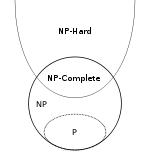


- If problem $Y$ can be reduced to problem $X$, we denote this by $Y \leq_P X$

  - This means $X$ is at least as hard as $Y$.

- If $Y\leq_P X$, and there is a polynomial time algorithm for $X$, then there is a polynomial time algorithm for $Y$.

- If $Y \leq_P X$ and $Y$ cannot be solved in polynomial time, then $X$ cannot be solved in polynomial time.

- If $X$ is NPC, then $X$ is solvable in polynomial time if and only if $P=NP$

- If $Y$ is NPC, and $X$ is in NP, $Y\leq_P X$, then $X$ is NPC


> NPC problems 
>
> - SAT
> - Knapsack  problem
> - Hamilton path problem
> - TSP
> - Vertex cover problem
> - Clique problem


### 15. Approximation

- approximation ratio
- Polynomial-time approximation scheme(PTAS)：对任意给定的$\varepsilon$, 时间关于$N$ 是多项式级别的
- Fully polynomial-time approximation scheme(FPTAS)：关于$\frac 1{\varepsilon}$和 $N$都是多项式级别的

- On-line Algorithms

  Place an item before processing the next one, cannot chage decisions.

- Off-line Algorithms

  View the entire item list before producing an answer.

- 装箱问题（Bin Packing Problem）
  - Next Fit：使用不超过$2M-1$个箱子
  - First Fit：使用不超过$1.7M$个箱子  $O(N\log N)$
  - Best Fit：使用不超过$1.7M$个箱子  $O(N\log N)$


### 16. Local Search

- Vertex Cover Problem

  给定无向图$G$，寻找最小的点集$S$使得所有的边至少有一个顶点在$S$中

  - The Metropolis Algorithm：随机化的梯度下降算法

- Hopfied Neural Networks

  给定无向有权图，若$w_e<0$则边的两顶点希望在同一state；若$w_e>0$则边的两顶点希望在不同state

  - 定义

    

  - State-flipping Algorithm

- Maximum Cut Problem

  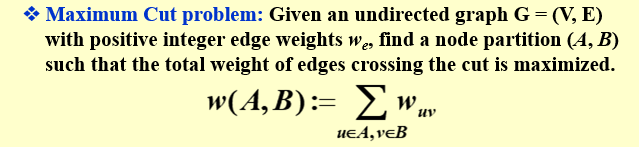

  - 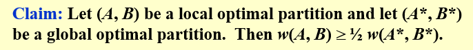
  
    - big improvement: Only choose a node which, when flipped, increase the cut value by at least $\frac{2\varepsilon}{|V|}w(A,B)$
      - return a cut $(A,B)$ so that $(2+\varepsilon) w(A,B)\geq w(A^*,B^*)$

> Greedy method is not a special case of local search


### 17. Randomized Algorithms

- Randomized algorithms that are always correct, and run efficiently in expectation

- The Hiring Problem

- Randomized Permutation Algorithm

  - Assign each element a random priority and sort according to it.

- Online Hiring Problem：先遍历interview前$k$个选出最好的值$Q$，剩下的只有比$Q$好才雇佣

  - Consider the online hiring problem, in which we have total *k* candidates. First of all, we interview *n* candidates but reject them all. Then we hire the first candidate who is better than all of the previous candidates you have interviewed. It is true that the probability of the *m*th candidate is the best is $\frac{n}{k(m−1)}$, where *m*>*n*.
  - The best value for $n$: $\frac N{e}$    succeed in hiring the best-qualified applicant with probability at least $1/e$

- Quick Sort

  ​	The expected number of iterations needed until we find a central splitter is at most 2.


### 18. Parallel Algorithms

- Parallel Random Access Machine(PRAM)

  

  - Resolve Access Conflicts
    - EREW（都不读不写）
    - CREW（可以写但不可以读）
    - CRCW（可读也可以写）
      - Arbitrary rule
      - Priority rule（smallest number）
      - Common rule

- Work-Depth(WD)

  > Each time unit consits of a sequence of instructions to be performed concurrently, the sequence of instructions may include **any number**.

  - An algorithm in the WD mode can be implemented by any $P(n)$ processors within $O(W(n)/P(n) + T(n))$ time, using the same concurrent-write convention as in the WD presentation.

- Prefix Sums
  
- 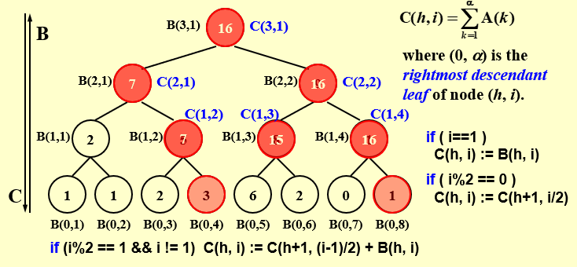
  
- Merge

  - Partition
  - Merging $\rarr$ Ranking

  - Ranking

    - Binary Ranking

    ```pseudocode
    for Pi, 1<=i<=n pardo
    	RANK(i,B) = BS(A(i),B)
    	RANK(i,A) = BS(B(i),A)
    ```

    ​	$T(n)=O(\log n)\ \ \ \ W(n)=O(n\log n)$

    - Serial Ranking

    ```pseudocode
    i=j=0;
    while(i<=n || j<=m){
    	if(A(i+1) < B(j+1))
    		RANK(++i, B) = j;
    	else RANK(++j, A) = i;
    }
    ```

    $T(n)=W(n)=O(n+m)$

    - Parallel Ranking

      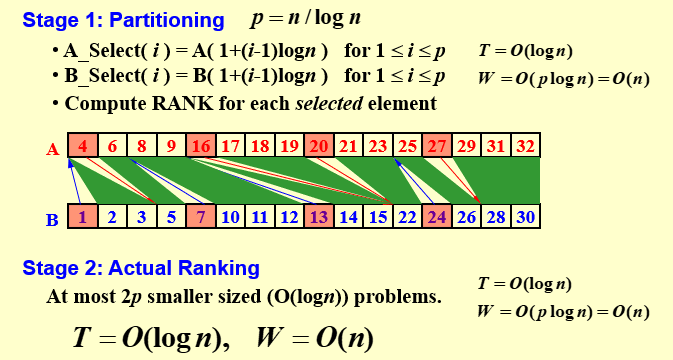

- Maximum Finding

  - Compare all pairs：$T(n)= O(1)\ \ \ \ W(n)=O(n^2)$
  - Partition by $\sqrt n$:  $T(n)=O(\log\log n)\ \ \ \ W(n)=O(n\log\log n)$
  - Partition by $h=\log\log n$：$T(n)=O(\log\log n)\ \ \ \ W(n)=O(n)$

  - Random sampling algorithm

    ​	The algorithm finds the maximum among n elements.  With very high probability it runs in $O(1) $time and $O(n)$ work.  The probability of not finishing within this time and work complexity is $O(1/n^c)$ for some positive constant $c$.


### 19. External Sorting

- Suppose that the internal memory can handle $M$ records at a time. The number of passes: $1+\lceil \log _2(N/M)\rceil$

- k-way merge

  - reduce the number of passes: $1+\lceil \log _k(N/M)\rceil$
  - require $2k$ tapes

- 3 tapes for 2-way merge

  - split unevenly

    If the number of runs is a Fibonacci number $F_N$, then the best way to distribute them is to split them into $F_{N-1}$ and $F_{N-2}$
    
    - Polyphase Merge: $k+1$ tapes only

- parallel operation

  In general, for a k-way merge, we need $2k$ input buffers and 2 output buffers for parallel operations

- generate longer run
  
  - Replacement selection：使用min heap选择递增最小序列；若heap中全不符合递增规律，则使用新的tape存储     $L_\text{avg} = 2M$
  
- Minimize the merge time
  - using Huffman Tree to arrange the merging.
  - Total merge time：$O(\text{the weighted external path length})$

> If only one tape drive is available to perform the external sorting, then the tape access time for any algorithm will be $\Omega(N^2)$