# Project 5 Texture Packing

​																			Group 24

​															     	 Date: 2020-05-12

[TOC]

## 1. Introduction

### 1.1 Description

​	In this project, we are going to implement the texture packing problem, that is, to pack $N$ rectangles on  a predefined stock sheet so that each rectangular piece does not overlap with another,  the goal is to find the minium height of the strip. This problem belongs to a subset of classical cutting and packing problems and has been shown to be NP hard.

​		Our group focus on orthogonal texutre packing problem (only 90 degrees rotation is allowed) and implements 3 different approxiamtion algorithms to solve this problem.

## 2. Algorithm Specification

### 2.1 First Fit Decreasing Height Algorithm(FFDH)

​	In this algorithm all items are sorted by decreasing height prior to packing. A level is initialized by the tallest unpacked item in the list. The level height equals the height of the item.  Items are iteratively packed into the lowest level into which they fit. If an item does not fit into any existing level, a new level is initialized. 

​	This algorithm is quite simple, the pseudocode is as follows"

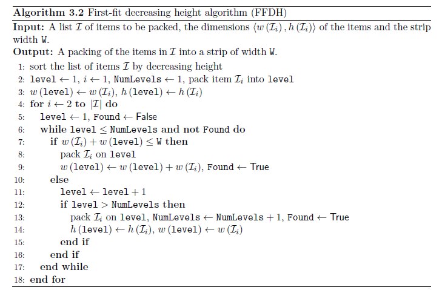

### 2.2 Heuristic Recursive Algorithm(HR)

#### 2.2.1 Overview

​	Heuristic Recursive Algorithm is a typical divided-and-conqure algorithm. It break the problem into several subproblems that are similar to the original problem but smaller in size, solve the subproblems recursively, and then combine these solutions to create a solution to the original problem. 

​	So we can construct the HR algorithm for the strip rectangular packing problem as follows:		

​		a）Pack a rectangle into the space to be packed. Divide the unpacked space into two subspaces. 

​		b）Pack each subspaces by packing them recursively. If the subspace size are small enough to only pack a rectangle, however, just pack this rectangle into the subspace in a straightforward manner.

​		c）Combine the solutions to the subproblems into the solution for the rectangle packing problem.

#### 2.2.2 UnBounded Area Packing

​	During the process of packing unbounded subspace, we always choose a rectangle with the maximum area to be packed. In detail, unpacked rectangles should be sorted by non-increasing ordering of area size.

​	Then the original space *S* can be divided into a unbounded space *S1* a bounded space *S2*. We call the RecusivePacking() function to pack space S2 first. Then the problem become the original problem "Pack in a unbounded space".

​	We use Packing() function to achieve the packing process of unbounded space:

#### 2.2.3 Bounded Area Packing

​	During the process of packing bounded subspaces *S2*, the recursive procedure is used. It can be described as a recursive process: 

​		a）Select a rectangle pack into the S2 and generate two bounded spaces *S3* and *S4* until there're no fit rectangle.

​		b）Apply the same way on the *S3* and *S4*. (Goto a)

 	We use RecursivePacking() function to achieve the packing process of bounded space:

### 2.3 Best-fit Heuristic Algorithm(BF)

#### 2.3.1 Overview

​	This algorithm dynamicly selects next rectangle for placement during the packing stage. We adopt a *best-fit* strategy, that is, always pack the *best-fitting* rectangle to the lowest available space.  In order to find the lowest available gap, we need to examine the stock sheet and current assignment of shapes. Once the lowest gap is found, we must examine the list of rectangles to find the *best-fitting* shape.  There're 3 possibilities

​	1) There exist shapes with a dimension (either width or height) that **exactly fits the gap**. On this condition, we pack the shape with the largest area.

​	2) There is a shape with a dimension **smaller than the gap**. In this case, we choose the shape which consumes the largest portion of the gap. As the shape does not completely fill the gap, we use three placement policies as follows:
​			a) Place at left-most.

​			b) Place next to Tallest Neighbor.

​			c) Place next  to Shortest Neighbor.

​	3) There are no shapes that will fit the gap(all **larger than the gap**). In this case,  none of the available rectangles can fit within the lowest gap, then we can regard the relevant space as wastage. This is clear to see because if none of the shapes fit the space now, then none of the remaining shapes will be able to fit in the space in future iterations.

​	After all the shapes are packed, we do a modification to avoid long thin rectangles negatively affect the solution quality.

#### 2.3.2 Preprocessing Stage

​		In this section, we address the problem of representation. To avoid the expensive collision detection, we store the stock sheet as a linear array `skyline[]`. Each element of the array holds the total height of the packing at that $x$ coordinate of the stock sheet, here is an example of a sheet with width nine units when empty , and the same sheet during packing.

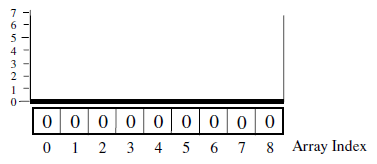		  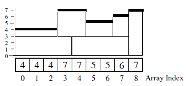

​	In addition, we store the rectangle information as a linked list of rectangles each denoted by a $(\text{width, height, x, y})$ pair. In an unsorted list we must examine all $n$ rectangles to be suret hat there is not a “better”-fitting rectangle at each rectanglep lacement. However, we can sort the list of rectangles once before packing commences so that we reduce the number of rectangles we need to examine to $\frac n{2}$  on average. The first stage of this restructuring is to rotate any rectangle for which the height is greater

than the width. For example:
	$\{	(3,5),(5,2),(1,1),(7,3),(1,2)\}$ becomes $\{(5,3),(5,2),(1,1),(7,3),(2,1)\}$ 
	Next, the list of rectangles is sorted into **decreasing width order** (resolving equal widths by decreasing heights):
	 $\{(5,3),(5,2),(1,1),(7,3),(2,1)\}$ becomes $\{(7,3),(5,3),(5,2),(2,1),(1,1)\}$ 
	This list of rectangles can now be examined for the best-fitting rectangle without the need to search the entire list. For example, suppose we require a shape to fill a gap of six units. The first rectangle in the list is examined, $(7,3)$.Note that it could fill three units of the gap if rotated. The second rectangle in the list, $(5,3)$, can occupy a gap of five units. At this point we can terminate, as we know that all remaining rectangles have dimensions of equal or less than five.

​	Note also that as soon as a rectangle that fits exactly is found, we terminate. This reduces the search time of the process and, due to the list structure, rectangle dimensions decrease as we proceed through the rectangle list.

#### 2.3.3 Packing Stage

 	The packing process can be defined as follows:
		1) Find the position and the width of the lowest gap

​		2) Find the best-fitting rectangle

​		3) Assign cooridinates

​		4) Remove the rectangle from the rectangle list

​		5) Update the stock-sheet array  (`skyline[]`)

​	If the best-fitting rectangle does not completely fill the gap, then we can compute the new gap location and gap width directly:

​		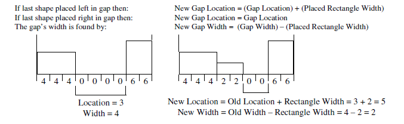

​	If no rectangles can fit the lowest gap, then it's a waste space, and the stock-sheet array elements that reference the gap are raised up to the lowest neighbor. Here's an example where no rectangles can fit the gap of 2 units:

​		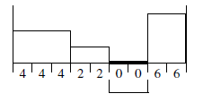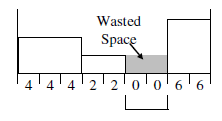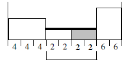

#### 2.3.4 Postprocessing Stage

​	Once every rectangle is packed, we proceed through all of the rectangles to find if any are protruding from the top of the packing and negatively affecting solution quality. When we find the highest positioned rectangle, if the rectangle is orientated in such a way that its height is greater than its width, then we remove it from the packing and reduce the stock-sheet array by the relevant rectangle height. Note that if the rectangle is found orientated with width greater than height, then we cannot improve (reduce) the height of the packing, as this rectangle is in the lowest position possible. We then rotate the rectangle
so that its width has the larger dimension and try to pack the rectangle as before in “normal” packing but with the constraint that it must be packed in the width > height orientation. Example is as follows:

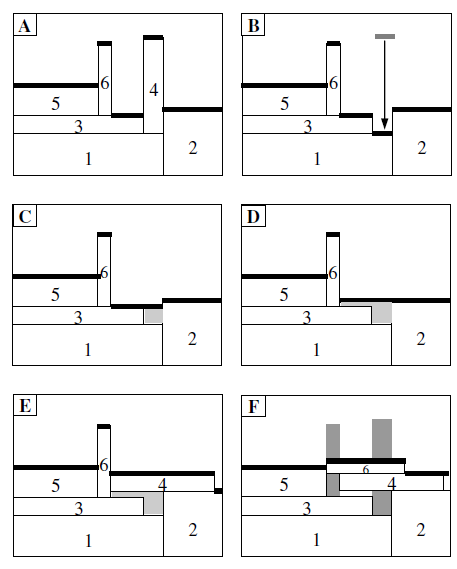

​	Figure A shows the solution after packing with the best-fit algorithm. To apply postprocessing to give better solutions, the tallest shape is removed (Shape 4) and the skyline is decreased appropriately as in Figure B. The removed shape is rotated and an attempt is made to reinsert it in the lowest part of the nest. As this shape will not fit, the lowest gap is raised to its lowest neighbour to make a more sizable gap, as in Figure C. As it still will not fit, the gap is raised once more (see Figure D). Now this gap is large enough to accommodate the shape, so it is placed as shown in Figure 10E. If this new arrangement improves the solution, it is accepted (as in this case). The same operation is performed with the next-highest shape(Shape 6). Figure F shows Shape 6 placed in its new position. If it enhances the quality of solution, it is accepted (as in this case). As all previous attempts have produced better-quality packings, the highest shape is selected once more. The highest shape is Shape 6 once again and its width is greater than its height, so we terminate and return the packing as the final solution.

#### 2.3.5 Pseudocode for the BF Algorithm

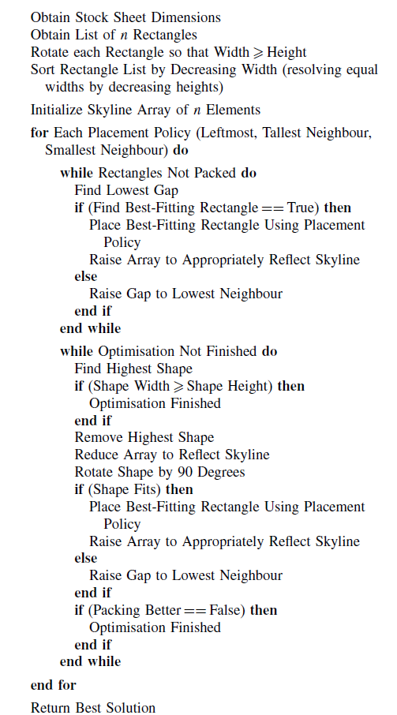

## 3. Testing Results

- Run time & Result table

| N     | optimal_result | result_FFDH | time_FFDH | result_HR | time_HR | result_BF | time_BF |
| ----- | -------------- | ----------- | --------- | --------- | ------- | --------- | ------- |
| 10    | 40             | 52          | 0.001     | 40        | 0.001   | 40        | 0.0433  |
| 20    | 50             | 64          | 0.001     | 57        | 0.001   | 55        | 0.0596  |
| 30    | 50             | 54          | 0.001     | 56        | 0.001   | 53        | 0.0649  |
| 40    | 80             | 111         | 0.001     | 88        | 0.001   | 83        | 0.0805  |
| 50    | 100            | 139         | 0.001     | 114       | 0.001   | 107       | 0.1002  |
| 60    | 100            | 141         | 0.001     | 105       | 0.001   | 103       | 0.1242  |
| 70    | 100            | 129         | 0.001     | 106       | 0.001   | 107       | 0.1234  |
| 80    | 80             | 105         | 0.001     | 85        | 0.001   | 84        | 0.1203  |
| 90    | 120            | 130         | 0.001     | 123       | 0.001   | 121       | 0.1333  |
| 100   | 1000           | 1165        | 0.001     | 1264      | 0.001   | 1100      | 0.1254  |
| 200   | 1000           | 1397        | 0.001     | 1095      | 0.003   | 1088      | 0.2353  |
| 300   | 150            | 194         | 0.002     | 159       | 0.005   | 151       | 0.374   |
| 500   | 1000           | 1075        | 0.003     | 1172      | 0.012   | 1043      | 0.382   |
| 700   | 2000           | 2412        | 0.004     | 2232      | 0.022   | 2056      | 0.4104  |
| 900   | 3000           | 3401        | 0.006     | 3271      | 0.035   | 3065      | 0.4495  |
| 1000  | 1000           | 1090        | 0.005     | 1193      | 0.045   | 1037      | 0.4899  |
| 2000  | 43500          | 45676       | 0.058     | 45099     | 0.102   | 43689     | 0.6301  |
| 3152  | 960            | 988         | 0.039     | 972       | 0.332   | 968       | 0.8134  |
| 5000  | 44000          | 46164       | 0.126     | 45099     | 0.547   | 44130     | 1.4166  |
| 7000  | 45500          | 48061       | 0.228     | 46142     | 1.171   | 45956     | 1.685   |
| 10000 | 88000          | 92140       | 0.472     | 90026     | 2.223   | 88167     | 3.0144  |

- Run time plot

  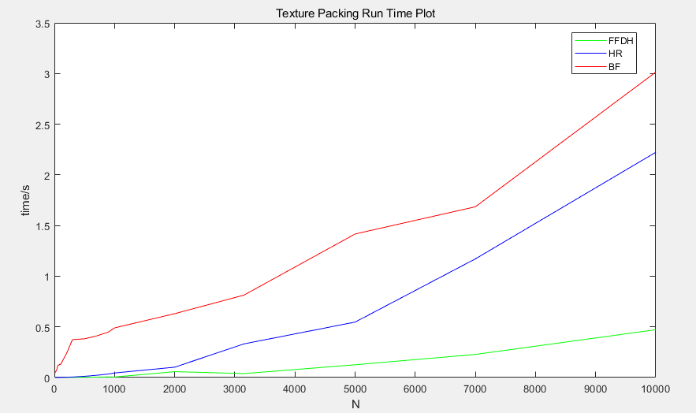

  ​	As is shown in the figure, run time of HR(blue line)and BF(red line) algorithms increases significantly when the input size becomes large, while the FFDH algorithm (green line) does not. Though all three algorithms takes $O(N^2)$, it varies in the scalar. 

- Result Plot

  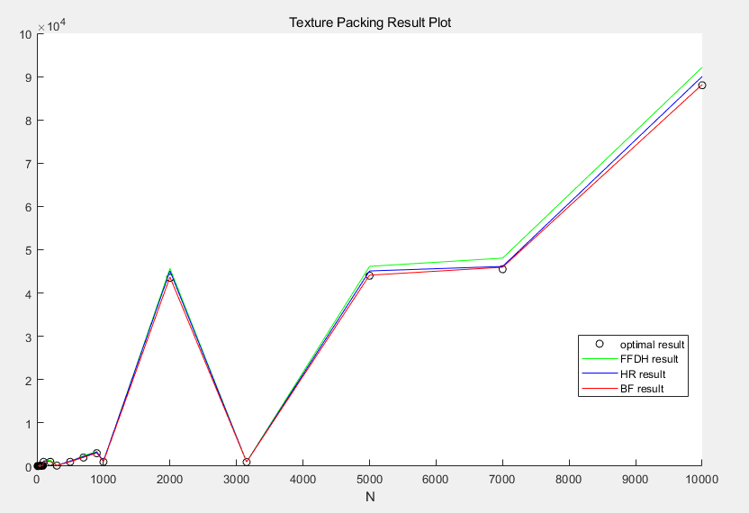

  We can conclude that BF Algorithm behave better than HR Algorithm in the texture packing problem, since BF Algorithm generates results closer to the optimal result. And FFDH algorithm is not that good(but it works fast).

- A comparison of the Placement Policies in BF

  > using the data set from Hopper and Turton (2001), where 21 problem sets of rectangle data are presented in seven different-sized categories (each category has three problems
  > of similar size and object dimension)

  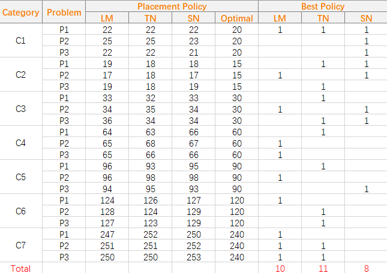

  ​	This table shows that each policy appears to have equal ability in finding good solutions.

  This result validates our decision to allow all three policies to be tried within our search.

## 4. Analysis and Comments

### 4.1 FFDH Algorithm

#### 4.1.1 Time Complexity

​	We use the quick sort the sort the rectangles into decreasing height, it takes $O(N\log N)$ times. And the packing takes $O(N^2)$ , the output takes $O(N)$ times. So FFDH takes $O(N^2)$ times.

#### 4.1.2 Space Complexity

​	We use arrays to store the position and the shape of rectangles, it takes $O(2N)$ space.

### 4.2 BF Algorithm

#### 4.2.1 Time Complexity

​	In the preprocessing stage, we sort the rectangle linked list, and it takes $O(N^2)$ in the worst case.

​	In the packing stage, for each rectangle, finding the lowest gap takes $O(W)$ ($W$ is the fixed width of the strip), finding the best fitting rectangle takes $O(N/2)$, placement takes $O(1)$, and updating the stock-sheet array takes $O(w_i)$ ($w_i$ is the width of the current packed rectangle). So the whole packing stage takes $O(MAX(N^2, NW))$ times.

​	In the postprocessing stage, it's the simplified packing stage, and the time complexity is the same as the one in packing stage.

​	As a result, the time complexity of BF algorithm is $O(MAX(N^2, NW)$.

#### 4.2.2 Space Complexity

 	The rectangle linked list takes $O(N)$ space, and the stock-sheet array takes $O(W)$ space. So the overall space complexity is $O(MAX(N, W))$.

### 4.3 HR Algorithm

#### 4.3.1 Time Complexity

​	We sort the rectangles first, whose time complexity is $O(NlogN)$.

​	Then the Packing() function traverses the each unpacked rectangles, whose time complexity is $O(N)$.

​	In the RecursivePacking() function, we only choose a fit rectangle and pack.  The time complexity of choosing the rectangle is $O(N)$. The pack operation just set several parameters in constant time.

​	As a result, the time complexity of HR algorithm is $O(N^2)$.

#### 4.3.2 Space Complexity

​	To achieve this algorithm, we use several variables to represent rectangles and space. The space of two sets unpacked_recs and packed_recs is $O(N)$, and that of the bounded and unbounded space *Si* is $O(1)$. So the overall space complexity is $O(N)$.

### 4.4 Analysis

#### 4.4.1 Approximation ratio analysis 

- Factors which might affect the approximation ratio

  - Floating-point data

    - Since the implementation is based on the integer-type, if the width and height of rectangles are floating-point data, we must convert floating-point data to integer format by multiplying each rectangle by a scaling factor, depending on the degree of accuracy required. So it will influence the minimum height we get, affecting the approximation ratio.

    - Floating-point data approach(Burke 2006)

      ​      Burke suggests the use of an array of triples (3-tuples).This data structure notes the horizontal coordinate of a change in height, the height (or vertical coordinate) of the skyline to the right of that point and the length of the region between subsequent changes in height.

      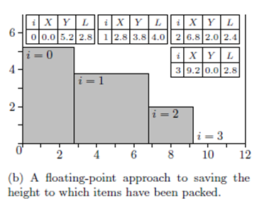

  - The shape of the rectangles

- The known performance bound for FFDH algorithm is 

  where ${\mathcal  {I}}$ is the set of rectangles and $h_{\text{max}}$ is the largest height of an item in ${\mathcal  {I}}$ .

#### 4.4.2 Comparison between BF and Bottom-left(BL) algorithm

- Bottom-left algorithm(Jakobs,1996)

  ​	This algorithm takes as input a list of rectangles and places each one in turn onto the stock sheet. The placement strategy first places the rectangle in the top-right location and makes successive moves of sliding it as far down and left as possible.

  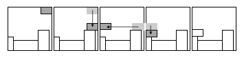

- Comparison

  - Bottom-left algorithm make placement based on the sequence of rectangles supplied to it, but BF algorithm dynamically selects the next rectangle for placement during the packing stage.
  - Bottom-left method requires a costly “overlap” function. This performs an overlap test between the current shape and each of the shapes that have previously been placed onto the sheet. Obviously, the more rectangles that have been packed, the more overlap tests we have to perform, thus resulting in the process becoming slower as each rectangle is placed. However, because of the best-fit approach and the implementation (presented in §2.1.2), we do not require this operation, as we are always sure that the shapes we are placing do not overlap with other rectangles.

## 5. Declaration

​		We hereby declare that all the work done in this project titled "Safe Fruit" is of our independent effort as a group.

## 6. Author List

​	Programmer: WangRui(BF), LiYalin(FFDH, HR)

​	Tester: Wang Rui

​	Writer: LiYalin OuyangHaodong

​	PPT: Wang Rui

## 7. Reference

[ 1 ]: Frank Gerald Ortmann. Heuristics for Offline Rectangular Packing Problems [D]. South Africa: Stellenbosch University, 2010.

[ 2 ]: E. K. Burke, G. Kendall, G. Whitwell. A New Placement Heuristic for the Orthogonal
Stock-Cutting Problem [J]. OPERATIONS RESEARCH. 2004, 52(4): 655–671

[ 3 ]: Defu  Zhang,  Yan  Kang,  Ansheng  Deng.  A  new  heuristic  recursive  algorithm  for  the  strip rectangular packing problem[J]. Computer & Operations Research, 2006, 33(8): 2209-2217. 

