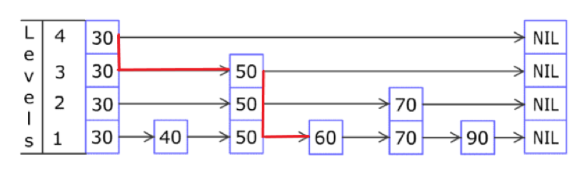
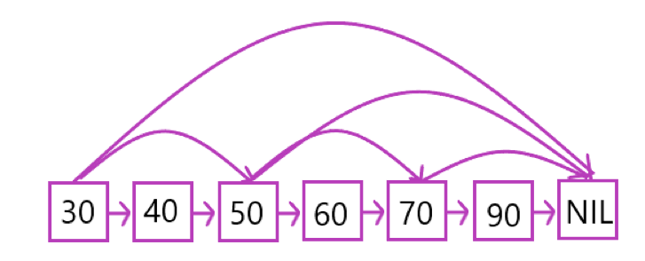
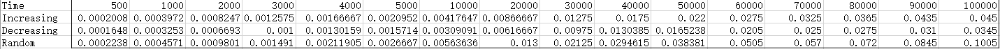
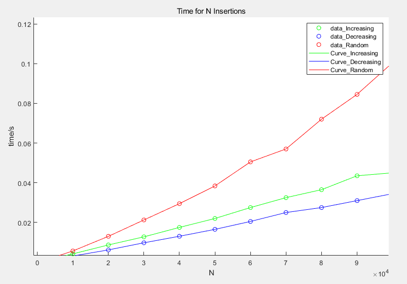
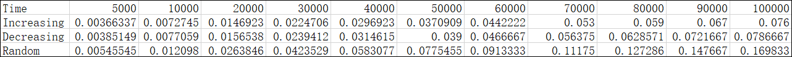
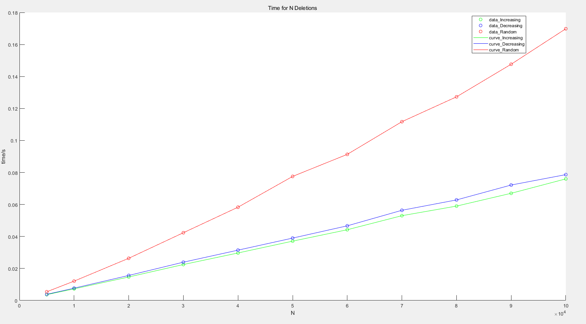
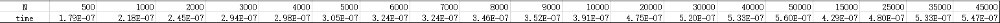
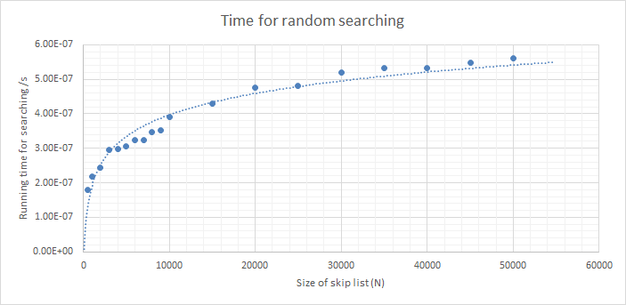
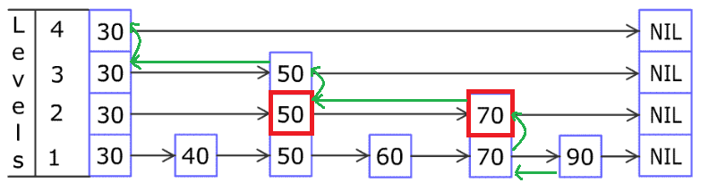

# Project 6 Skip List

​																			Group 24

​															     	 Date: 2020-05-28


<div STYLE="page-break-after: always;"></div>

[TOC]


<div STYLE="page-break-after: always;"></div>

### 1. Introduction

#### 1.1 Description

​	In the ordinary linked list data structure, search takes $O(N)$ time complexity, which is inefficient. In this project, we are going to implement the *skip list*.  Based on randomization, skip list supports both searching and insertion in $O(\log N)$ expected time.


### 2. Algorithm Specification

#### 2.1 Description of Skip List

​	The structure of an ordinary ordered Linked List is as follows:


<center style="font-size:14px;color:#000000;">Figure1: Ordinary Ordered Linked List</center>

​	If we want to find 60 in the ordinary ordered linked list, we need to search sequentially from 30. So it takes $O(N)$. Since the linked list doesn't support binary search, so it cannot reduce the time complexity to $O(\log N)$. 

​	A skip list is built in levels. If we store some internal node in a higher level, we can perform search similar to binary search. Suppose we want to find 60 in a skip list in figure2, the procedure is as follows:



<center style="font-size:14px;color:#000000;">Figure2: Skip List Example</center>		

​	Start from the header node in front of 30 in the level 4.

 1. Compare 60 with 30, 60 > 30; reaches end, go down at 30

 2. Compare 60 with 50, 60>50; reaches end, go down at 50

 3. Compare 60 with 70, 60<70, go down at 50

 4. Compare 60 with 60, 60=60, found.

    The procedure is painted in red in the above figure.

    In other words, skip list stores some indices of the binary search, which combines the structure of linked list and the method of binary search.

#### 2.2 Data Structure of skip list

##### 2.2.1 Skip List Node

```C++
class Node
{
public:
    int value;
    Node** next_nodes; // Array to hold pointers to node of different level  
    Node(int value, int level);  //constructor
};
```

​	`value` refers to the value in the node. In our implementation, we store the successor nodes in an array, so that the same node in different levels shares the same storage space. `next_nodes[i]` is the successor node in level $i$. For example, for the node 30 of level 2 in the figure2, `next_nodes[0]` is 50, `next_nodes[1]` is 70, and `next_nodes[2]` is NIL. In this way,we can decrease the space complexity and reduce the structure in Figure2 to as follows:



<center style="font-size:14px;color:#000000;">Figure3: Skip List with Shared Nodes</center>


##### 2.2.2 Skip List

```C++
class SkipList
{
    int MAXLVL;		// Maximum level for this skip list 
    int level;		// current level of skip list   
    Node* header;	// pointer to header node 
public:
    SkipList(int MAXLVL);  //constructor
    int randomLevel();    // create random level for node 
    Node* createNode(int value, int level);	// create new node 
    void Insert(int value);	// Insert given value in skip list
    void Delete(int value);	// Delete element from skip list
    void Find(int value);	// Search for element in skip list 
    void printList(void);	// Display skip list level wise 
};
```


#### 2.3 Operations

##### 2.3.1 Search

 	The search operation can be expressed as follows

​	1. Start at the head node $H$ and level $MAXLVL-1$

 	2. Move ahead to next node until tail or $value\leq node.value$
 	3. If $value=node.value$, we have found, return; else $level=level-1$ and repeat step 2
 	4. If $level=0$ and still not found, then the search failed.

The pseudocode is as follows

```pseudocode
procedure Find(value)
	node = H;
	for level from MAXLVL-1 to 0 do
		while node.next_nodes[level] != T and node.value < value do
			node = node.next_nodes[level]
		end while
		if node.value = value then
			return FOUND_SUCCESS
		end if
	end for
	return FOUND_FAILED
end procedure
```

 

##### 2.3.2 Insertion

​	There are 3 steps when we insert a new value into a skip list: finding the predecessors, creating a new node and finally insert into the list:

1. Finding the predecessors:
Firstly, we need to locate the position of the newly-inserted node in the list by finding its predecessors. This step is similar to the find operation, just to find the last node whose value is less than the new value in each level.
2. Creating a new node:
In this step, we construct a new node and choose a number $k$ with a randomized strategy (which will be mentioned below) as the number of levels of the node.
3. Inserting into the list:
For level $0$ to $k$, insert the new node after its predecessor just like ordinary linked list.

Here's the pseudocode

```pseudocode
procedure Insert(value)
	//Step1: Find the predecessors
	predecessors = new Node[MAXLVL]
	node = H
	for level from MAXLVL to 0 do
		while node.next_nodes[level] != T and node.value < value do
			node = node.next_nodes[level]
		end while
		predecessors[level] = node
	end for
	//Step2: Creating a new node
	k = RANDOM_LEVEL(MaxLevel)
	new_node = new Node(value, k)
	//Step3: Insert into the skip list
	for level from 0 to k do
		Insert new_node after predecessors[level]
	end for
end procedure
```


##### 2.3.3 Deletion

​	The process of deletion is similar to insertion. It takes 2 steps: finding the predecessor and deleting the node.

​	The pseudocode is as follows:

```pseudocode
procedure Delete(value)
	//Step1:Find the predecessor
	predecessors = new Node[MAXLVL]
	node = H
	for level from MAXLVL-1 to 0 do
		while node.next_nodes[level] != T and node.value < value do
			node = node.next_nodes[level]
		end while
		if node.next_nodes[level] != NULL and node.next_nodes[level].value = value then
			predecessors[level] = node
		else
			predecessors[level] = NULL;
		end if
	end for
	//Step2: Deleting the node
	for level from 0 to k do
		Delete new_node after predecessors[level]
	end for
end procedure
```


##### 2.3.4 Randomization

​	Let's introduce the random strategy to determine the level $k$ of a new node in the process of insertion. $k$ is a random number between $0$ and $Max\_level$. However, in order to make the expected result to similar too binary-search, we don’t generate uniform random (i.e. $k=rand()\%Max\_level$), but make k follows Geometric Distribution with p = 0.5 . The algorithm is like flipping a coin — If the coin faces up, the level increases by 1, or else stop at current level. 

​	Here's the pseudocode for the algorithm

```pseudocode
procedure RANDOM_LEVEL
	level = 0
	while level < MAXLVL - 1 do
		if Random{0,1} then
			level = level + 1
		else 
			break
		end if
	end while
	return level
end procedure
```

Suppose the maximum level is $M$, then
$$
P(k=n) =
\begin{cases}
(\frac 1{2})^{n+1}, & n < M - 1\\
(\frac 1{2})^n = (\frac 1{2})^{M-1}, & n = M-1

\end{cases}
$$
If the size of the skip list is $N$, then the expected number of nodes in the $k^{th}$ level is $E(N_k)=\frac N{2^k}$, each level decreases by $\frac 1{2}$, just like the process of binary search.

### 3. Testing Results

​	To demonstrate that the time complexity of this skip list, we record the running time of insertion, deletion and search.

#### 3.1 Insertion

We insert $N$ values from 0 to $N-1$ to an initially empty skip list with $MAXLVL=32$ in an order of 

-  Increasing order: $1, 2, 3, ... , N-1$
- Decreasing order: $N-1,N-2,...1,0$
- Random order

And here's the total time of  $N$ insertions with different scale of $N$ ranging from $1$ to $ 100000$. The run time table is as follows:



And we can get the runtime plot from the runtime table



<center style="font-size:14px;color:#000000;">Figure4: Time for N insertions</center>


#### 3.2 Deletion

We insert $N$ values from 0 to $N-1$ to an initially empty skip list with $MAXLVL=32$, and then, we delete values in an order of

-  Increasing order: $1, 2, 3, ... , N-1$
- Decreasing order: $N-1,N-2,...1,0$
- Random order

We use the same method as that in insertion test. And we can get the runtime table and runtime plot





<center style="font-size:14px;color:#000000;">Figure5: Time for N deletions</center>

#### 3.3 Search

​	When testing the search operation, we first create a skip list with $MAXLVL=32$ and insert $N$ values from $0$ to $N-1$ into it. Then, we find a random value between $[0,N)$ from the skip list for $N$ times. The average time per searching is $\frac {\text{total time}}{N}$. The result is as follows



The runtime plot is as follows:



<center style="font-size:14px;color:#000000;">Figure6: Time for random searching</center>

​	The fitting curve is quite similar to $O(\log N)$.

### 4. Analysis and Comments

#### 4.1 Time Complexity

 We will prove the expectation of time complexity for search, insertion and deletion are all $O(\log N)$.

##### 4.1.1 The expected $Max\_level$

​	Since every element has a probability of $\frac 1{2}$ to go to the upper level, let $P_i$ denotes the probability that an element in skip list with $N$ total elements gets up to level $i$ , then $P_i=\frac 1{2^i}$

​	So the expected elements $E_i$ in level $i$ can be described as $E_i=\frac N{2^i}$

​	Suppose the expected height of skip list is $H$, then $\frac N{2^H}=E_H=O(1)$, that means $H=O(\log N)$. 

##### 4.1.2 Search

​	First, suppose we have found the node in the $k^{\text{th}}$ level, we will analyze backwards. At an arbitrary node $x$ in the $i^{th}$ level in the backward-path, there're 2 conditions:

1. The level of node $x$ is exactly $i$, then the next step is to go left
2. The level of node $x$ is larger than $i$, then the next step is to continue to climb up.



<center style="font-size:14px;color:#000000;">Figure7: The search path backwards from 90</center>

​	Let's take the case of finding 90 in the figure7 as an example. The green arrows denote the path backwards. The red 70 and 50 nodes satisfy the 2 conditions above respectively.

​	The red node 70 is in level 2, equals to the maximum level of itself, so satisfies case 1; while the red node 50 is in level 2 but the maximum level of itself is 3, which satisfies case 2.

​	Because the level follows geometric distribution, in an arbitrary node $x$, it has a probability of $\frac 1{2}$ tp satisfy case1 while $\frac 1{2}$ to satisfy case2. Let $C(k)$ denotes the expected cost of search path that climbs up $k$ level, then
$$
\begin{align}
C(0)& = 0\\
C(k)& = \frac 1{2}(1+\text{cost in case1})+\frac 1{2}(1+ \text{cost in case2})\\
	& = \frac 1{2}(C(k-1)+1)+\frac 1{2}(C(k)+1)\\
\text{so  }  C(k)& = 2 + C(k-1)\\
		  & = 2k

\end{align}
$$
​	Since $k\leq MAXLVL = O(\log  N)$, thus $C(k)=O(\log N)$. The time complexity of search is  proportional to the cost of the search path, so the time complexity of search is $O(\log N)$

##### 4.1.3 Insertion / Deletion

The insertion / deletion takes 2 steps

​	1. Find the predecessor

 	2. Insert / Delete

Step1 costs $O(\log N)$ and step2 takes $O(k)\leq MAXLVL=O(\log N)$ where $k$ is the level of the node to be inserted/deleted. As a result, the time complexity of insertion or deletion is $O(\log N)$.


#### 4.2 Space Complexity

​	The level of the skip list follows geometric distribution, so the expectation of $L$ is 
$$
E(L)=\sum\limits_{k=0}^{\infin} k(\frac 1{2})^k(\frac 1{2})=2
$$
​	For each node, it takes $O(L)$ space to store the successors array next_nodes. So the space complexity is $0(NL)=O(\frac N{1-p})=O(N)$.  


### 5. Declaration

​		We hereby declare that all the work done in this project titled "Safe Fruit" is of our independent effort as a group.

### 6. Author List

​	Programmer: Wang Rui

​	Tester: Wang Rui

​	Writer: Li Yalin / Ouyang Haodong


