C++ Notes

> - （继承）使派生类区别于原始基类
>   - 简单地向派生类添加全新函数（is-like-a）
>   - 改变原有基类函数的行为（重载）（is-a）
> - OOP论域：抽象数据类型、继承、多态性
> - 创建和销毁对象
>   - 在栈和静态存储区中创建自动变量和局部变量
>   - 在堆中利用`new`动态创建对象
> - const常量必须有初始值 
> - class与struct，只是class默认成员private，而struct默认public


### 1. 运算符

#### 1.1 Reference

​	引用变量是某个已存在变量的一个别名。一旦把引用初始化为某个变量，就可以使用该引用名称或变量名称来指向变量

- Reference vs. Pointer
  - 不存在空引用，引用必须连接到一块合法内存
  - 一旦引用被初始化为一个对象，就不可被指向到另一个对象。
  - 引用必须在创建时被初始化。 


#### 1.2 Cast Operator

- `(dataType)variable`

  ​	e.g. `(unsigned long int)b`

- `dataType(variable)`
  
  - 类似于函数调用 e.g.`float(200)`


#### 1.3 C++ 显式转换


- static_cast
  - 全部用于明确定义的转换。
  - e.g. `i = static_cast<int>(l)`

- const_cast
  - 从const转换为非const或从volatile转换为非volatile

- reinterpret_cast
  - 最不安全的转换机制


### 2. 隐藏实现

#### 2.1 C++ 访问控制

- public
  - 在其后声明的所有成员可以被所有人访问（public成员就如同一般的struct成员）
- private
  - 除了该类型的创建者和类的内部成员函数之外，任何人都不能访问
- protected
  - 与private基本相似，但有一点不同：继承的结构可以访问protected成员，但不能访问private成员


#### 2.2 友元(friend)

​	如何允许显式地不属于当前结构的一个成员函数访问当前结构中的数据？

- 在当前结构**内部**声明这个函数为友元(friend)
  - 可以把一个全局函数声明为友元，也可以把另一个结构中的成员函数甚至整个结构都声明为友元

- **友元在类内声明时要加`friend`，但在类外定义时不能加friend**

- friend函数有权访问类的所有私有（private）成员和保护（protected）成员。尽管友元函数的原型有在类的定义中出现过，但是友元函数并不是成员函数。
- 友元关系不能继承、不具备传递性，是单向的

#### 2.3 类(Class)

​	是C++中的关键字。C中的struct加上函数。在C++中，它和struct的每一个方面都是一样的，除了**class中的成员默认为private，而struct中的成员默认为public**


### 3. 初始化与清除

#### 3.1 构造函数（constructor）

- 构造函数的名字与类名相同，在初始化时会被自动调用
- 没有返回值
- 默认构造函数
  - 无参构造函数
  - 所有参数都有默认值的构造函数

- 初始化

  - 初始化列表`A(int a, double b) : x(a), y(b) {}`
    - 初始化顺序是类内声明的顺序；而不是list内的顺序
    - destroy按初始化的逆序

  - 默认参数（default arguments）

    - 默认参数必须从右往左添加

    ```c++
    int harpo(int n, int m = 4, int j = 5);
    int chico(int n, int m = 6, int j);//illeagle
    ```

    

#### 3.2 析构函数（destructor）

- 在类的名字前加上~作为析构函数名
- 在包含该对象的右括号处被调用


### 4. 运算符重载与默认参数

#### 4.1 默认参数

- 默认参数是在函数声明时就已给定一个值，如果在调用函数时没有指定这一参数的值，编译器就会自动插上这个值

  e.g. `Stash(int size, int initQuantity = 0);`
  
  在指定了缺省值的参数右边，不能出现没有指定缺省值的参数

#### 4.2 函数重载 （overload）

 **函数重载**是一种特殊情况，C++允许在*同一作用域中*声明几个类似的*同名函数*，这些同名函数的==形参列表（参数个数，类型，顺序）==必须不同，常用来处理实现功能类似数据类型不同的问题。

- 函数重载规则
  - 函数名称必须相同
  - 参数列表必须不同（个数不同、类型不同、参数排列顺序不同等）
  - 函数的返回类型可以相同也可以不相同
  - **仅仅返回类型不同不足以成为函数的重载**


### 5. 常量（const）

#### 5.1 值替代

- 用`const`替代C语言中的`#define`

- 通常==C++编译器不为const创建存储空间，相反把这个定义放在符号表中；但extern会强制分配内存==

- 与C语言中const的区别

  - C语言中const常量总是占用内存，且是全局符，因此如下代码会报错

    ```C
    const int bufSize = 100;
    char buf[bufSize];
    ```

  - C++中const默认为内部连接（internal linkage)，即const仅在const被定义过的文件里才可见，而在连接时不能被其他编译单元看到。

  - C++中当定义一个const时必须赋一个值给它，除非extern作出了清楚的说明：`extern const int bufSize;`
  
- 运行时常量

  ```c++
  const int class_size = 12;
  int finalGrade[class_size]; // ok
  
  int x;
  cin >> x;
  const int size = x;
  double classAverage[size]; // error!
  ```

#### 5.2 const指针

> - const总是放在被修饰者的右边
> - 可以将一个非const对象的地址赋给一个const指针；但不能将const对象的地址赋给非const指针
> - 字符数组的字面值是一个常量字符数组；若要修改字符串应该放到数组中：`char cp[]  = "howdy"`；而不能`char* cp = "howdy"`

- 指向const 的指针
  - `const int *p`  等价于 `int const *p`
  - 理解：p是一个指针，指向const int变量，通过p不能对该变量进行修改；但p可以指向任何标识符
- const指针
  - `int* const w = &d`
  - w是一个指向int的const指针，w不再修改指向别的内存单元，但可以通过w修改变量的值

#### 5.3 函数参数和返回值

- 传递const值

  ```C
  void f(const int i);
  ```

  变量i的初值不会被函数f( )改变。因为按值传递，会立即产生原变量的副本。一般用于保护指针和引用

  更好的做法是在函数内部用const限定引用

  ```C++
  void f(int ic)
  {
  	const int& i = ic;
      i++; //illegal
  }
  ```

- 返回const值

  - 对于内建类型来说，按值返回的是否是一个const无关紧要，所以一般不加const
  - 处理用户定义的类型时，按值返回是很重要的。如果一个函数按值返回一个类对象为const时，则这个函数的返回值不能是一个左值

  ```C++
  int f3() { return 1; }
  const int f4() { return 1; }
  int main() {
      const int j = f3(); // Works fine
      int k = f4(); // But this works fine too!
  }
  ```

- 传递和返回地址（引用）

  - 无论什么时候传递一个地址给一个函数，都应该尽可能用const去修饰它。
  - 是否返回一个指向const 的指针或引用取决于用户需求

#### 5.4 类

- 类里的const

  > ​		在C++中，const成员变量也不能在类定义处初始化，只能通过[构造函数初始化列表](https://www.baidu.com/s?wd=初始化列表&tn=SE_PcZhidaonwhc_ngpagmjz&rsv_dl=gh_pc_zhidao)进行，并且必须有[构造函数](https://www.baidu.com/s?wd=构造函数&tn=SE_PcZhidaonwhc_ngpagmjz&rsv_dl=gh_pc_zhidao)。（const成员必须在进入构造函数体前被初始化）
  > 　　const数据成员只在某个对象生存期内是[常量](https://www.baidu.com/s?wd=常量&tn=SE_PcZhidaonwhc_ngpagmjz&rsv_dl=gh_pc_zhidao)，而对于整个类而言却是可变的。因为类可以创建多个对象，不同的对象其const数据成员的值可以不同。所以不能在类的声明中初始化const数据成员，因为类的对象没被创建时，编译器不知道const数据成员的值是什么。

  - 构造函数初始化列表

    - 这是初始化所有const的地方

    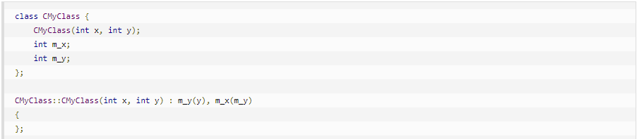

    - 注意：C++ 初始化类成员时，是==按照声明的顺序初始化==的，而不是按照出现在初始化列表中的顺序。

  - 内建类型的“构造函数”

    - 在构造函数初始化列表内，可以把一个内建类型看成好像它有一个构造函数

    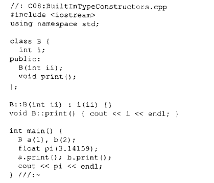

- 编译期间类里的常量

  Q: 如何让一个类有编译期间的常量成员？

  A: 使用`static const`

  - static关键字：不管类的对象被创建多少次，都只有一个实例（满足类内常量的需求）
  - `static const`必须在**定义的地方对其进行初始化**

- const对象和成员函数

  const对象只能调用const成员函数(**声明和定义都必须含有const**)

  - 声明const成员函数：必须把const修饰符放在函数参数表后面

    e.g. `int f() const;`

    const成员函数不允许修改类内成员的值。

  - 关键字const必须用同样的方式重复出现在定义里，否则编译器把它看作一个不同的函数

- mutable：按位const和按逻辑const
  - 按位const：对象中的每个字节固定，所以对象的每个位的映像从不改变
  - 按逻辑const：虽然对象从概念上讲是不变的，但是可以以成员为单位改变
    - 通过在类的声明里使用关键字mutable，以指定一个特定的数据成员可以在一个const对象里被改变


### 6. 内联函数(inline function)

> - C++中使用预处理器宏的问题
>   - 宏看起来像一个函数调用，但并不总是这样，会存在隐藏的错误 (C中也存在)
>   - 预处理器不允许访问类的数据成员，因此预处理器宏不能用作类的成员函数（C++特有）
>
> - 为既保持预处理器宏的效率又提高安全性，而且还能像一般成员函数一样可以在类里访问自如，C++引入了内联函数

#### 6.1 inline function

​	任何类中定义的函数自动成为内联函数，但也可以在非类的函数前面加上inline关键字使之成为内联函数。为使之有效，必须使用**函数体和声明结合在一起的方式**，如：

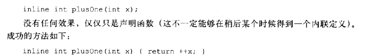

- 若声明和定义分开，则二者都必须加inline关键字
- 一般把内联函数放在头文件中（包含该函数的声明和定义）
- 类内部的内联函数
  - inline关键字非必须，**任何在类内定义的函数自动成为内联函数**
  - 一般在类内定义函数，但若函数较大，就不适用内联函数
- 特点
  - 增大代码长度；减小函数调用的overhead

#### 6.2 内联函数和编译器

- 两种情况不能执行内联
  - 函数太复杂
  - 要显式或隐式取函数地址


### 7. 名字控制 （static关键字）

> Uses of `static` in C++
>
> - Static local variables: persistent storage
> - Static member variables: shared by all instances
> - Static member function: shared by all instances, can only access static member variables.

> - static基本含义
>   - 在固定的地址上进行存储分配，也就是说对象是在一个特殊的静态数据区上创建的
>   - 对一个特定的编译单位来说是局部的。static控制名字的可见性(visibility)

- 名字空间

  - 创建一个名字空间

    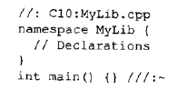

    - namespace只能在全局范围内定义，但他们之间可以相互嵌套

    - 在namespace定义的结尾，右花括号后面不必跟分号

    - 一个namespace可以用另一个名字来作它的别名

      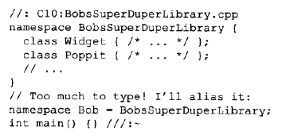

  - 使用名字空间（两种方法）

    - 作用域运算符

      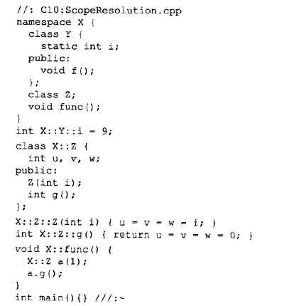

      ​	注意定义`X::Y::i`就跟引用一个类Y的数据成员一样容易

    - 用using指令把所有名字引入到名字空间中

- C++中的静态成员

  - 某个类的所有对象分配单一的存储空间（==类的所有对象共用一个变量==）

  - 定义静态存储成员

    - ==**定义必须出现在类的外部（不允许内联），且只能定义一次**==

      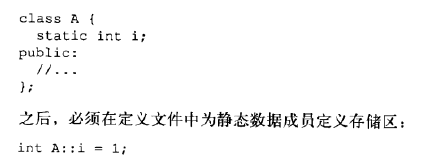
    
      ​		注意：是`A::i`，而非`i`

    

  - 静态成员函数

    - 使用作用域运算符调用

      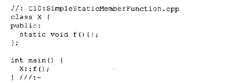

    - 使用 . 或者->调用

      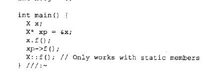
  
    - **静态成员函数不能访问非静态的数据成员，不能调用非静态的成员函数；只能访问静态数据成员，也只能调用其他的静态成员函数。（因为静态成员函数没有this指针）**
    
    - ==不能被动态重载==


### 8. 引用和拷贝构造函数

#### 8.1 C++中的引用

> - const引用
>   - const引用可以绑定到不同类型或初始化为右值：`const int &b = 1.5;`	而非const引用只能绑定与该引用同类型的对象
>   - const引用与普通引用一样，不可以被修改引用对象；且const引用的值是只读的
> - 引用的对象必须有一个地址（e.g. `func(i*3)`会报错）
> - 没有指向引用的指针（i.e. `int& *p; //illegal`）；有指针的引用（i.e. `int*& p; //ok`）

- 引用规则

  - 当引用被创建时，它必须被初始化
  - 一旦引用被初始化为指向一个对象，它就不能改变为另一个对象的引用
  - 不可能有NULL引用，任何引用都是与一块合法的存储单元联系的

- 函数中的引用

  - 当引用被当作函数参数时，在函数内任何对引用的更改将对函数外的参数产生改变（语法比指针更清晰）

- 当输入函数参数为常量时，必须为常量引用，如： `const int&`

- 指针引用

  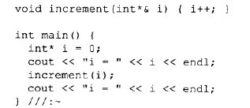

#### 8.2 拷贝构造函数

- 从现有对象创建新对象时，编译器默认执行位拷贝，不会调用构造函数。但当设计了拷贝构造函数，编译器将总是调用拷贝构造函数。
- 拷贝构造函数是一种特殊的**构造函数**，函数的名称必须和类名称一致，它必须的一个参数是本类型的一个**引用变量**。

```C++
#include <iostream>
using namespace std;

class CExample {
private:
    int a;
public:
    //构造函数
    CExample(int b)
    { a = b;}
    
    //拷贝构造函数
    CExample(const CExample& C)
    {
        a = C.a;
    }

    //一般函数
    void Show ()
    {
        cout<<a<<endl;
    }
};

int main()
{
    CExample A(100);
    CExample B = A; // CExample B(A); 也是一样的
     B.Show ();
    return 0;
} 
```

- 拷贝构造函数调用时机

  - 对象以值传递的方式传入函数参数

    ```c++
    //全局函数，传入的是对象
    void g_Fun(CExample C)
    {
     cout<<"test"<<endl;
    }
    
    int main()
    {
     CExample test(1);
     //传入对象
     g_Fun(test);
    
     return 0;
    }
    ```

    - 调用g_Fun()时，会产生以下几个重要步骤：
      (1).test对象传入形参时，会先会产生一个临时变量，就叫 C 吧。
      (2).然后调用拷贝构造函数把test的值给C。 整个这两个步骤有点像：`CExample C(test);`
      (3).等g_Fun()执行完后, 析构掉 C 对象。

  - 对象以值传递的方式从函数返回

    ```C++
    class CExample 
    {
    private:
     int a;
    
    public:
     //构造函数
     CExample(int b)
     { 
      a = b;
     }
    
     //拷贝构造
     CExample(const CExample& C)
     {
      a = C.a;
      cout<<"copy"<<endl;
     }
    
         void Show ()
         {
             cout<<a<<endl;
         }
    };
    
    //全局函数
    CExample g_Fun()
    {
     CExample temp(0);
     return temp;
    }
    
    int main()
    {
     g_Fun();
     return 0;
    }
    ```

    - 当g_Fun()函数执行到return时，会产生以下几个重要步骤：
      (1). 先会产生一个临时变量，就叫XXXX吧。
      (2). 然后调用拷贝构造函数把temp的值给XXXX。整个这两个步骤有点像：CExample XXXX(temp);
      (3). 在函数执行到最后先析构temp局部变量。
      (4). 等g_Fun()执行完后再析构掉XXXX对象。

  - 对象需要通过另一个对象进行初始化

    ```C++
    CExample A(100);
    CExample B = A; 
    CExample B(A); 
    ```

    后两句都会调用拷贝构造函数。

- 默认构造函数进行浅拷贝（即在对象复制时，只对对象中的数据成员进行简单的赋值）。当对象存在动态成员时，浅拷贝就会出现问题

  ```C++
  class Rect
  {
  public:
      Rect()      // 构造函数，p指向堆中分配的一空间
      {
          p = new int(100);
      }
      ~Rect()     // 析构函数，释放动态分配的空间
      {
          if(p != NULL)
          {
              delete p;
          }
      }
  private:
      int width;
      int height;
      int *p;     // 一指针成员
  };
  
  int main()
  {
      Rect rect1;
      Rect rect2(rect1);   // 复制对象
      return 0;
  }
  ```

  此时`rect1.p=rect2.p ` 这不是我们想要的结果

  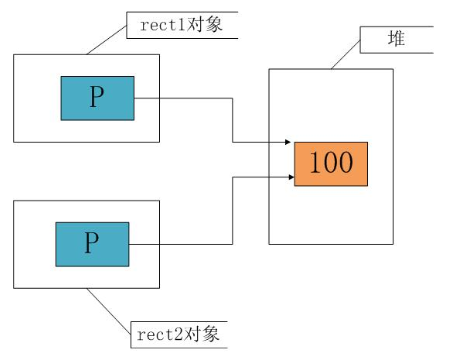

  - 通过深拷贝解决（对对象中的动态成员重新分配内存空间）

    ```C++
    class Rect
    {
    public:
        Rect()      // 构造函数，p指向堆中分配的一空间
        {
            p = new int(100);
        }
        Rect(const Rect& r)
        {
            width = r.width;
            height = r.height;
            p = new int;    // 为新对象重新动态分配空间
            *p = *(r.p);
        }
        ~Rect()     // 析构函数，释放动态分配的空间
        {
            if(p != NULL)
            {
                delete p;
            }
        }
    private:
        int width;
        int height;
        int *p;     // 一指针成员
    };
    ```

    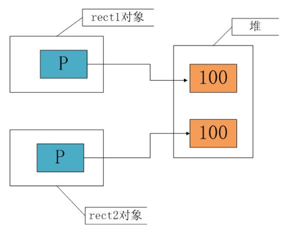 

- 防止默认拷贝的发生

  ​	通过对对象复制的分析，我们发现对象的复制大多在进行“值传递”时发生，这里有一个小技巧可以防止按值传递——声明一个私有拷贝构造函数。甚至不必去定义这个拷贝构造函数，这样因为拷贝构造函数是私有的，如果用户试图按值传递或函数返回该类对象，将得到一个编译错误，从而可以避免按值传递或返回对象。

  ```C++
  // 防止按值传递
  class CExample 
  {
  private:
  	int a;
  
  public:
  	//构造函数
  	CExample(int b)
  	{ 
  		a = b;
  		cout<<"creat: "<<a<<endl;
  	}
  
  private:
  	//拷贝构造，只是声明
  	CExample(const CExample& C);
  
  public:
  	~CExample()
  	{
  		cout<< "delete: "<<a<<endl;
  	}
  
      void Show ()
  	{
          cout<<a<<endl;
      }
  };
  
  //全局函数
  void g_Fun(CExample C)
  {
  	cout<<"test"<<endl;
  }
  
  int main()
  {
  	CExample test(1);
  	//g_Fun(test); 按值传递将出错
  	
  	return 0;
  } 
  ```

  

### 9. 运算符重载

#### 9.1 语法

- 定义重载运算符就像定义函数，只是该函数的名字是`operator@`，这里的@表示被重载的运算符
  - 函数参数表中的参数取决于两个因素
    - 运算符是一元的（一个参数）还是二元的（两个参数）
    - 运算符被定义为全局函数（即**非成员的友元函数**  一元：一个参数；二元：两个参数）还是成员函数（一元：没有参数；二元：一个参数-->此时该类的对象用作左侧参数）

- C++ 规定，箭头运算符`->`、下标运算符`[]`、函数调用运算符`()`、赋值运算符`=`只能以成员函数的形式重载；

  - 基本方针

    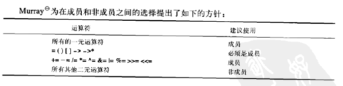


- `>>`与`<<`的重载

  建议使用非成员函数：`friend ostream& operator<< (ostream& os, const IntArray& a)`
  
- 自增与自减

  - prefix (返回自增之后的值)
    - 全局函数：`const Integer& operator++(Integer& a)`
    - 成员函数：`const Integer& operator++()`
  - postfix (返回自增之前的值)
    - 全局函数：`const Integer operator++(Integer& a, int)`
    - 成员函数：`const Integer operator++(int)`
    - 参数多一个哑元常值量

**运算符重载时要遵循以下规则：** 

   (1) 除了类属关系运算符"."、成员指针运算符".*"、作用域运算符"::"、sizeof运算符和三目运算符"?:"以外，C++中的所有运算符都可以重载。
 
 (2) 重载运算符限制在C++语言中已有的运算符范围内的允许重载的运算符之中，不能创建新的运算符。
 
 (3) 运算符重载实质上是函数重载，因此编译程序对运算符重载的选择，遵循函数重载的选择原则。
 
 (4) 重载之后的运算符不能改变运算符的优先级和结合性，也不能改变运算符操作数的个数及语法结构。
 
 (5) 运算符重载不能改变该运算符用于内部类型对象的含义。它只能和用户自定义类型的对象一起使用，或者用于用户自定义类型的对象和内部类型的对象混合使用时。
 
 (6) 运算符重载是针对新类型数据的实际需要对原有运算符进行的适当的改造，重载的功能应当与原有功能相类似，避免没有目的地使用重载运算符。


#### 9.2 自动类型转换

- 构造函数转换

  - 定义一个构造函数，这个构造函数能把零一类型对象或引用作为它的单个参数`Two(const One&){}`
  - 可以通过加`explicit`关键字阻止构造函数转换

- 运算符转换

  - 定义一个成员函数，这个函数通过在关键字operator后跟随想要转换到的类型的方法，将当前类型转换为希望的类型，无返回类型（返回类型就是正在重载的运算符名字）

    `operator Three() const {return Three(x);}`


### 10. 动态对象创建

#### 10.1 new

- new创建对象时的操作（返回一个对象的地址）
  - 在堆内为对象分配内存
  - 调用这块内存的构造函数进行初始化
  - this指针指向返回值的地址

- 下面是自己总结的一些关于new创建类对象特点：
  - new创建类对象需要指针接收，一处初始化，多处使用
  - new创建类对象使用完需delete销毁
  - new创建对象直接使用堆空间，而局部不用new定义类对象则使用栈空间
  - new对象指针用途广泛，比如作为函数返回值、函数参数等
  - 频繁调用场合并不适合new，就像new申请和释放内存一样

#### 10.2 delete

- delete时的操作（需要一个对象的地址）

  - 首先调用析构函数
  - 释放内存（常调用`free()`）

- 注意点

  - new的对象一定要用delete回收占用内存
    - 对于数组

      ```c++
      MyType* fp = new MyType[100];
      delete []fp;
      ```
  
    - delete只用于删除由new创建的对象。用于删除malloc等创建的对象时，动作行为是未定义的
  
    - 使用`delete void*`可能会出错。因为程序只会释放内存，不会执行析构函数

#### 10.3 重载new和delete

- 重载operator new()和operator delete()时，我们只是改变了原有的内存分配方法

- 重载全局new和delete：极端，使默认版本完全不能被访问
- 对一个类重载new和delete
  - 实际是在创建static成员函数
  - 对分配表进行搜索，寻找值为false的成员，找到后将该成员设置为true，以此声明对应的存储单元已经被分配了，并且返回这个存储单元的地址；若找不到空闲内存，将会给跟踪文件发送信息，并产生bad_alloc类型的异常


### 11. 继承和组合

> - super set: S1是S2的子集，则S2是S1的超集

#### 11.1 组合的语法

​	常见的是将嵌入的对象设为私有，因此它们将成员内部实现的一部分。新类的共有接口函数包括了对嵌入对象的使用。

```C++
class X{
	int i;
public:
    X(){ i=0; }
    void set(int ii) { i = ii; }
    int read() const { return i; }
    int permute() { return i *= 47 }
}

class Y{
	int i;
    X x;
public:
    Y(){ i = 0; }
    void f(int ii){ i = ii; x.set(ii); }
    int g() const { return i * x.read(); }
    void permute() { x.permute(); };
}
```

#### 11.2 继承的语法

- Y对X进行公有继承：`class Y : public X`   Y将包含X种的所有数据成员和成员函数
  
  - 公有继承：公有成员在派生类中仍是共有的
  
- 构造函数初始化表达式

  `MyType2::MyType2(int i) : Bar(i), m(i+1){ //...`

  这是类`MyType2`的开头，该类是从`Bar`继承来的，并且包含一个称为`m`的成员对象

- 构造函数和析构函数的调用顺序

  - 按照声明顺序初始化
  - 基类永远是最先构造的

#### 11.3 名字隐藏

- 继承一个类并对它的成员函数重新进行定义（操作和返回值），有两种情况
  - 重定义（redefining）：基类成员函数是普通函数
  - 重写（overriding）：基类成员函数是虚函数

- 若基类有两个版本的成员函数`f()`，则
  - 继承时只重定义其中一个版本，而对另一个版本没有进行重定义，则对没有重定义的版本的函数重载形式是无法使用的
  - 通过改变返回类型或改变参数列表会隐藏基类中的两个函数版本

#### 11.4 非自动继承的函数

- 构造函数和析构函数不能被继承，必须为每一个特定的派生类分别创建
- operator= 也不能被继承

#### 11.5 组合与继承的选择

- 组合通常是在希望新类内部具有已存在类的功能时使用，而不是希望已存在类作为它的接口。

- 私有继承
  - 在基类表中去掉public或通过显式声明private
  - 基类的所有数据和功能都是隐藏的（即基类所有public成员都变成了private）

- **protected**
  - 就这个类的用户而言，它是private的，但它可以被这个类继承来的任何类使用

#### 11.6 Upcasting

- 含义：处理派生类型就如同处理其基类型
  - 一个函数接受基类型的引用，但向其传递其派生类型的引用也是可行的
  
- 从派生类到基类的类型转换，即向上类型转换，总是安全的。

  `Base& p = DeriveClass;`


### 12. 多态性和虚函数

#### 12. 1 binding

- 把函数体和函数调用相联系称为捆绑
  - 早捆绑（early binding）：在程序运行之前，由编译器和连接器完成
  - 晚捆绑（late binding）：捆绑根据对象的类型，发生在运行时（dynamic binding, runtime binding）

#### 12.2 虚函数

- 晚捆绑指对virtual函数起作用，并且只在使用含有virtual函数的基类地址时发生
- 仅需在声明中使用关键字virtual，定义时并不需要；基类的virtual函数，在派生类中都是virtual的（在派生类中重定义vitual函数被称为override）
- 当类含有虚函数时，类内会存在一个VPTR，指向该类的VTABLE。（因此类的大小为所有成员变量大小 + sizeof(void*)）

#### 12.3 抽象基类和纯虚函数

- 仅想对基类进行向上类型转换，使用它的接口，而不希望用户实际地创建一个基类的对象。要做到这一点可以通过在基类中加入至少一个纯虚函数，来使基类成为抽象类
  
  - 使用关键字virtual，并且在后面加上`=0`
  
    `virtual void paly(note) = 0;`
  
- 当继承一个抽象类时，必须实现所有的纯虚函数，否则继承出的类也将是一个抽象类（而虚函数中派生类可以自己实现，也可以不实现）

- 析构函数不能是纯虚函数

- 总结

  1.抽象类只能用作其他类的基类，**不能定义抽象类的对象**。

  2.抽象类**不能用于参数类型、函数返回值或显示转换的类型**

  3.抽象类**可以定义抽象类的指针和引用**，此指针可以指向它的派生类，进而实现多态性。

> 内敛纯虚函数的定义是非法的


### 13. 模板介绍

