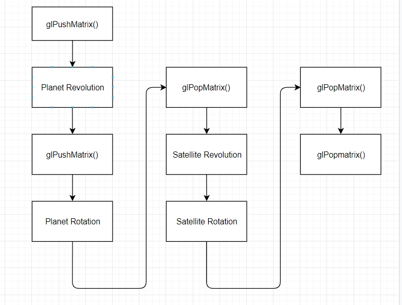

## A4 Report

​																																				王睿 3180103650

### 1. Build the Solar System

> - I used global variables to record the current rotation angle of the planets and satellites.
> - Since modifying one object, we want the other objects remain the same, so we should use `glPushMatrix()` and `glPopMatrix()`.
> - I use a camera class to record the `gluLookAt()` parameters, like camera position, reference point position and up vector.

#### 1.1 Rotation

 	Rotation is simple, we just use `glRotatef((GLfloat)sun_rotate, 0, 0, 1)` to rotate the sun along the Z axis with rotation angle `sun_rotate`


#### 1.2 Revolution

​	Revolution is bit more complex, it consists of a translation and a rotation. For example, to get the planet revolute along the sun with revolution distance 5, we can use the following code

```C++
    glRotatef((GLfloat)planet_revolute, 0, 0, 1);
    glTranslatef(5.0, 0.0, 0.0);
```

​	Note that since the planet is doing rotation and revolution at the same time, we need to perform this 2 operations in the same `glPushMatrix()` and `glPullMatrix()` block. Also, we should do the rotation first, and then do the revolution part. For example, to perform the rotation as well as revolution of planet2, the code is as follows

```C++
//Planet2
	glColor3f(0.15, 0.77, 0.29);
	glPushMatrix();
		//P2 revolution
	glRotatef((GLfloat)planet2_revolute, 0, 0, 1);
	glTranslatef(5.0, 0.0, 0.0);
		//P2 rotation
	glRotatef((GLfloat)planet2_rotate, 0, -1, 2);
	glutSolidSphere(0.3, 20, 20);
	glPopMatrix();
```

 

#### 1.3 Satellite

​	Note that the satellite revolute around the planet, while the planet revolute around the sun, so we should perform the revolution of the satellite after we perform the revolution of the planet. That is to say, we should do  `glPushMatrix()` after we finish the revolution of the planet to record the CTM, since we would do the rotation of the planet next. After we finish performing the rotation of the planet and drawing the planet sphere, we need to do `glPopMatrix()` to restore the CTM to the state of after performing the revolution while not performing the rotation. After that, we can do the revolution of the satellite which is just the same as revolution of the planet.

​	The flow chat is as follows




### 2. Navigation

> In the navigation section, when `WASD` is input or mouse drag occurs, I simply change the parameters in the `gluLookAt()` (camera position or reference position) to simulate the modification of the camera view.

#### 2.1 Keyboard Control

​	I use the keyboard call back function `glutKeyboardFunc()` to manipulate the control. In the `keyboardDown()` function, I make use of the switch-case statement to identify the keyboard input. If it is one of `WASD` then it will change the camera position or reference position, specified as follows

- W
  - Modification: `camera_x - 0.5`
  - Explanation: `W` indicates moving upwards, since the initial galaxy is put at the origin $(0, 0, 0)$ while the camera is put at $(10, 0, 5)$, we just need to move the camera closer to the origin along x axis.
- S
  - Modification: `camera_x + 0.5`
  - Explanation: just the opposite situation of `W`
- A
  - Modification: `ref_y - 0.5`
  - Explanation: change position of the reference point. Since `A` indicates camera moving left, so it can be simulated as  object(reference point) moving right, so we can subtract the value of y axis of the reference point.
- D
  - Modification: `ref_y + 0.5`
  - Explanation: just the opposite situation of `A`


#### 2.2 Mouse Control

​	Similar the keyboard control, I use the `glutMouseFunc()` and `glutMotionFunc()` to do the simulation. The mouse control is implemented as follows: if the mouse is being dragged, we compare the current mouse position with its previous position of the last frame, and calculate the `xoffset` and `yoffset`, then we can use this offsets to modify the reference point position in the `gluLookAt()` function.

- glutMouseFunc(onMouse)

  ​	In this mouse call back function, it records the value of the mouse position in `lastX` and `lastY` when the left button of the mouse is pressed. (Do the initialization of these two variables)

- glutMotionFunc(dragMouse)

  ​	We calculate the offsets along the x axis and y axis of the mouse positions with that in the previous frame. Then update the `lastX` and `lastY`. Finally, we make the modification according to whether these offsets are positive or not

  - `xoffset`
    - `xoffset > 0`
      - Modification: `ref_y + 0.5`
      - Explanation: Since the offset along the x axis of the mouse position is positive, it means we want to look to right. So we can simply add the value along the y axis of the reference point to perform this simulation. 
    - `xoffset < 0`
      - Modification: `ref_y - 0.5`
      - Explanation: just the opposite situation of the above situation.
  - `yoffset`
    - `yoffset > 0`
      - Modification: `ref_z - 0.5`
      - Explanation: Note that the y coordinates in the 2D is downwards, so since the offset along the y axis of the mouse position is positive, it means we want to look to down. So we can simply reduce the value along the z axis of the reference point to perform this simulation. 
    - `yoffset < 0`
      - Modification: `ref_z + 0.5`
      - Explanation: just the opposite situation of the above situation.

  