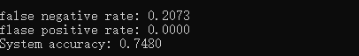
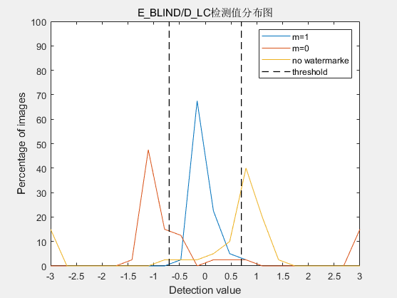
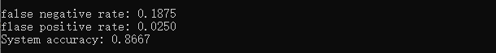
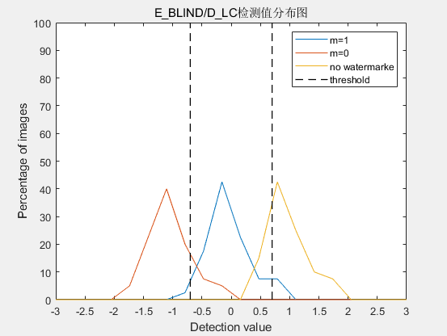
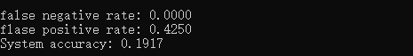
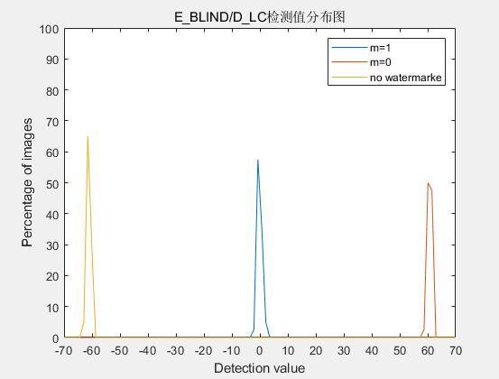
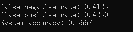
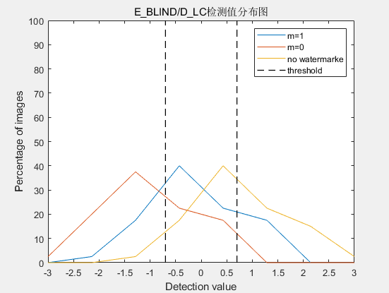

## 实验一：E_BLIND/D_LC系统测试

​																															王睿 3180103650

### 1. 实验目的

1. 了解 E_BLIND/D_LC 系统的基本原理，理解 False Positive 和 False Negative 的概念，掌握 Linear Correlation 的计算
2. 考察 E_BLIND/D_LC 系统检测值的分布，给出检测值的概率分布图或密度分布图
3. 测试 8-bit 灰度值截断对系统检测准确率的影响

### 2. 实验内容与要求

1. 实现 E_BLIND/D_LC 系统
2. 设计一张水印，嵌入强度 $\alpha$ = 1，使用该水印测试 E_BLIND/D_LC 系统应用于不同封面时的检测准确率，计算 False Positive/Negative Rate，并绘制如课本图 3.6 的检测值分布图或密度图。 要求封面数量不少于 40 张(建议使用课程提供的标准数据集作为测试封面)
3. 设计不少于 40 张不同的水印, 使用固定的嵌入强度 $\alpha$ = 1，选择一张黑白像素比例(即灰度值接近 0 或 255 的像素数量占总像素数量的比例) 不高于 30% 的封面，测试不同的水印嵌入同一封面时 E_BLIND/D_LC 系统的检测准确率，计算 False Positive/Negative Rate，并绘制如课本图 3.6 的检测值分布图或密度图
4. 选取一张黑白像素比例不低于 50% 的原始封面，重复子实验 3，比较检测准确率并分析原因

### 3.实验环境

- openCV 4.4.0

### 4. 实验过程

#### 4.1 实验要求1：实现E_BLIND/D_LC系统

##### 4.1.1 E_BLIND系统实现

系统使用single reference pattern $w_r$，它是一个与封面相同大小的像素矩阵。同时，因为我们仅编码一个比特的信息，所以$m$是1或者0，也就是说message pattern $w_m$，是$-w_r$或$w_r$. 

在embedder中，$w_m$需要被$\alpha$控制，来平衡水印的可见度与健壮性。因此，blind embedding 算法计算如下：
$$
w_m = \left\{ \begin{array}{rcl}
-w_r & \mbox{if} & m=0\\
w_r & \mbox{if} & m = 1
\end{array}\right.
\\
w_a  = \alpha w_m
\\
c_w = c_o + w_a
$$

```c++
Mat E_BLIND(Mat Co, Mat Wr, int m, double alpha)
{
	Mat Wm = (m == 1 ? Wr : -Wr);
	Mat Wa = alpha * Wm;
	Mat Cw;

	Cw.create(Co.rows, Co.cols, CV_8UC1);
	
	for(int i = 0; i < Co.rows; i++)
		for (int j = 0; j < Co.cols; j++) {
			Cw.at<uchar>(i, j) = (uchar)(Wa.at<float>(i, j) + Co.at<uchar>(i, j));
		}

	return Cw;
}
```

​	需要注意的是，因为watermark reference pattern是符合$N(0,1)$随机生成的矩阵，因此它是一个float类型的Mat；而cover work是uchar类型的Mat；同时，因为最后加完水印后的work要仍能显示，所以相加后的`Cw`应该也是uchar类型的（像素值为整数），这时就需要注意类型转换。

##### 4.1.2 D_LC系统实现

为了检测水印，我们需要在由$c_o$与$n$产生的噪声的情况下测试信号$w_r$。最有效的测试方法就是计算收到的图片$c$与reference pattern $w_r$ 的线性相关度:
$$
z_{lc}(c, w_{r})=\frac{1}{N}c\cdot w_{r}=\frac{1}{N}\sum_{x,y}^{}c[x,y]w_{r}[x,y]
$$
其中，$c[x,y]$与$w_r[x,y]$均为在相应的矩阵中$(x,y)$处的像素值，$N$为图像中的总像素数。

若$c=c_o+w_a+n$，则：
$$
z_{lc}(c, w_r)=\frac{1}{N}(c_o\cdot w_r+w_a\cdot w_r+n\cdot w_r)
$$
而因为高纬度的随机向量的大概率垂直，所以$c_o\cdot w_r$与$n\cdot w_r$趋近于零；而$w_a\cdot w_r=\pm \alpha w_r\cdot w_r$。于是，有
$$
z_{lc}(c,w_r)\approx \left\{ \begin{array}{rcl}
\frac \alpha{N} w_r\cdot w_r & \mbox{if} & m=0\\
-\frac \alpha{N} w_r\cdot w_r & \mbox{if} & m=1
\end{array}\right.
$$
在实际应用中，我们通过设定阈值$\tau_{lc}$来确定是否检测出水印，若$|z_{lc}(c,w_r)|<\tau_{lc}$，则检测器报告无水印。

因此，D_LC检测器的输出如下:
$$
m_{n}=\left\{
\begin{aligned}
1&&if\ \ z_{lc}(c, w_{r})>\tau_{lc}\\
no \ watermark &&if\ \ -\tau_{lc}<z_{lc}(c, w_{r})<\tau_{lc}\\
0&&if\ \ z_{lc}(c, w_{r})<-\tau_{lc}\\
\end{aligned}\right.\\
$$

在`D_LC`函数的实现中，我们没有判断最后的`m_n`，而将其放在了`main()`中，避免过多的参数传入（如记录结果的vector等）

```C++
double D_LC(Mat Cw, Mat Wr)
{
	double Z_lc = 0;
	int N = Cw.rows * Cw.cols;
	for(int i = 0; i < Cw.rows; i++)
		for (int j = 0; j < Cw.cols; j++) {
			Z_lc += (float)(Cw.at<uchar>(i, j) * Wr.at<float>(i, j));
		}

	Z_lc /= N;
	return Z_lc;
}

```

#### 4.2 实验要求2：同一水印不同封面测试系统

对嵌入的信息$m$，我们要判断三种情况：$m$为$0$，$m$为$1$，以及$m$不存在，其分别对应于：检测为无水印，检测为有水印，检测为原图。

对$m$不存在的情况，我使用了$m=-1$来标志。当$m=-1$时，我们就不需要经过`E_BLIND()`函数，直接将$C_w$置为$Co$即可；否则，$C_w=\text{E_BLIND(...)}$。然后将$C_w$与$W_r$作为参数，传递进`D_LC()`检测函数，获得二者的线性相关度$Z_{lc}$，将其与设置的阈值$\tau_{lc}$比较，即可获得测试结果，大致代码如下：

```c++
	float T_lc = 0.7;

	Mat Wr = readin_watermark(".\\xml_files\\exp1\\Wr.xml", "Wr");

	string path = ".\\data_bmp\\";
	vector<String> images;

	vector<float> res_z_lc;
	vector<int> res_exp;
	vector<int> res_real;

	glob(path + "*", images);
	for (int i = 0; i < images.size(); i++) {
		Mat coverWork = imread(images[i], IMREAD_GRAYSCALE);
		if (coverWork.empty()) {
			cout << "image:" << images[i] << " not found!" << endl;
			exit(-1);
		}
		cout << "coverWork: " << images[i] << endl;
		Mat Co;
		Co.create(coverWork.rows, coverWork.cols, CV_8UC1);
		coverWork.convertTo(Co, CV_8UC1, 1.0, 0.0);

		Mat Cw;
		for (int m = -1; m < 2; m++) {
			if (m == NO_WM) 
				Cw = Co;
			else
				Cw = E_BLIND(Co, Wr, m, 1);

			float Z_lc = D_LC(Cw, Wr);

			res_z_lc.push_back(Z_lc);
			res_real.push_back(m);
			if (Z_lc > T_lc)
				res_exp.push_back(M_IS_1);
			else if (Z_lc < -T_lc)
				res_exp.push_back(M_IS_0);
			else
				res_exp.push_back(NO_WM);
		}
		cout << endl;
	}

	compute_result(res_real, res_exp);
```

后续的具体结果计算过程如下：

```c++
void compute_result(vector<int> res_real, vector<int> res_exp)
{
	if (res_real.size() != res_exp.size()) {
		cout << "ERROR: res_real.size != res_exp.size" << endl;
		exit(-1);
	}

	int total_num = res_real.size();
	int accurate_num = 0;
	int true_pos = 0, true_neg = 0;
	int false_pos = 0, false_neg = 0;

	for (int i = 0; i < res_real.size(); i++) {
		if (res_real[i] == res_exp[i])
			accurate_num++;

		if ((res_real[i] == M_IS_1 || res_real[i] == M_IS_0) && (res_exp[i] == M_IS_1 || res_exp[i] == M_IS_0))
			true_pos++;
		else if ((res_real[i] == M_IS_1 || res_real[i] == M_IS_0) && res_exp[i] == NO_WM)
			false_neg++;
		else if (res_real[i] == NO_WM && res_exp[i] == NO_WM)
			true_neg++;
		else if (res_real[i] == NO_WM && (res_exp[i] == M_IS_1 || res_exp[i] == M_IS_0))
			false_pos++;
		else {
			cout << "ERROR: exception occurs in function compute_result()!" << endl;
			exit(-1);
		}

	}

	cout << "false negative rate: " << fixed << setprecision(4) << (float)false_neg / (false_neg + true_pos) << endl;
	cout << "flase positive rate: " << fixed << setprecision(4) << (float)false_pos / (false_pos + true_neg) << endl;
	cout << "System accuracy: " << fixed << setprecision(4) << (float) accurate_num / total_num << endl;
}
```

需要注意的是，false positive rate的计算应该为$\frac{\text{假阴性数量}}{\text{假阴性数量+真阴性数量}}$；false negative rate同理

计算得到的检测准确率为74.80%，false positive rate为0%，false negative rate为20.73%



绘制的检测值分布图如下：



#### 4.3 实验要求3: 不同水印同一封面测试系统 (黑白像素比例$\leq30$%）

​	实验中的封面选择了 airplaneGray.bmp，它的黑白像素比例接近0%.

​	本实验略微修改了代码，具体可见`./code/exp2.cpp`

​	阈值$\tau_{lc}=0.7$，计算得到的检测准确率为86.67%，false positive rate为2.5%，false negative rate为18.75%



​	绘制的检测分布图如下：



#### 4.4 实验要求4: 不同水印同一封面测试系统（黑白像素比例$\geq 50$%）

​	实验中的封面选择了rec.bmp，它的黑白像素比例接近100%. 

​	阈值$\tau_{lc}=0.7$，计算得到的检测准确率为19.17%，false positive rate为42.5%，false negative rate为0%



​	绘制的检测分布图如下：



### 5. 实验分析与结论

可以看到，在黑白像素比高的图像中嵌入水印，通过E_BLIND/D_LC系统去检测，其检测准确率会明显低于普通图片。猜测是因为黑白像素比高的图片中，像素值接近0或255的值较多，使得添加水印后容易发生8-bit灰度值截断（即因为8bit限制，导致嵌入水印后的值只能在$[0,255]$内，无法反映真实的情况）

#### 8-bit灰度值截断

因此，为了测试8-bit 灰度截断，我将导入的图像Mat矩阵设置为`CV_16UC1`，对应了16bit，从而避免了8-bit灰度截断的发生，同时将Mat的元素类型设置为`short`，使得其可以存储负数值与大于255的值



绘制的检测分布图如下：



​	可以看到，当不发生8-bit灰度值截断，系统检测准确率明显上升（从4.4中的19.2%到现在的56.7%）

### 6. 实验感想

通过本次实验，我对E_BLIND/D_LC有了初步认识，对水印的检测也有了一定的理解。