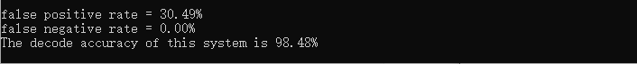
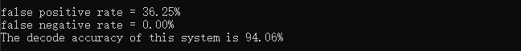
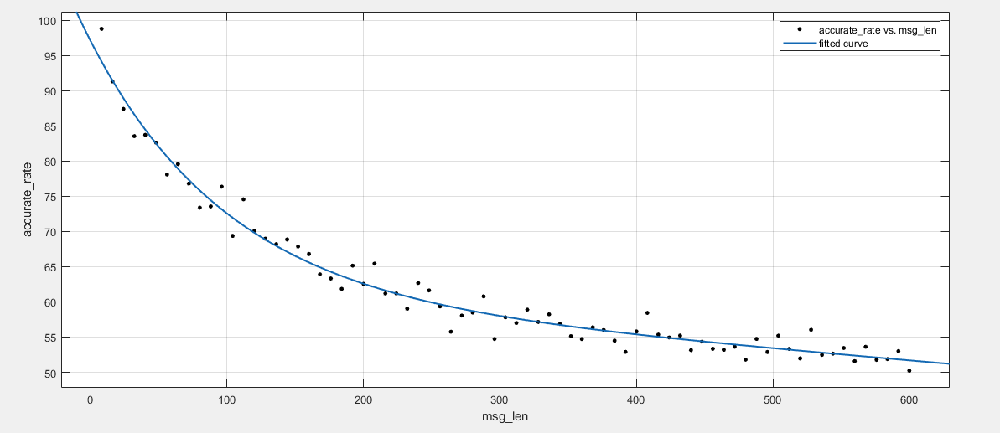

## 实验二：E_SIMPLE_8/D_SIMPLE_8系统测试

​																															王睿 3180103650

### 一. 实验目的

1. 理解 E_SIMPLE_8/D_SIMPLE_8 系统的基本原理，掌握简单的多位信息水印技术

### 二. 实验内容与要求

1. 实现 E_SIMPLE_8/D_SIMPLE_8 系统

2. <font color="#dd0000">设计一张水印，嵌入强度 α = $\sqrt{8}$</font>，使用该水印测试 E_SIMPLE_8/ D_SIMPLE_8 系统应用于不同封面时的检测准确率，计算 False Positive/Negative Rate 和解码的准确率。要求封面数量不少于 40 张。False Positive/Negative Rate 的计算可以采取不同的原则。其中一种可以使用的原则是，预先设定一个固定的阈值，8 个检测值（detect value）中有 4 个超过了阈值，就认为存在水印，否则认为不存在水印。（也可以使用其他合理的原则，需要在报告中说明使用的是哪种原则）。<font color="#dd0000">准确率的计算，则是对确实添加了水印的图片，计算解码出来的信息的错误率。</font>

3. <font color="#dd0000">设计不少于 40 张不同的水印, 使用固定的嵌入强度 *α* = $\sqrt{8}$，</font>测试 E_SIMPLE_8/ D_SIMPLE_8 系统应用于同一封面时的检测准确率，计算 False Positive/Negative Rate

4. <font color="#dd0000">分析信息长度增加对检测准确率的影响</font>

### 三.实验环境

- openCV 4.4.0

### 四. 实验过程

#### 4.1 实现E_SIMPLE_8/D_SIMPLE_8系统

##### 4.1.1 E_SIMPLE_8实现

在E_SIMPLE_8/D_SIMPLE_8水印检测系统中，信息到符号序列的映射就是简单地将信息映射到比特序列。为了调制信息，序列的第$i$位被映射到了$W_{AL}[i,1]$若该比特值为$1$，否则被映射到$W_{AL}[i,0]$.

同一位置的reference pattern应该区别越大越好。而我们在课上学过，当两个向量相反时二者区别最大。因此，我们构建一个理想的二进制系统，通过设计一个reference pattern $w_{ri}$，对每一位$i$，并用这个pattern来编码$1$，或是它的相反向量来编码$0$。也就是说，对任意一个位置$i$，$W_{AL}[i,1]=w_{ri}$或$W_{AL}[i,0]=-w_{ri}$.

对$w_{r1},...,w_{r8}$中间的每一个base reference pattern，它都是根据给定的seed为随机生成的。我们对其进行正则化使得它满足均值为零的性质。

综上，message pattern $w_m$编码了给定的信息$m$，通过一个字符串序列$m[1], m[2],...,m[s]$来表示，$w_m$中的第$i$位是对消息$m$中的第$i$位编码，记为$w_{mi}$，根据$m[i]$的值来确定其值：
$$
w_{mi}=
\left\{\begin{aligned}
w_{ri}&&if\ \ m[i]\ =1\\
-w_{ri}&&if\ \  m[i]\ =0\\
\end{aligned}\right.\\
$$
然后将八个水印相加，合成成一张水印，并对其进行归一化处理，得到最终的message pattern，其中，$s_{w_{tmp}}$是样本标准差。

$$
\begin{aligned}
w_{tmp} &= \sum_{i}{w_{mi}}\\
w_{m} &= \frac{w_{tmp}}{s_{w_{tmp}}}\\
\end{aligned}
$$
E_SIMPLE_8 embedder通过blind embedding实现嵌入，也就是说嵌入水印的coverwork $c_w$满足：
$$
\begin{aligned}

c_{w}&=c_{o}+\alpha w_{m}
\end{aligned}
$$


E_SIMPLE_8代码实现如下：

```c++
Mat E_SIMPLE_8(Mat Co, vector<int>& m, double alpha, int seed)
{
	Mat Wm(Co.rows, Co.cols, CV_32FC1);

	for (int i = 0; i < 8; i++) {
		Mat Wr = generate_watermark(Co.rows, Co.cols, seed + i);

		//write_watermark(Wr, "Wr_E_" + to_string(seed + i));

		if (i == 0)
			Wm = Wr;
		else {
			Wm += (m[i] == 1 ? Wr : -Wr);
		}
	}

	// normalization
	Scalar mean, stddev;
	meanStdDev(Wm, mean, stddev);
	double meanVal = mean.val[0];
	double stddevVal = stddev.val[0];

	Wm = Wm - meanVal;
	Wm = Wm / stddevVal;

	Mat Cw(Co.rows, Co.cols, CV_32FC1);
	Co.convertTo(Co, CV_32FC1);

	Cw = Co + alpha * Wm;

	// need 0&255 truncate
	for (int i = 0; i < Cw.rows; i++) {
		for (int j = 0; j < Cw.cols; j++) {
			if (Cw.at<float>(i, j) > 255)
				Cw.at<float>(i, j) = 255;
			else if (Cw.at<float>(i, j) < 0)
				Cw.at<float>(i, j) = 0;
		}
	}

	return Cw;
}

```

需要注意的是，组后需要对结果进行截断，避免出现像素值超过255或小于0。

##### 4.1.2 D_SIMPLE_8实现

我们通过计算添加了水印的图像和某个水印的线性相关度来判断是否检测出水印。单个水印的线性相关度计算如下：

$$
\begin{aligned}
z_{lc}(c, w_{ri})&=\frac{1}{N}c\cdot w_{ri}=\frac{1}{N}\sum_{x,y}^{}c[x,y]w_{ri}[x,y]\\
\end{aligned}
$$

若线性相关度大于某个阈值免责说明检测出水印，否则认为未检测出水印。当图中没有水印时，$z_{lc}$的绝对值趋近于零，因此我们根据阈值来判断图中是否加了水印：

$$
m_{n}=\left\{
\begin{aligned}
1&&if\ \ z_{lc}(c, w_{r})>\tau_{lc}\\
no \ watermark &&if\ \ -\tau_{lc}<z_{lc}(c, w_{r})<\tau_{lc}\\
0&&if\ \ z_{lc}(c, w_{r})<-\tau_{lc}\\
\end{aligned}\right.\\
$$

对八个水印都做以上处理，就能得到实验结果。

```c++
vector<int> D_SIMPLE_8(Mat Cw, int seed)
{
	Cw.convertTo(Cw, CV_32FC1);

	//write_watermark(Cw, "Cw");

	Mat Wr(Cw.rows, Cw.cols, CV_32FC1);
	vector<int> m;

	for (int i = 0; i < 8; i++) {
		Wr = generate_watermark(Cw.rows, Cw.cols, seed + i);
		//write_watermark(Wr, "Wr_D_" + to_string(seed + i));

		double val = 0;
		val = sum(Cw.mul(Wr))[0];

		double temp = val / (double)(Cw.rows * Cw.cols);
		
		//cout << "m[" << i << "]: " << temp << endl;
		if (temp > thresh)
			m.push_back(1);
		else if (temp < -thresh)
			m.push_back(0);
		else
			m.push_back(-1);
	}
	return m;
}
```

#### 4.2 同一水印不同封面测试

首先随机生成一个长度为8的0/1串，作为message。然后将原始图片$C_o$放入`E_SIMPLE_8()`获得嵌入水印后的$C_w$，然后分别将$C_w$与$Co$放入解码器`D_SIMPLE_8()`判断是否检测出水印。

对False Positive/Negative Rate 的计算采用的原则是，预先设定一个固定的阈值，8 个检测值（detect value）中有 4 个超过了阈值，就认为存在水印，否则认为不存在水印。

而解码准确率则是对确实添加了水印的图片，计算解码出来的信息的正确率，即8比特中有多少比特解码后与原始信息一致。系统解码准确率是对所有水印图片解码准确率的平均。

值得一提的是，我们通过RNG（random number generator）设置不同的seed，生成不同的随机水印。若seed值相同，则水印也相同。因此我们就避免了像lab1中每次生成水印后要存储为xml文件，后续使用又要读取xml文件转为Mat的繁琐过程。每次要用某一水印，只需要设置相应的seed值生成即可，程序效率也大大提高。

主体代码逻辑如下：

```c++
	string path = ".\\data_bmp\\";
	vector<String> images;

	vector<int> res_1;
	vector<int> res_2;

	int false_pos_num = 0;
	int false_neg_num = 0;


	glob(path + "*", images);

	for (int i = 0; i < images.size(); i++) {
		Mat coverWork = imread(images[i], IMREAD_GRAYSCALE);
		if (coverWork.empty()) {
			cout << "image:" << images[i] << " not found!" << endl;
			exit(-1);
		}
		cout << "coverWork: " << images[i] << endl;

		Mat Cw = E_SIMPLE_8(coverWork, m, alpha, seed);
/***********************   case 1:  add watermark      *************************/
        res_1 = D_SIMPLE_8(Cw, seed);

		int count_no = 0;
		int accurate_num = 0;

		for (int i = 0; i < 8; i++) {
			if (res_1[i] == -1)
				count_no++;
			if (res_1[i] == m[i])
				accurate_num++;
		}

		double accurate_rate = (double)accurate_num / 8 * 100;
		cout << "The decode accuracy is " << fixed << setprecision(2) << accurate_rate << "%" << endl;
		decode_accuracy.push_back(accurate_rate);

		if (res_1 != m && count_no >= 4)
			false_neg_num++;
        
/***********************   case 2: do not add watermark      **********************/
		res_2 = D_SIMPLE_8(coverWork, seed);

		count_no = 0;
		for (int i = 0; i < 8; i++) {
			if (res_2[i] == -1)
				count_no++;
		}
		if (count_no < 4)
			false_pos_num++;
	}

	double sys_decode_accuracy = accumulate(decode_accuracy.begin(), decode_accuracy.end(), 0.0) / images.size();

	cout << endl << endl;
	cout << "false positive rate = " << fixed << setprecision(2) << (double)false_pos_num / (2 * images.size()) * 100 << "%" << endl;
	cout << "false negative rate = " << fixed << setprecision(2) << (double)false_neg_num / (2 * images.size()) * 100 << "%" << endl;
	cout << "The decode accuracy of this system is " << fixed << setprecision(2) << sys_decode_accuracy << "%" << endl;
```

解码准确率仅是针对添加了水印的图片而言的。

以下为检测结果：



系统的可以看到，系统的解码准确率相对还是很高的接近98.48%

#### 4.3 同一封面不同水印测试

我们可以通过在random number generator中设置不同的seed来生成不同水印。

整体的逻辑与上一节内容相似，区别在于此处使用同一封面，加入不同水印进行检测。

具体代码如下：

```c++
	float alpha = sqrt(8);
	int seed = 1;
	vector<double> decode_accuracy;

	vector<int> res_1;
	vector<int> res_2;

	int false_pos_num = 0;
	int false_neg_num = 0;

	string path = ".\\data_bmp\\girl512.BMP";

	Mat coverWork = imread(path, IMREAD_GRAYSCALE);
	if (coverWork.empty()) {
		cout << "image:" << path << " not found!" << endl;
		exit(-1);
	}
	cout << "coverWork: " << path << endl;

	for (int i = 0; i < SIZE; i++) {
		vector<int> m = generate_message_8();
	
		Mat Cw = E_SIMPLE_8(coverWork, m, alpha, seed * (i + 8));
		res_1 = D_SIMPLE_8(Cw, seed * (i + 8));

		int count_no = 0;
		int accurate_num = 0;

		for (int i = 0; i < 8; i++) {
			if (res_1[i] == -1)
				count_no++;
			if (res_1[i] == m[i])
				accurate_num++;
		}

		double accurate_rate = (double)accurate_num / 8 * 100;
		cout << "The decode accuracy is " << fixed << setprecision(2) << accurate_rate << "%" << endl;
		decode_accuracy.push_back(accurate_rate);

		if (res_1 != m && count_no >= 4)
			false_neg_num++;

		res_2 = D_SIMPLE_8(coverWork, seed * (i + 8));

		count_no = 0;
		for (int i = 0; i < 8; i++) {
			if (res_2[i] == -1)
				count_no++;
		}
		if (count_no < 4)
			false_pos_num++;
	}

	double sys_decode_accuracy = accumulate(decode_accuracy.begin(), decode_accuracy.end(), 0.0) / SIZE;

	cout << endl << endl;
	cout << "false positive rate = " << fixed << setprecision(2) << (double)false_pos_num / (2 * SIZE) * 100 << "%" << endl;
	cout << "false negative rate = " << fixed << setprecision(2) << (double)false_neg_num / (2 * SIZE) * 100 << "%" << endl;
	cout << "The decode accuracy of this system is " << fixed << setprecision(2) << sys_decode_accuracy << "%" << endl;


```

各指标的计算与上一节相同，系统的检测结果如下：



#### 4.4 信息长度对检测准确率的影响

通过将信息长度`len`不断增长8，检测系统对水印的检测准确率。

首先需要修改E_SIMPLE_8与D_SIMPLE_8，使其变为用于添加与检测`len`长度的pattern，同时生成的message也要变为`len`长度的0/1比特串。

代码其余部分与4.2节相似，整体逻辑也相同，可见code/task3.cpp查看完整源码。

以下为实验结果：当信息长度增减时，信息检测准确率不断降低，趋近于50%（黑色点为数据点，蓝色曲线为高斯拟合获得的曲线。



### 五. 实验分析与结论

从4.2与4.3的实验结果可以看出，E_SIMPLE_8/D_SIMPLE_8水印系统的检测准确率还是相对比较高的。

同时，在4.4节进行了不同信息长度对系统水印检测率的比较，可以看出，当信息长度增加，水印的检测准确率也逐渐下降，最后趋近于50%。
$$
\begin{aligned}
z_{lc}(c, w_{ri})&=
\frac{1}{N}(c_{o}\cdot w_{ri}+w_{a}\cdot w_{ri}+n\cdot w_{ri})\\
&=\frac{1}{N}(c_{o}\cdot w_{ri}+\alpha \cdot \sum_{j=1}^{len}{w_{mj}}\cdot w_{ri}+n\cdot w_{ri})\\
&\approx \frac 1{N}(\alpha \cdot \sum_{j=1}^{len}{w_{mj}}\cdot w_{ri})\\
&\approx \alpha\cdot {w_{ri}}\cdot w_{ri}
\end{aligned}
$$
在上式中，我们默认$c_o\cdot w_{ri}$与$n\cdot w_{ri}$近似于零，且包含不同信息的水印之间几乎是线性无关的，即：$w_{mi} \cdot w_{mj} \approx 0 (i \neq j)$，所以上式最后一个（约）等号成立。而当信息的维度不断增长时，不同信息之间的水印不能始终保持线性无关，导致$w_{mi} \cdot w_{mj} \neq 0 (i \neq j)$，所以最后$z_{lc}(c, w_{ri}) \approx \pm \alpha w_{ri}\cdot w_{ri} + \sum_{j=1}^{len} w_{mi} \cdot w_{mj}$，从而使得检测的准确率降低。


### 六. 实验感想

本次实验我对E_SIMPLE/D_SIMPLE水印系统有了更加深刻的理解，对整体的概念也清晰了很多。

