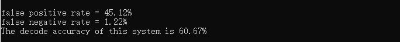
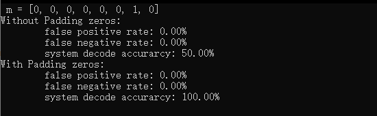
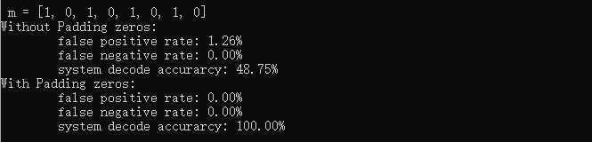
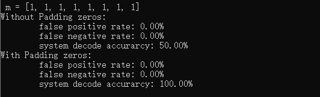
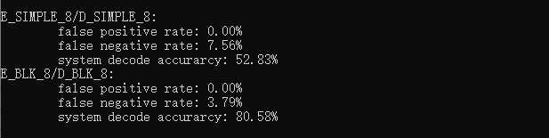

## 实验三： E_BLK_8/D_BLK_8系统测试

​																														王睿 3180103650

### 一. 实验目的

1. 了解 E_BLK_8/D_BLK_8 系统的基本原理

2. 了解 Hamming Code 和 Trellis Code 的工作原理

3. 掌握 Correlation Coefffficient 的计算

### 二. 实验内容与要求

1. 实现基于 E_SIMPLE_8/D_SIMPLE_8 系统的 E_BLK_8/D_BLK_8 系统。<font color="#dd0000">要求使用 Correlation Coefffficient 作为检测值。</font> 

2. <font color="#dd0000">设计一张水印，选择嵌入强度 $\alpha=\sqrt 8$</font>，使用该水印测试基于 E_SIMPLE_8/ D_SIMPLE_8 系统的 E_BLK_8/D_BLK_8 系统应用于不同封面时的检测准确率。要求封面数量不少于 40 张。 

3. 实现基于 Hamming Code 或 Trellis Code 的 E_BLK_8/D_BLK_8 系统

4. 使用固定的水印和固定的嵌入强度，测试基于 Hamming Code 或 Trellis Code 的 E_BLK_8/D_BLK_8系统应用于不同封面时的检测准确率。这里 *α* 取值根据所采用的 Hamming Code 或 Trellis Code编码方式选定。<font color="#dd0000">比较在信息末尾添加两个 0 比特是否有助于提高检测的准确率，如果可以，请解释原因</font>

5. 比较基于不同系统，E_SIMPLE_8/D_SIMPLE_8 和（基于 Hamming Code 或 Trellis Code 的) E_BLK_8/D_BLK_8 系统的检测准确率，试分析原因

### 三. 实验环境

​	openCV 4.4.0

### 四. 实验过程

#### 4.1 实现基于E_BLK_8/D_BLK_8系统

##### 4.1.1 E_BLK_8嵌入器实现

E_BLK_8嵌入器的实现过程简要如下：

​	首先，从未添加水印的图像$c_o$中提取出标记$v_o$；然后在标记空间中选择一个新向量$v_w$，使得$v_m$满足在尽可能接近$v_o$的同时处于检测区域内；最后，E_BLK_8将$v_m$映射到图像空间中，得到带有水印的作品$c_w$.

​	接下来逐步分析上述过程

- 从未添加水印的原始图像$c_o$中提取标记$v_o$

  ​	为了从图像中提取标记，我们首先将图像分割成相等的$8\times 8$个block，然后将每个block叠加并取平均值得到mark标记$v_o$：
  $$
  v[i,j]=\frac{1}{B} \sum_{x=0}^{ \frac{width}{8}}\sum_{y=0}^{ \frac{height}{8}}{c[8x+i,8y+j]}\\
  $$
  ​	上式中，$B$为分割出的block数量，width和height分别是未添加水印的图像$c_o$的宽和高。

- 在标记空间中选择一个新向量$v_m$，满足一定要求

  ​	$v_m$的生成过程如下：

  ​		根据消息每一位的值，生成相应8x8的水印：
  $$
  w_{mi}=\left\{\begin{aligned}w_{ri}&&if\ \ m[i]\ =1\\-w_{ri}&&if\ \  m[i]\ =0\\\end{aligned}\right.\\
  $$

  然后将八个水印相加，合成成一张水印，并对其进行归一化处理，得到最后的水印$w_m$。

  $$
  \begin{aligned}
  w_{tmp} &= \sum_{i}{w_{mi}}\\
  w_{m} &= \frac{w_{tmp}}{s_{w_{tmp}}}\\
  \end{aligned}
  $$
  在嵌入水印中，message pattern $w_{m}$由输入参数$\alpha$进行缩放，生成添加的pattern $\alpha$。因此，得到的mark标记向量如下：
  $$
  \begin{aligned}
  w_{a}&=\alpha w_{m}\\
  v_{w}&=v_{o}+w_{a}
  \end{aligned}
  $$

- 将$v_m$映射到图像空间中，得到带有水印的作品$c_w$

  ​	将$v_{w}$映射到图像空间的过程中，需要生成一个基于原图的图像$c_{w}$，这里采用简单的把8x8矩阵映射到原图大小的空间中，方法如下：
  $$
  \begin{aligned}
  c_{w}[x,y] = c_{o}[x,y]+(v_{w}\cdot [x\mod8,\ y \mod 8]-v_{o}\cdot[x \mod 8,y\mod 8])\\
  \end{aligned}
  $$

  这一步保证了当检测器对$c_{w}$应用提取函数时，结果是$v_{w}$，水印将被检测到。

具体的实现代码如下：

```c++
Mat E_BLK_8(Mat Co, vector<int>& m, float alpha, int seed)
{
	Mat Wm(8, 8, CV_32FC1);
	Co.convertTo(Co, CV_32FC1);

	for (int i = 0; i < 8; i++) {
		Mat Wr = generate_watermark(8, 8, seed + i);

		//write_watermark(Wr, "Wr_E_" + to_string(seed + i));

		if (i == 0)
			Wm = (m[i] == 1 ? Wr : -Wr);
		else {
			Wm += (m[i] == 1 ? Wr : -Wr);
		}
	}

	// normalization
	Scalar mean, stddev;
	meanStdDev(Wm, mean, stddev);
	double meanVal = mean.val[0];
	double stddevVal = stddev.val[0];

	Wm = Wm - meanVal;
	Wm = Wm / stddevVal;

	Mat Vo = Mat::zeros(8, 8, CV_32FC1);
	Mat n = Mat::zeros(8, 8, CV_32FC1);
	for(int i = 0; i < Co.rows; i++)
		for(int j = 0; j < Co.cols; j++){
			int id_x = i % 8;
			int id_y = j % 8;
			Vo.at<float>(id_x, id_y) += Co.at<float>(i, j);
			n.at<float>(id_x, id_y)++;
		}

	Vo = Vo / n;

	Mat Vw(8, 8, CV_32FC1);
	Vw = Vo + alpha * Wm;

	Mat vo_1 = Mat::zeros(8, 8, CV_32FC1);
	Mat n_1 = Mat::zeros(8, 8, CV_32FC1);
	for(int i = 0; i < Co.rows; i++)
		for(int j = 0; j < Co.cols; j++){
			int id_x = i % 8;
			int id_y = j % 8;
			vo_1.at<float>(id_x, id_y) += Co.at<float>(i, j);
			n_1.at<float>(id_x, id_y)++;

		}

	Mat delta(8, 8, CV_32FC1);
	delta = n.mul(Vw) - n_1;

	Mat Cw = Mat::zeros(Co.rows, Co.cols, CV_32FC1);
	for(int i = 0; i < Cw.rows; i++){
		for(int j = 0; j < Cw.cols; j++){
			int id_x = i % 8;
			int id_y = j % 8;
			float oldVal = Co.at<float>(i, j);
			float newVal = Co.at<float>(i, j) + (delta.at<float>(id_x, id_y) / n.at<float>(id_x, id_y));
			
			newVal = (newVal > 255 ? 255 : (newVal < 0 ? 0 : newVal));

			Co.at<float>(i, j) = newVal;
			n.at<float>(id_x, id_y)--;
			delta.at<float>(id_x, id_y) -= (Co.at<float>(i, j) - oldVal);
		}
	}

	Cw = Co;

	return Cw;
}
```

##### 4.1.2 D_BLK_8检测器实现

D_BLK_8检测器的实现过程简要如下：

​	首先从添加了水印的$c_w$中提取出mark标记$v$；然后通过D_SIMPLE_8算法对提取出的mark进行检测，判断水印是否存在。

​	检测水印的过程中，D_BLK_8中运用的是相关系数检测，在相关系数检测前需要对矩阵进行减去均值处理，这是为了防止对某一矩阵进行数据加减影响检测值，同时，根据两个矩阵的大小对线性相关进行归一化处理，这样能防止对某一矩阵进行数据乘除影响检测值。这样的操作有很好的鲁棒性，能够抵抗图像亮度和对比度的变化。

​	相关系数检测定义如下：
$$
\begin{aligned}
z_{cc}(v, w_{r})&=\frac{\tilde{v} \cdot \tilde{w_{r}}}{\sqrt{(\tilde{v} \cdot \tilde{v})(\tilde{w_{r}} \cdot \tilde{w_{r}})}}\\
\end{aligned}
$$

​	其中$\tilde{v}$和$ \tilde{w_{r}}$经过了减去均值操作，相关系数检测可以看作$\tilde{v}$和$ \tilde{w_{r}}$归一化处理后的内积，这个可以简单理解为两个向量之间的夹角，也就是$\tilde{v}$和$ \tilde{w_{r}}$之间的夹角，所以：

$$
\begin{aligned}
-1 \leq z_{cc}(v, w_{r}) \leq 1\\
\end{aligned}
$$

​	于是和D_LC类似，检测结果设置阈值如下：

$$
m_{n}=\left\{
\begin{aligned}
1&&if\ \ z_{cc}(v, w_{r})>\tau_{cc}\\
no \ watermark &&if\ \ -\tau_{cc}<z_{cc}(v, w_{r})<\tau_{cc}\\
0&&if\ \ z_{cc}(v, w_{r})<-\tau_{cc}\\
\end{aligned}\right.\\
$$

因此，D_BLK_8代码如下：

```c++
vector<int> D_BLK_8(Mat Cw, int seed, float Tcc)
{
	Cw.convertTo(Cw, CV_32FC1);

	// extract mark
	Mat v = Mat::zeros(8, 8, CV_32FC1);
	Mat n = Mat::zeros(8, 8, CV_32FC1);

	for(int i = 0; i < Cw.rows; i++)
		for(int j = 0; j < Cw.cols; j++){
			int id_x = i % 8;
			int id_y = j % 8;
			v.at<float>(id_x, id_y) += Cw.at<float>(i, j);
			n.at<float>(id_x, id_y)++;
		}

	v = v / n;

	// demodulation
	Mat Wr(8, 8, CV_32FC1);
	vector<int> m;

	for (int i = 0; i < 8; i++) {
		Wr = generate_watermark(8, 8, seed + i);
		//write_watermark(Wr, "Wr_D_" + to_string(seed + i));

		double val = 0;
		val = sum(v.mul(Wr))[0];

		double temp = val / (double)(8 * 8);

		//cout << "m[" << i << "]: " << temp << endl;
		if (temp > thresh)
			m.push_back(1);
		else if (temp < -thresh)
			m.push_back(0);
		else
			m.push_back(-1);
	}

	// modulate
	Mat Wm = Mat::zeros(8, 8, CV_32FC1);
	for(int i = 0; i < 8; i++){
		Mat temp_W = generate_watermark(8, 8, seed + i);

		if(m[i] == 1)
			Wm += temp_W;
		else
			Wm -= temp_W;
	}

	// compute correlation coefficiency
	Scalar mean, stddev;
	meanStdDev(v, mean, stddev);
	float meanVal = mean.val[0];
	v = v - meanVal;

	meanStdDev(Wm, mean, stddev);
	meanVal = mean.val[0];
	Wm = Wm - meanVal;

	double vWm = sum(v.mul(Wm))[0];
	double vv = sum(v.mul(v))[0];
	double WmWm = sum(Wm.mul(Wm))[0];
	double cc = 0;

	if(abs(vv * WmWm) < 0.0000001)
		cc = 0;
	else	
		cc = vWm / sqrt(vv * WmWm);

	if(cc < Tcc){
		m.clear();
		for(int i = 0; i < 8; i++)
			m.push_back(-1);
	}	
	return m;
}

```

#### 4.2 E_BLK_8/D_BLK_8系统检测不同封面

实验统计了data文件夹内的41张图，分别添加了8位水印与未添加任何水印，共82个检测样本。

False Positive/Negative Rate 的计算采用的原则是，预先设定一个固定的阈值，8 个检测值（detect value）中有 4 个超过了阈值，就认为存在水印，否则认为不存在水印，准确率的计算，则是对确实添加了水印的图片，计算解码出来的信息的正确率。

最终检测结果如下：



#### 4.3 实现基于Trellis Code的E_BLK_8/D_BLK_8系统

##### 4.3.1 E_BLK_8_Trellis嵌入器

Trellis Code本质是一种编码后的状态机，每读入一位输入，Trellis Code就会输出4bit数据，并转换状态。当输入位是0时，它从当前状态穿过细线并输出线上标记的四位数字。如果输入位是1，它将遍历粗线并输出线上标记的4位数字。因此，4位的信息经过编码后将被转换为16位。


具体代码如下，整体逻辑与上面无Trellis Code的相同：

```c++
Mat E_BLK_8_Trellis(Mat Co, vector<int>& m, float alpha, int seed)
{
	Mat Wm(8, 8, CV_32FC1);
	Co.convertTo(Co, CV_32FC1);
	int current_state = 0;

	for (int i = 0; i < 10; i++) {
		Mat Wr = generate_watermark(8, 8, seed + current_state * 10 + i - 1);
		if (i < 8 && m[i] == 1) {
			Wm += Wr;
			current_state = state[current_state][1];
		}
		else {
			Wm -= Wr;
			current_state = state[current_state][0];
		}
	}

	// normalization
	Scalar mean, stddev;
	meanStdDev(Wm, mean, stddev);
	double meanVal = mean.val[0];
	double stddevVal = stddev.val[0];

	Wm = Wm - meanVal;
	Wm = Wm / stddevVal;

	// extract mark
	Mat Vo = Mat::zeros(8, 8, CV_32FC1);
	Mat n = Mat::zeros(8, 8, CV_32FC1);
	for (int i = 0; i < Co.rows; i++)
		for (int j = 0; j < Co.cols; j++) {
			int id_x = i % 8;
			int id_y = j % 8;
			Vo.at<float>(id_x, id_y) += Co.at<float>(i, j);
			n.at<float>(id_x, id_y)++;
		}

	Vo = Vo / n;

	// mix blind
	Mat Vw(8, 8, CV_32FC1);
	Vw = Vo + alpha * Wm;

	// inv extract mark
	Mat vo_1 = Mat::zeros(8, 8, CV_32FC1);
	Mat n_1 = Mat::zeros(8, 8, CV_32FC1);
	for (int i = 0; i < Co.rows; i++)
		for (int j = 0; j < Co.cols; j++) {
			int id_x = i % 8;
			int id_y = j % 8;
			vo_1.at<float>(id_x, id_y) += Co.at<float>(i, j);
			n_1.at<float>(id_x, id_y)++;

		}

	Mat delta(8, 8, CV_32FC1);
	delta = n_1.mul(Vw) - vo_1;

	Mat Cw = Mat::zeros(Co.rows, Co.cols, CV_32FC1);
	for (int i = 0; i < Cw.rows; i++) {
		for (int j = 0; j < Cw.cols; j++) {
			int id_x = i % 8;
			int id_y = j % 8;
			float oldVal = Co.at<float>(i, j);
			float newVal = Co.at<float>(i, j) + (delta.at<float>(id_x, id_y) / n_1.at<float>(id_x, id_y));

			newVal = (newVal > 255 ? 255 : (newVal < 0 ? 0 : newVal));

			Co.at<float>(i, j) = newVal;
			n_1.at<float>(id_x, id_y)--;
			delta.at<float>(id_x, id_y) -= (Co.at<float>(i, j) - oldVal);
		}
	}

	Cw = Co;

	return Cw;
}
```

##### 4.3.2 D_BLK_8_Trellis检测器

解码的过程就是找到通过最有可能的路径。最有可能的路径的特征是，接收到的向量与该路径的信息向量之间具有最高线性相关性或内积。

找到最有可能的路径就是通过Viterbi解码，为了解释解码算法，定义如下：

* $v$是需要解码的向量
* $w_{i,j}$是从状态图上状态$i$到状态$j$的路径上的reference mark
* $p[A...H]$是八条路径的数组，$p[i]$是最有可能到状态$i$的路径
* $z[A...H]$是八个内积，$z[i]$是$v$和$p[i]$这条路径上reference mark的内积

最一开始，$p[A...H]$初始化为无路径，$z[A...H]$初始化为0，在第一次迭代中，计算$v$与从列0到列1的状态的转换相关的16个reference mark之间的内积。为了计算$v$与从列0的状态到列1的状态的路径之间的内积之和，新定义一个$z$变量，将与之对应转换路径的计算结果加对应的$z$上。

比较两条路径上的内积，选择内积大的那条路径，再继续进行计算。直到到达最后，得到的内积结果值是最高的，这条路径就是解码结果。

具体代码如下：

```c++
vector<int> D_BLK_8_Trellis(Mat Cw, int seed, float Tcc)
{
	Mat Wr(8, 8, CV_32FC1);
	Cw.convertTo(Cw, CV_32FC1);

	// extract mark
	Mat v = Mat::zeros(8, 8, CV_32FC1);
	Mat n = Mat::zeros(8, 8, CV_32FC1);

	for (int i = 0; i < Cw.rows; i++)
		for (int j = 0; j < Cw.cols; j++) {
			int id_x = i % 8;
			int id_y = j % 8;
			v.at<float>(id_x, id_y) += Cw.at<float>(i, j);
			n.at<float>(id_x, id_y)++;
		}

	v = v / n;

	// demodulation
	int lc0[8] = { 0 };

	for (int i = 0; i < 8; i++)
		lc0[i]--;
	lc0[1] = 0;

	int m0[8][8] = { 0 };
	int m1[8][8] = { 0 };


	for (int i = 0; i < 10; i++) {
		int lc1[8] = { 0 };
		for (int j = 0; j < 8; j++)
			lc1[j]--;

		for (int current_state = 0; current_state < 8; current_state++) {
			if (lc0[current_state] != -1) {
				Wr = generate_watermark(8, 8, seed + current_state * 10 + i - 1);
				float lc = sum(v.mul(Wr))[0] / (float)(8 * 8);
				int next_state = state[current_state][0];
				if (lc1[next_state] == -1 || lc1[next_state] < lc0[current_state] - lc) {
					lc1[next_state] = lc0[current_state] - lc;
					for (int j = 0; j < 8; j++) {
						m1[next_state][j] = m0[current_state][j];
					}
				}
				if (i < 8) {
					next_state = state[current_state][1];
					if (lc1[next_state] == -1 || lc1[next_state] < lc0[current_state] + lc) {
						lc1[next_state] = lc0[current_state] + lc;
						for (int j = 0; j < 8; j++) {
							m1[next_state][j] = m0[current_state][j];
						}
						m1[next_state][i] = 1;
					}
				}
			}
		}

		for (int j = 0; j < 8; j++) {
			lc0[j] = lc1[j];
			for (int k = 0; k < 8; k++) {
				m0[j][k] = m1[j][k];
			}
		}

	}

	int bestState = 0;
	for (int i = 1; i < 8; i++) {
		if (lc0[i] > lc0[bestState])
			bestState = i;
	}

	vector<int> m_best(8, 0);
	for (int i = 0; i < 8; i++) {
		m_best[i] = m0[bestState][i];
	}

	// modulate
	Mat Wm = Mat::zeros(8, 8, CV_32FC1);
	int current_state = 0;

	for (int i = 0; i < 10; i++) {
		Wr = generate_watermark(8, 8, seed + current_state * 10 + i - 1);
		if (i < 8 && m_best[i] == 1) {
			Wm += Wr;
			current_state = state[current_state][1];
		}
		else {
			Wm -= Wr;
			current_state = state[current_state][0];
		}
	}

	// compute correlation coefficiency
	Scalar mean, stddev;
	meanStdDev(v, mean, stddev);
	float meanVal = mean.val[0];
	v = v - meanVal;

	meanStdDev(Wm, mean, stddev);
	meanVal = mean.val[0];
	Wm = Wm - meanVal;

	double vWm = sum(v.mul(Wm))[0];
	double vv = sum(v.mul(v))[0];
	double WmWm = sum(Wm.mul(Wm))[0];
	double cc = 0;

	if (abs(vv * WmWm) < 0.0000001)
		cc = 0;
	else
		cc = abs(vWm) / sqrt(abs(vv * WmWm));

	if (cc < Tcc) {
		for (int i = 0; i < 8; i++)
			m_best[i] = 2;
	}
	return m_best;
}
```

#### 4.4 水印检测系统应用于不同封面以及PADDING对比

- m = [0, 0, 0, 0, 0, 0, 1, 0]

  

- m = [1, 0, 1, 0, 1, 0, 1, 0]

  

- m = [1, 1, 1, 1, 1, 1, 1, 1]

  

之所以在信息末尾添加两个0比特后，检测准确率能明显上升，是因为在信息末尾增加两个比特后，最后需要计算内积的路径扩展到了十位，其中最后两位是0，所以在构造$w_{m}$时，最后两个水印都是$-w_{r}$。由于这是已知条件，在最后计算内积时，正确的路径上的最后两位能够确保是正确的，也就是正确的路径上，计算最后两位内积时得到的结果必然是最大的。

如果前面8位数据中有解码错误偏离了正确路径，比如路径A前八位的的结果是$z_{A}$，路径B前八位的的结果是$z_{B}$，正确结果是路径A，但是$z_{B} \gt z_{A}$，这种情况下，计算最后两位的内积$z_{A2}$和$z_{B2}$，由于路径A的最后两位是正确的，所以$z_{A2} \gt z_{B2}$，这样能够消除A和B路径之间的微小差距，不会让程序误以为路径B是正确的。

因此，添加两位信息后，检测结果正确率得到很大的提升。

#### 4.5 比较E_SIMPLER_8/D_SIMPLE_8与E_BLK_8/D_BLK_8的检测准确率



可以看到，添加了Trellis Code的E_BLK_8/D_BLK_8的系统检测准确率远高于E_SIMPLE_8/D_SIMPLE_8的系统检测准确率。因为Trellis Code添加了两比特的信息，其作用相当于纠正码，能够在一定程度上校正解码错误。

### 五. 实验感想

本次实验难度比较大，水印算法的原理就比前两次实验复杂，且实现起来也有一定难度。通过本次实验，我对E_BLK_8，Trellis Code有了更加很深刻的认识，获益匪浅。
