## Digital Watermarking and Steganography

#### 1. Introduction

- message and the work

  - watermark: **imperceptible** message about the work
    - 人眼作为常见感知主体
  - steganology: **undetectable** and secret message in the work
    - 普通算法作为感知主体

- ==Four categories of information hiding==

  

#### 2. Applications and Properties

- watermarking
  - features
    - imperceptible （可量化）
    - inseparable
    - transform along with the work
  - performance
    - robustness (反例：NIKON->WM脆弱，表明被修改过)
    - fidelity (how imperceptible the WM is)
- steganography
  - features
    - hiding the presence/communicating (compare to encryption)
  - performance
    - statistical undetectability
    - steganographic capacity: the max payload without causing statistically detectable artifacts

##### 2.1 Application of Watermarking

- Broadcast Monitoring
  - 在电子枪回扫过程中添加弱信号，作为WM  （vertical blanking interval)
- Owner Identification
  - watermarking
    - not removable
      - can add more
      - countering ambiguity attacks

- Proof of Ownership

- Transaction Tracking

- Content Authentication -> **fragile** watermark

- Copy Control

  > encryption: content must be decrypted before using, and once decrypted, all protection is lost.

  - record control
  - playback control

- Device Control
  - 电台播放广播内植入水印，告知后续播放内容
  - Interactive TV   (节目内植入水印)

##### 2.2 Applications of Steganography

##### ==2.3 Properties of Watermarking Systems==

- Embedding
  - Embedded Effectiveness 
    - definition:
      - watermarked WORK: input to a detector results in a positive detection
      - embedded effectiveness: the probability that the output of the embedder will be watermarked
    - detect immediately after embedding
  - fidelity
    - definition: perceptual similarity
    - dependency
      - transmission quality
      - requirements on quality
    - 在cover work中容易被发现 -> 需要用高fidelity的水印；vice versa
  - payload
    - definition: the number of bits a watermark encodes within a unit of time or within a Work 
    - zero-bit watermarks -> $N$ bits encodes $2^N+1$ possible outputs   (+原图)
- Detection
  - Blind or Informed Detection
    - blind: no any info related to the original needed
    - informed: detectors require some info derived from the original Work
  - False Positive Rate
    - probability
      - fixed work, randomly selected watermarks
        - transaction tracking
        - false positive rate仅与watermark detector有关，与embedder无关
      - fixed watermark, randomly selected works
        - copy control
  - Robustness
- Security feature
  - ability to resist hostile attacks
  - types
    - unauthorized removal: active attacks
      - elimination attacks
        - no WM at all -> difficult
      - masking attacks
        - still there, but undetectable easily
      - collusion attacks
        - combines several copies of a given work with different watermarks
    - unauthorized embedding: active attacks
    - unauthorized detection: passive attacks

- Cipher and Watermark Keys
- Modification and Multiple Watermarks
  - copy-once and copy-no-more
- Cost
  - Speed/Complexity
  - Number of embedders and detectors

##### 2.4 Evaluating Watermarking Systems

- =="BEST"==
  - evaluation criteria must depend on the application
  - improvement in one property may help others
  - related properties
    - embedding strength: robustness and fidelity
    - detection threshold: robustness and false positive probability
- Benchmark
- Scope of Testing
  - test false positive rate (e.g. e-6)

##### 2.5 Properties of Steganographic and Steganalysis Systems

- Embedding 
  - Embedding Effectiveness (水印与work相关；隐写术与信息相关)
    - constraints from fidelity
  - Fidelity
  - Capacity:
    - embedding capacity 
    - steganographic capacity (= watermark payload $\leq$ embedding capacity)
  - Efficiency
- Detection
  - Blind or informed extraction
    - blind：普适的检测
    - targeted: 对特定的隐写方式的检测
  - Statistic Undetectability
    - should be inconspicuous
    - Assumptions
      - 与加密相同：==方法公开，但具体使用什么密钥不公开==
      - 与加密不同：presence 比 content 更重要
- Security

##### 2.6 Evaluating and Testing Steganographic Systems

#### Chapter 3. Models of Watermarking

##### 3.2 Communication Systems

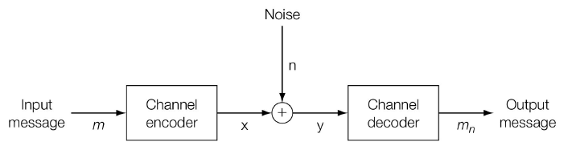

- Channel Encoder

  - Source coder
    - maps a message into a sequence of symbols drawn from some alphabet
  - Modulator
    - converts a sequence of symbols into a physical signal that can travel over the channel.
  
- message & signal

  - message

    ​	说的具体内容，需要的信息（数字的

  - signal

    ​	与信道相关（物理层面的

  - message经过source coder与modulator后变为signal

- Secure Transmission

  - Passive security (aims at message)

    ​		message layer

    

  - Active security (aims at transmission)

    ​		transport layer  (key based channel encoding)

    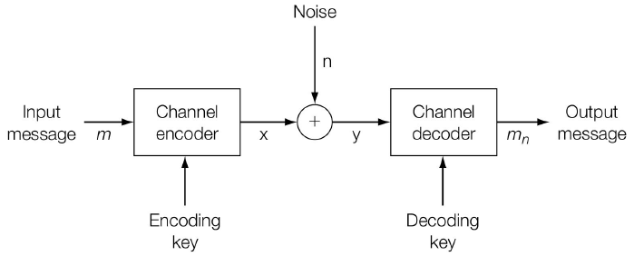

##### 3.3 Communication-Based Models of Watermarking

- Models

  - from embedder to decoder

    $c_{wn} = c_o+w_a+n$

  - How to use cover work

    - As Noise

      - Noise 1 (using informed detector)

      

      ​	$c_o$并非一定需要

      - Noise 2 (using blind detector)

        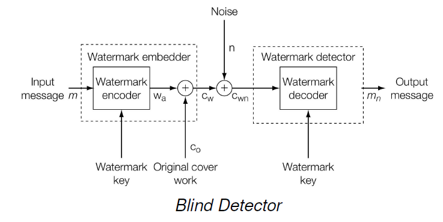

        $w_a$ is corrupted by both $c_o$ and $n$.
      
      - Examples

        - Blind Embedding (E_BLIND)
    
          
    
        - Linear Correlation Decoder (D_LC)
    
          
  
  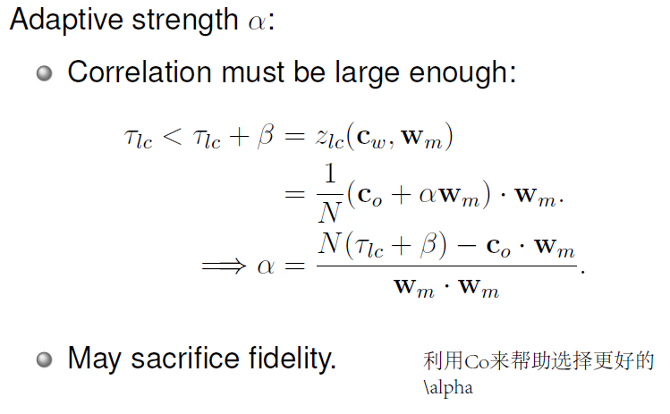
  
  可以达到100% effectiveness；而 false positive rate保持不变==（false positive rate只与检测算法、原图和水印有关）==
  
- ROC曲线（离左上角越近，检测准确率越高）

  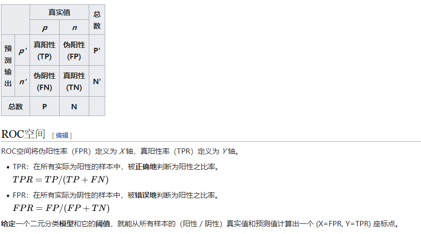 

#### 3.4 Geometric Models of Watermarking

> - media space: a point corresponds to a work (the dimension is the number of pixels)
> - marking space: projections or distortions of media space

- Region and Distributions

  - Distribution of unwatermarked works

    - different statistical distributions
    - useful for false positive rate

  - Region of acceptable fidelity

    - depends on human perception
    - approximate by MSE:     $D_{mse}(c_1,c_2)=\frac 1{N}|| c_1-c_2||^2$   ( a ball )

  - ==Detection region==

    - describe the behavior of the detection region (works containing the watermark)

    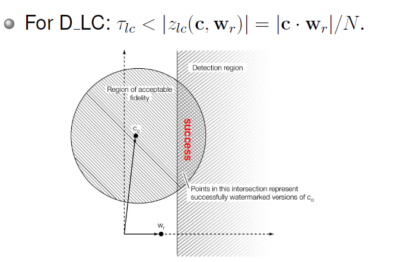

  - ==Embedding distribution (embedding region)==

    - The region (probability) of watermark embedder output for all the unwatermarked works.
    - type
      - every point is possible: E_BLIND
      - only in detection region: E_FIXED_LC: 100% effectiveness $\Leftrightarrow$ embedding region $\subset$ detection region

                       

  - Distortion distribution

    To judge the effects of attacks on watermarked content

- Marking Space

  > - usage: Performing a projection or distortion of media space into marking space. The rest of the system can be viewed as a simple watermarking system.
  > - purpose:
  >   - lower cost of embedding and detection
  >   - simpler distribution
  >     - average blocks: more closely Gaussian
  >     - fourier: acceptable fidelity is more closely spherical
  >     - normalization: cancel out geometric and temporal distortions
  
  - embedding in marking space
    $$
    v = \tau(c), v_w=g(v, w(m)), c_w=\tau^{-1}(v_w, c)
    $$
  
  - Embedder
  
    
  
  - Detector
  
    
    
  - perfromance
  
    - if using D_LC: identical to D_LC (特殊性：周期性)
    - faster but smaller key space
  
- Modeling watermarking detection by correlation

  - linear correlation：平面

    ​	

  - normalized correlation：圆锥

    ​	

  - correlation coefficient：

    ​	The correlation coefficient between two vectors in N-space is just the normalized correlation between those two vectors after projection into an (N−1)-space.

### Chapter 4. Basic Message Coding

#### 4.1 Mapping Messages into Message Vectors

- Direct Message Coding
  
  - one-one-mapping: $|W| = |M|$
  - Design of $W$
    - false positive rate
    - fidelity
    - robustness
    - ...
  - Correlation in $W$
    - goal: low correlation -> ==negative correlation==
  - Sequence of Symbols
    
  - 一个sequence只能对应一个message; 但一个message可以对应多个sequence
    
  - The Index/Order
  
    - time-div multiplexing
  
    - space-div multiplexing
  
    - freq-div multiplexing
  
    - ==code-div multiplexing== 
  
      - 同一行强调唯一性；不同行强调独立性
        - 同一个message index中的pattern最好负相关
        - 不同index中的pattern最好正交（独立，不相关，不妨碍）
    
    

> - Hamming Code
>
> 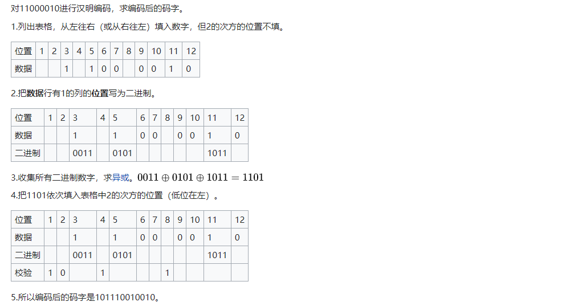
>
> - Hamming Distance
>
>   ​	两个字符串对应位置的不同字符的个数

#### 4.2 Error Correction Code

- In general, the smallest possible inner product between two message marks that differ in $b$ symbols is $N(L-2b)$, where $N$ is the dimensionality of the marking space, $L$ is the length of the message.

- expand the alphabet -> equiv to : increasing length in capacity

- Trellis Codes and Viterbi Decoding

  - Encoding

    - input bit is 0: traverse light arc, output 4 bits
    - input bit is 1: traverse dark arc, output 4 bits

    > - convolutional coding
    >
    >   - slicing window
    >
    >     
    >
    >     读入1位，输出2位 ——> 增大word space
    >
    > - Trellis code是convolutional code的特例

  - Decoding

    总hamming distance最小

    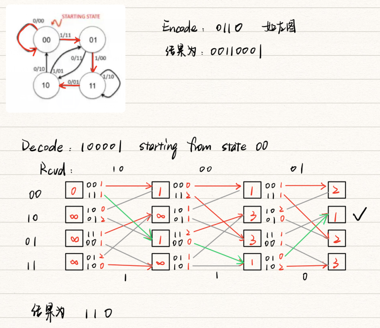

#### 4.3 Detecting Multisymbol Watermarks

- valid messages

  - decode过程会先将经过ECC，所以Trellis Padding会降低false positive rate

- Geometric Interpretation

  - Large threshold -> no overlap for the cones 

    

  - work只可能检测出含有一种水印

  - 修正: reencode

    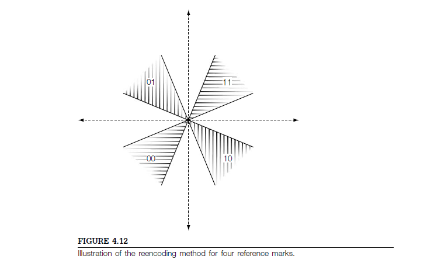

### Chapter 5. Watermarking with Side Information

> EBLIND中通过scaling修改$\alpha$的值

#### 5.1 Informed Embedding

- Illustration of the problems associated with a fixed normalized correlation embedding strategy
$\beta$越大，锥体越小

  

- Robustness Measurement

  - definition: Amount of white Gaussian noise that can be added to the embedded vector $v_w$, before it is expected to fall outside the detection region.

- Fidelity Constraints

  ​	for highest fidelity: $C_w=W_m$   -> stupid

  - media space: do not resemble the original work at all
  - marking space: occasionally feasible: 每个像素做修改，有自由度

#### 5.2 Watermarking using Side Information

- Shannon-Hartley Theorem

  - the more dirt, the less information can be reliably sent

  > Shannon Theorem: the rate the an additive white Gaussian noise channel is given by
  > $$
  > R=\frac 1{2}\log(1+\frac {P_c}{P_a})
  > $$
  > where $P_c$ is the signaling power and $P_a$ is the distortion power.

#### 5.3 Dirty-Paper Codes

- difference
  - classical notion of a code: one message, one code word
  - dirty-paper code: one message, a set of candidate code words

- quality of dirty-paper codes
  - density of the subcode words
    - higher the density -> less embedding distortion
  - density of union code book
    - lower the density -> better robustness

- LSB watermarking

  - 仅修改最低有效位，使LSB包含message

  

  - advantages
    - high payload
    - good fidelity for 1-bit only
  - drawbacks
    - not robust
    - false positive rate较高

- Quantization Index Modulation

  
  - 思想

    ​	根据水印信息，把原始载体数据用量化器量化到不同的索引区间，水印检测时则根据调制后的数
    据所属的量化索引区间来识别水印信息。

  - example

    

- Lattice Codes

  将QIM从1维拓展到2维

  

### Chapter 6: Practical Considerations for Dirty-Paper Codes

#### 6.1 Practical Considerations for Dirty-Paper Codes

- efficient
  - efficient encoding algorithm
    - low cost
      - low distortion to the cover work
      - efficiently in computation
  - efficient decoding algorithm
    - good metric
      - robust against some distortions
      - efficiently in computation

- tradeoff between Robustness and Encoding Cost
  - code separation: code与polluted code的距离 （距离越远，越robust
  - coset formation: wide but close spacing for low cost (lattice 就是比较好的结构)

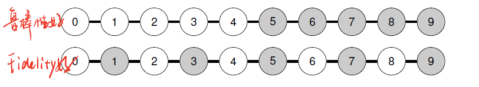
#### 6.3 A Simple Lattice Code

- ==N-Dimensional Lattice==

  

### Chapter 9 :Robust Watermarking

==2D angle QIM==

### Chapter 10: Watermark Security

> Ambiguity Attack with Blind Detection

- directly using $c_d/||c_d||^2$ as $w_f$
  - $c_f=c_d-c_d\approx 0$ has poor fidelity
- better solution
  - using Fourier transformation $F$:  $w_f=F^Tc^2_d=F^TDFc_d$
  - refinement: add noise before applying Fourier transformation: $w_f=(F^TDF)(c_d+n)$

- Countering Ambiguity Attacks
  - make the reference pattern dependent on $c_o$

### Chapter 11: Content Authentication

- Embedded Signatures

  > making the watermark 'link' to cover

  - Signatures, e.g. SHA, MD5
  - Partition the cover into two parts (one for signatures, one for embedding)

- Erasable Watermarks

  - idea
    - $c_w$ is a work with authentication $w_r$
    - I can get the true original unmodified $c_o$: remove $w_r$ from $c_w$
    - verify $w_r$ with $c_o$

  - example (use E_BLIND and D_LC)

    - $c_w = c_o + w_r$ 

      - pixel value clamping --> modulation ($c_w=c_o+w_r \text{ mod 256}$)

        ​													--> salt-and-pepper noise影响fidelity

  - Practical Solutions for Erasability ( ==Difference Expansion== )

    - fact: neighboring pixels in images are more likely to have similar values

      

      - convert it back

      

      - Modulo 3 ($y_1-y_2=3(x_1-x_2)$)
        - embed
          - embed 1: $y_1+=1$
          - embed 0: $y_1-=1$
        - detect ($y_1-y_2 \text{ mod 3}$)
          - 0: no message
          - 1: 1
          - 2: 0

      > 若不expand直接做mod, 我们就得不到唯一$c_o$; 但优点是: less change on brightness, noisy is better than block change

  - Fundamental Problem with Erasability

    - perfect erasable watermarking --> impossible (media space cannot hold $c_o$ and $c_w$; 100% effectiveness -> 100% false positive rate)

### Chapter 12: Steganography

> main requirement of steganography: (statistical) **undetectability** not imperceptibility

- embedding function

  - cover lookup

    - definition: the cover works are preexisting and the embedder does not modify the cover works
    - 方法:
      - labeling work by messages
      - deliver the messages by sequence of transmission
    - 特征: payload低

  - cover synthesis

    - definition: the cover works are generated based on the hidden message and the embedder does not modify the cover works
    - 方法: creates the stego work without recourse to a cover work
    - 特征: 范围受限 (packer but nature sequence of lookup)

  - ==cover modification==

    - definition: the cover works are preexisting and the embedder modifies the cover works.

    - location of changes (selection rule)
      - sequential selection
      - pseudo-random selection
      - adaptive selection (informed): e.g. 不改背景.改噪点多的地方

- LSB

  - We see that the histogram bins of each PoV, (2i, 2i + 1), have been equalized
    by embedding (因为LSBs是完全随机的)

- Practical Steganography Methods

  - Statistics Preserving Steganography ==(OutGuess)==

    - Preserving DCT Statistics

      - first pass: LSB along a pseudo-random walk
      - second pass: correct the coefficients to restore the histogram (未使用的用来校正直方图)

    - ==for simple detection==

      

  - Model-Based Steganography

- embedding efficiency

  - definition: the average number of embedded bits per unit distortion
    - LSB: 2 = 1/0.5 (embed 1 bit; 50% of chance to change)

- Masking Embedding as Natural Processing

  - Preserving statistics

  - mimicked some natural process

    - ==F3== (1往奇数; 0往偶数    ---->    与LSB相同)

      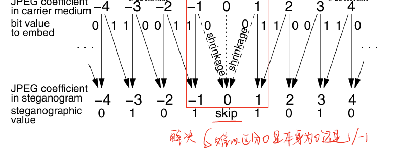

      - F3 embedding

      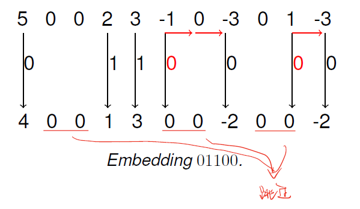

      - F3 Problem
        - in normal work:  $P(2i-1) > P(2i)$
        - in steganographic work:  $P(2i-1)<P(2i)$  (0会变多)

    - F4 (正数: 1往奇数,0往偶数; 负数: 0往奇数,1往偶数    ----> 正LSB,负逆LSB)

      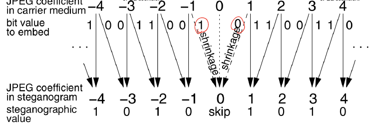

      - F4 Embedding

        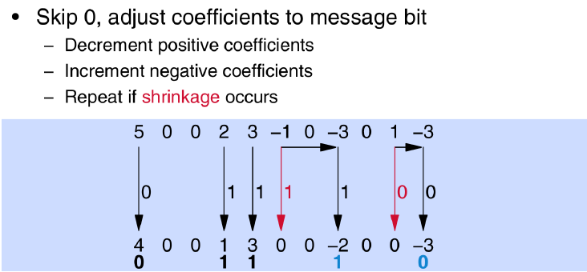

      - More Efficiency

        - $5\%$ shrinkage实际上的change数为: $5\%+\frac {95\%}{2} = 52.5\%$
        - Matrix Encoding的efficiency会高很多

    - F5 (==Matrix Encoding==)

      - Policy

        Embedding $b_1,b_2$ to $x_1, x_2,x_3$ with at most 1 change

        

         Change $x_i$ accordingly.

      - Efficiency: $2/(3/4) = 8/3>2$

      - Upper Bound on Embedding Efficiency

        ​	For a message set $M$, in an $n$-pixel image, the minimal number of change $R$ (in the sense of exception), the upper bound on embedding efficiency would be $\frac {\log_2 |M|}{R}$

        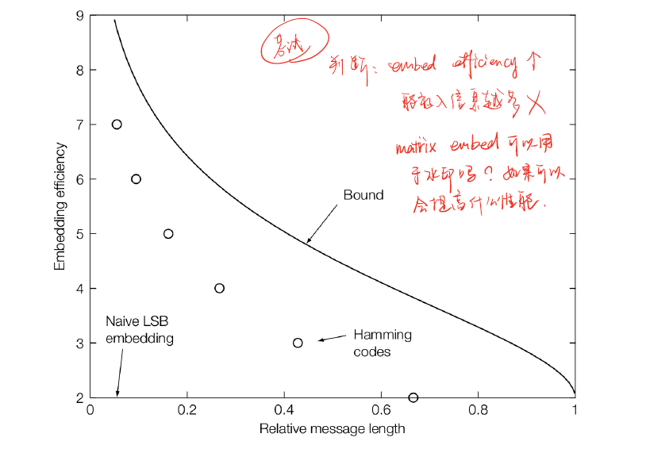

- Wet Paper Codes with Syndrome Coding   (cover image: $x$, received image: $y$)

  Message $m\in\{0, 1\}^m$ in $y\in \Z^n$ via a shared parity matrix $D\in\{0,1\}^{m\times n}$     XOR modulation
  $$
  D_{m\times n}y_{n\times 1}=m_{m\times 1}
  $$
  In $x$, there are:

  - dry part: $x[j],j\in J\sub\{1,...,n\}$, which can be changed
  - wet part: $x[j], j\notin J$, which cannot be changed

  Thus, the change $v=y-x$ has the property: $v[j]=0,j\notin J$.

  Under the above constraints, solve the following equation:
  $$
  \begin{align}
  Dy\ =&\ m\\
  D(x+v)\ =&\ m\\
  D v\ =&\ m-Dx    \tag{12.1}
  \end{align} 
  $$
  Using a permutation matrix $P$ tp sort fixed $v[j]$ to the end:
  $$
  Pv=
  \left(
  \begin{matrix}
  u_1\\u_2\\...\\u_{|J|}\\0\\...\\0
  \end{matrix}
  \right)=
  \left(
  \begin{matrix}
  u\\0
  \end{matrix}
  \right)
  $$
  因此, 上述$(12.1)$式可改写为
  $$
  \begin{align}
  Dv\ =&\ m-Dx=z\\
  (DP^{-1})(Pv)\ =&\ z\\
  \left(
  \begin{matrix}
  H K
  \end{matrix}
  \right)
  \left(
  \begin{matrix}
  u\\0
  \end{matrix}
  \right)
  \ =&\ z\\
  H_{m\times |J|}u\ =&\ z
  \end{align}
  $$

- ==Arithmetic coding==

  - encoding

    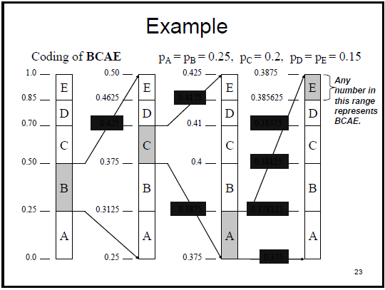

  - decoding

    ​						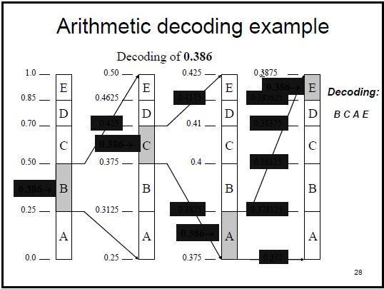

### Chapter13: Steganalysis

- Some Significant Steganalysis Algorithms

  - Sample Pairs Analysis

    Given a sequence of values $s_1,s_2, ...,s_n$. All adjacent pairs $P=\{(u,v)=(s_i, s_{i+1},1\leq i\leq n \}$

    - Partition of $P$

      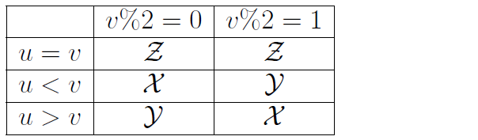

    - Continue partitioning $y$ into $W,V$

      - $W$:  $\{(u=2k,v=2k+1\vee (u=2k+1,v=2k),\ k\in \Z \}$         (i.e. $|u-v|=1$)

      - $V = y-W$

      (The bin of LSB: $W+Z$)

​						

