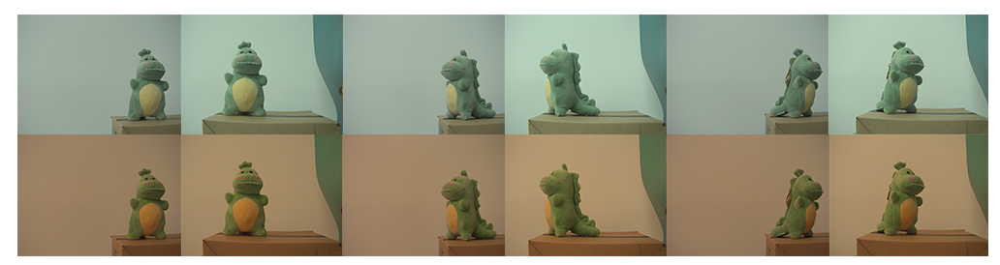
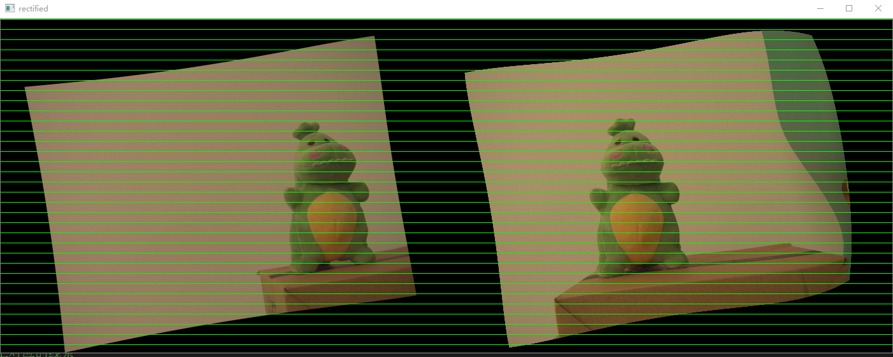
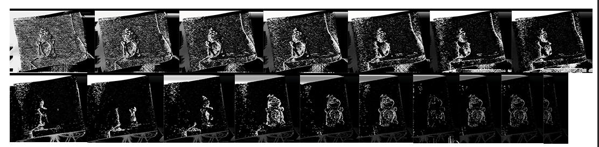
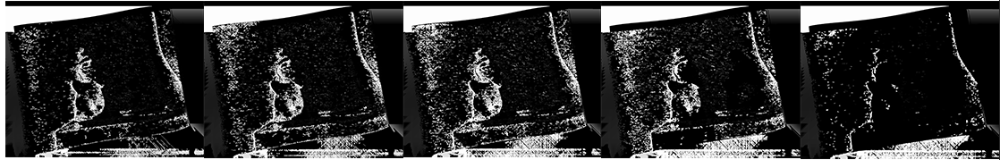
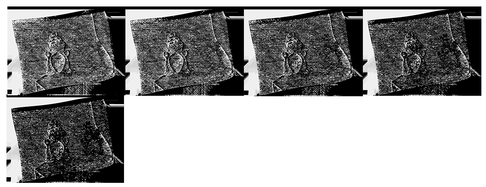
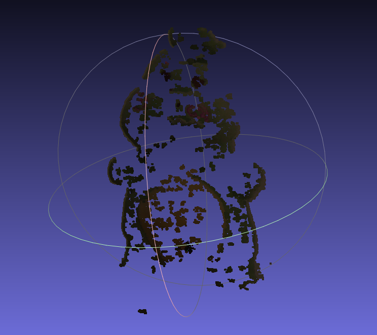
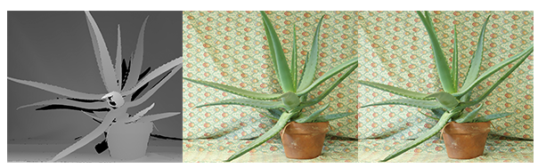
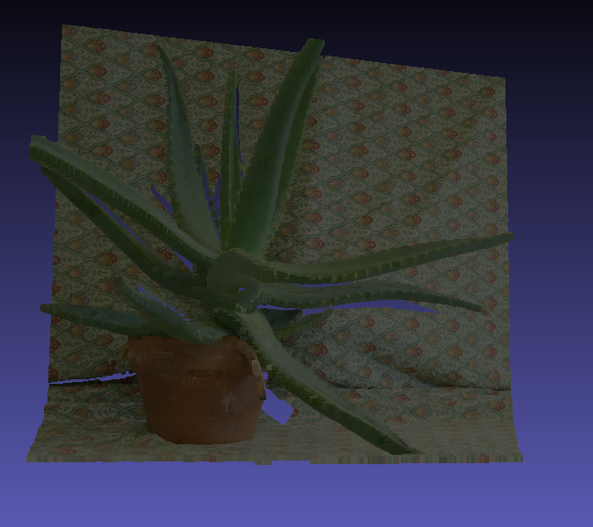

## Report of A3

​																																																				G6

### 1. Stereo Calibration

​	To do the stereo calibration, we took 17 pairs of images of chessboard from different angles and different depth using our stereo camera.


​	Using the `stereoCalibrate()` function, we get the intrinsic matrix and extrinsic matrix as well as matrix $Q$ in .xml files. We just show the intrinsics.xml here：

```xml
<!--- intrinsics.xml></intrinsics.xml> -->
<?xml version="1.0"?>
<opencv_storage>
<M1 type_id="opencv-matrix">
  <rows>3</rows>
  <cols>3</cols>
  <dt>d</dt>
  <data>
    2.6569861182035270e+03 0. 1.0353951278310813e+03 0.
    2.6569861182035270e+03 9.9966105606385088e+02 0. 0. 1.</data></M1>
<D1 type_id="opencv-matrix">
  <rows>1</rows>
  <cols>14</cols>
  <dt>d</dt>
  <data>
    -2.0385227775148645e-01 3.7264672265277188e-02 0. 0. 0. 0. 0.
    -1.7820328178889719e-01 0. 0. 0. 0. 0. 0.</data></D1>
<M2 type_id="opencv-matrix">
  <rows>3</rows>
  <cols>3</cols>
  <dt>d</dt>
  <data>
    2.6569861182035270e+03 0. 1.0360143419277833e+03 0.
    2.6569861182035270e+03 9.9733343911860959e+02 0. 0. 1.</data></M2>
<D2 type_id="opencv-matrix">
  <rows>1</rows>
  <cols>14</cols>
  <dt>d</dt>
  <data>
    -4.0372736431497286e-01 -3.2929285008962944e-01 0. 0. 0. 0. 0.
    -2.3254422354827882e+00 0. 0. 0. 0. 0. 0.</data></D2>
</opencv_storage>
```


### 2. Radiometric Calibration

​	Since the RGB of the images taken from the camera are not standard, so we need to perform the radiometric calibration. In radiometric calibration, we took pictures of pure blue, green and red, examining the RGB in the images with the standard RGB to get the $3\times 3$ RGB modification matrix. Here is the experiment data: 


| 标准RGB     | left camera                  | right camera                |
| ----------- | ---------------------------- | --------------------------- |
| (0, 0, 255) | (0, 0, 253)                  | (0, 0, 252.432)             |
| (0, 255, 0) | (1.87088, 233.388,  101.998) | (2.07407, 231.939, 103.326) |
| (255, 0, 0) | (254.876, 86.892, 10.6445)   | (254.975, 98.2325, 20.0926) |

​		After the computation, the RGB modification matrix is derived
$$
\text{RGB modification matrix of left camera} =
    \left[
    \begin{matrix}
		1.003228199 & -0.3735089407 & 0.1083727366\\
		-8.042056887\times10^{-3} & 1.095595277 & -0.4413554282\\
		0 & 0 & \frac{255}{253}
    \end{matrix}
    \right]\\
    \text{RGB modification matrix of right camera} =
    \left[
    \begin{matrix}
		1.003555441 & -0.4250331329 & 0.09409637228\\
		-8.974101952\times10^{-3} & 1.103227782 & -0.4508612249\\
		0 & 0 & 1.010173037
    \end{matrix}
    \right]
$$

​	We can then convert the images taken by the camera to the "standard images" using the RGB modification above.




### 3. Compute disparity map and Analysis

#### 3.1 Get the disparity map

​		First, we need to perform the rectification to minimize the effect of distortion as well as to make the matching process easier. Here is an example of rectified images.



​		Using the rectified images, we can perform the SGBM algorithm to get the disparity map. There are 3 factors that would influence the effect of the SGBM algorithm: `numDisparities`,  `blockSize` and `uniquenessRatio`. We will further cover the discussion of these parameters' effect.

#### 3.2 Evaluate the impact of different parameters over final quality

##### 3.2.1 numDisparities

​		`numDisparities` is maximum disparity minus minimum disparity. The value is always greater than zero. In the current implementation, this parameter must be divisible by 16.

​	

​	We tested the value of  `numDisparities` from 16 to 1920, and found that the quality of disparity map is not positively corelated with the value of `numDisparities`.  And when `numDisparities` ranges from 320 to 640, we can hardly distinguish the object in the derived disparity map.


##### 3.2.2 blockSize

​		 Matched block size(patch size). It must be an odd number, somewhere in the 3...11 range.



​	As you can see, when the patch size gets too large (i.e. aroud 11), the diaprity map is quite bad. We conclude that increasing the `blockSize` mitigates the effect of noise and resulting in less matched pixels.


##### 3.2.3 uniquenessRatio

​		Margin in percentage by which the best (minimum) computed cost function value should "win" the second best value to consider the found match correct. Normally, a value within the 5-15 range is good enough.



​	We found that when the uniqueness ratio gets too large, the quality of the disparity map will get worse, so in our experiment, we set this value to 5.


### 4. Produce the final colored 3D point cloud

​	We use Martin Peris's method to reconstruct the scene in 3D using PCL, which uses the rectified left image, the disparity map as well as the matrix $Q$ derived in stereo calibration. The point cloud seems okay, but when we open the generated .ply file in Meshlab, the mesh is not satisfying. You can watch the video `viewPointCloud.mp4` which record the view in the PCL cloud viewer.



​																						(the resulted could point is quite unsatisfying)


### 5. Run the sample image from openCV sample

​	To demonstrate that our implementation is correct, we use the images from the openCV sample.

​				

​	We make use of the disparity map and generate the point cloud. The final pointcloud_sample.ply file in the Meshlab looks as this:



​	It is quite amazing. So it demonstrate that the quality of the disparity map really makes a difference. But in our experiment, we cannot get such a smooth disparity map even we have spent a lot of time in tuning parameters. (also the calibration stage also matters)