## Report

​																																						G6

### 1. 双目+投影仪

​		双目+投影仪与A3实验中的方法一样，只是在对物体进行拍摄时用投影仪在物体上投噪声，人为加强两张图片的区分度。我们采用的是Xbox Kinet的噪声图，如下：


<center style="font-size:14px;color:#000000;">图1：实验所用的噪声图</center>		

#### 1.1 双目标定

​		本实验中的双目标定就是最经典的棋盘格标定，我们用工业相机对棋盘格从不同角度、不同距离拍摄了17组图片，如下：

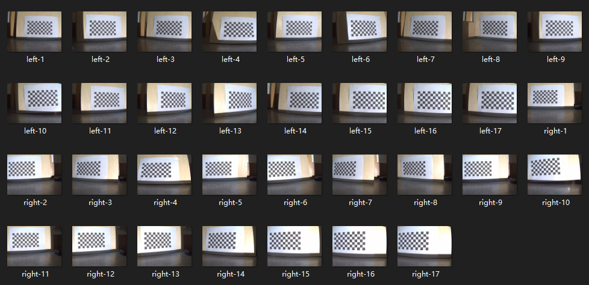

<center style="font-size:14px;color:#000000;">图2：双目标定</center>		

​			我们也尝试了在标定时打噪声，但这会影响找角点，从而导致无法正常标定


<center style="font-size:14px;color:#000000;">图3：有噪声的双目标定</center>		

​		通过`stereoCalibrate()`函数，我们可以获得以.xml格式存储的内参矩阵与外参矩阵以及转换矩阵$Q$. 内参矩阵如下：

```xml
<?xml version="1.0"?>
<opencv_storage>
<M1 type_id="opencv-matrix">
  <rows>3</rows>
  <cols>3</cols>
  <dt>d</dt>
  <data>
    3.6092386941054965e+03 0. 1.2435147842388342e+03 0.
    3.6092386941054965e+03 1.0610963173798152e+03 0. 0. 1.</data></M1>
<D1 type_id="opencv-matrix">
  <rows>1</rows>
  <cols>14</cols>
  <dt>d</dt>
  <data>
    -3.7297279533960692e-01 -2.1174827089616599e+00 0. 0. 0. 0. 0.
    -1.1835261951199508e+01 0. 0. 0. 0. 0. 0.</data></D1>
<M2 type_id="opencv-matrix">
  <rows>3</rows>
  <cols>3</cols>
  <dt>d</dt>
  <data>
    3.6092386941054965e+03 0. 1.2400041052389995e+03 0.
    3.6092386941054965e+03 1.0622880023745945e+03 0. 0. 1.</data></M2>
<D2 type_id="opencv-matrix">
  <rows>1</rows>
  <cols>14</cols>
  <dt>d</dt>
  <data>
    -4.1318399170902159e-01 -9.5018956089294981e-01 0. 0. 0. 0. 0.
    -8.1587983740844034e+00 0. 0. 0. 0. 0. 0.</data></D2>
</opencv_storage>

```

#### 1.2 辐射标定（Radiometric Calibration）

​		同上一个实验，为了得到经过RGB颜色矫正的点云，我们需要对相机进行辐射标定，获得的RGB矫正矩阵如下：
$$
\text{RGB modification matrix of left camera} =
    \left[
    \begin{matrix}
		1.003228199 & -0.3735089407 & 0.1083727366\\
		-8.042056887\times10^{-3} & 1.095595277 & -0.4413554282\\
		0 & 0 & \frac{255}{253}
    \end{matrix}
    \right]\\
    \text{RGB modification matrix of right camera} =
    \left[
    \begin{matrix}
		1.003555441 & -0.4250331329 & 0.09409637228\\
		-8.974101952\times10^{-3} & 1.103227782 & -0.4508612249\\
		0 & 0 & 1.010173037
    \end{matrix}
    \right]
$$

#### 1.3 计算深度图

​		为了认为提高左右相机拍到的区分度，我们采用了Xbox Kinet的噪声图，利用投影仪打到恐龙身上。

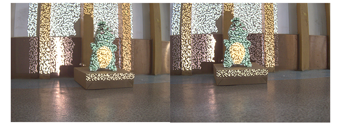

<center style="font-size:14px;color:#000000;">图4：将噪声打在物体上</center>		

​		我们先通过rectification来尽可能减小扭曲，来让优化后期的匹配效果。然后通过SGBM算法进行左右相机照片的匹配，生成位差图（完全看不出恐龙形状）

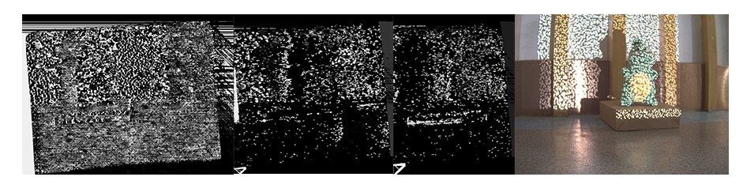

<center style="font-size:14px;color:#000000;">图5：numDisparity分别为16,640,1120的位差图及原始图</center>		

​			因而生成的点云也完全不知道是什么...（见pointcloud.ply）


### 2. 单目+投影仪

#### 2.1 实验原理

​		基于结构光的重建包括了双目三维重建和单目三维重建。双目的重建方法主要采用双目立体视觉算法来匹配两幅图片的相位信息，而传统的单目三维重建算法是将投影仪设备当作一个反向相机来处理，其本质也还是双目的立体匹配方法。标定过程需要确定的参数与双目成像系统相似，分别是相机矩阵$K_c$，投影仪的内参矩阵$K_p$，以及相机和投影仪之间的外部矩阵：旋转矩阵$R$和平移矩阵$T$。此外，由于相机和投影仪镜头存在的畸变，我们需要还标定出他们的畸变系数$d_c$和$d_p$。

​		标定过程如下：首先，利用相机拍摄空间中的棋盘格标定板，并提取出拍摄到的棋盘格标定板的角点；然后，我们利用投影仪将编码后的结构光依序投射在棋盘格标定板上，并对相机图片拍摄的投影仪的光进行解码；最后，我们要找到相机图片中棋盘格标定板的角点对应的投影仪“图片”中的像素。这样就使得投影仪能够确定标定板上的有效角点。

​		但在解码过程中，直接把相机棋盘格图片上每个角点对应的相机像素点对应到其解码出的投影仪编码位置上会存在较大误差，因此Brown大学提出了通过对相机中看到的棋盘格角点求解局部单应性（local homography）矩阵，再通过每个棋盘格角点获得的局部单应性矩阵把相机平面下的棋盘格角点转换到投影仪平面上，这样就获得了棋盘格角点在投影仪图片上的准确成像位置，且每个角点在投影仪图片上的成像坐标是亚像素级的。

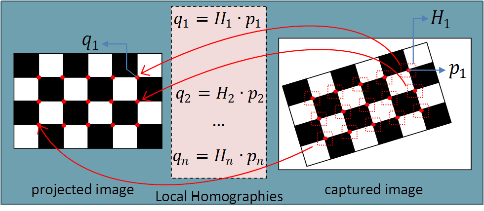

<center style="font-size:14px;color:#000000;">图6：坐标系转换原理</center>	

​		如图所示，captured image表示的是相机图片，projected image表示的是假想的投影仪图片。利用相机图片中每个角点附近的像素点集及其对应的解码坐标，计算一个局部单应性矩阵$H$，然后把相机图片上的角点$p$与单应性矩阵相乘，就可以得到棋盘格角点在投影仪图片上的成像位置$q$。需要注意的是，我们要对一幅棋盘格图片上的每个角点都单独计算一个局部单应性矩阵$H$，如图中所示，如果棋盘格上有$n$个角点，则每幅棋盘格图像要计算$n$个局部单应性矩阵。

​		需要注意的是，在实际标定过程中，由于投影光容易受到外界环境影响，具体体现在光投射在黑色物体上容易显得过暗，而光投射在白色物体上就会显得很亮，棋盘格标定板因为其既有黑色格子又有白色格子，无法保证在同一投影仪光强下，同时满足黑色棋盘格区域和白色棋盘格区域的解码需求。实际上，黑色物体的光解码是结构光的挑战之一。棋盘格的这种特性，给实际的解码提出了比较大的挑战。在实际应用时，有些论文会主张蓝白棋盘格，并投影红光，来避开棋盘格黑色部分带来的挑战。

#### 2.2 实验过程

1. 获取相机拍摄的棋盘格标定板图片，获取棋盘格角点坐标

   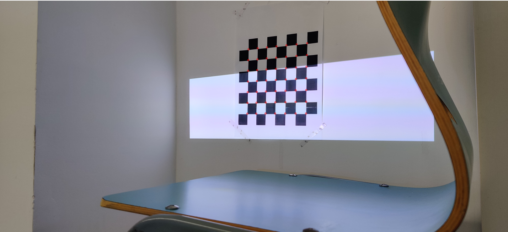

   <center style="font-size:14px;color:#000000;">图7：单目相机标定获取角点</center>	

2. 并保持标定板位置不变，依次将gray code结构光编码到标定板上，对相机拍摄到的投影结构光进行解码

   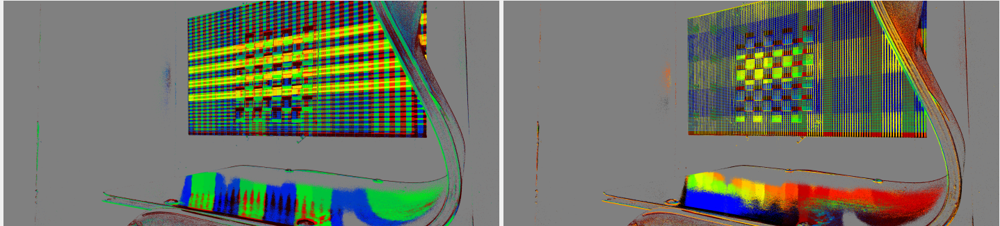

   <center style="font-size:14px;color:#000000;">图8：经过译码后的图</center>	

3. 对每个找到的标定板图片中的特征点坐标求局部的单应性矩阵，并使用局部单应性矩阵计算出特征点在投影仪图片上的坐标

4. 改变棋盘格标定板位置与姿态，重复上述步骤至少三次，并利用找到的棋盘格角点在相机坐标系与投影仪坐标系中分别算出相机和投影仪的内部矩阵与畸变系数

5. 对两个坐标系下的特征点进行双目标顶计算，得到相机和投影仪之间的外部矩阵

   

#### 2.3 实验结果

​		可能因为我们使用了彩色打印的棋盘格，在投影仪的强光照射下黑色棋盘格很亮，无法与白色进行很好的区分，导致无法保证在同一投影仪光强下，同时满足黑色棋盘格区域和白色棋盘格区域的解码需求。

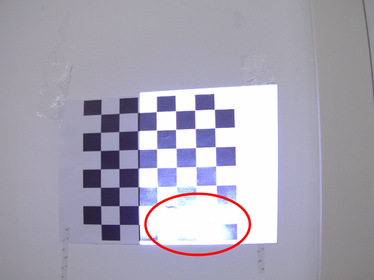

<center style="font-size:14px;color:#000000;">图9：反光可能会导致译码失败</center>	

​		同时，使用长宽不等的棋盘格来进行标顶效果会更好，这样能够在运行程序时更好地区分相机坐标系与投影仪坐标系下的棋盘格。

​		我们尝试了各种方法，换了相机（手机、工业相机）、换了棋盘格（非正方形）、换了实验环境，换了棋盘格的摆放方式（考虑到不让背景影响到译码，我们先后采用了木板，全黑电脑屏幕作为背景），但就是无法成功译码。以下是**部分**实验截图：

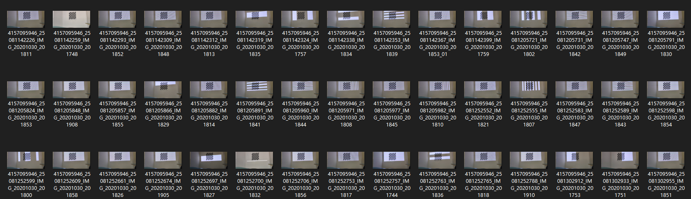

<center style="font-size:14px;color:#000000;">图10：10月30日5点摄于实验室</center>	

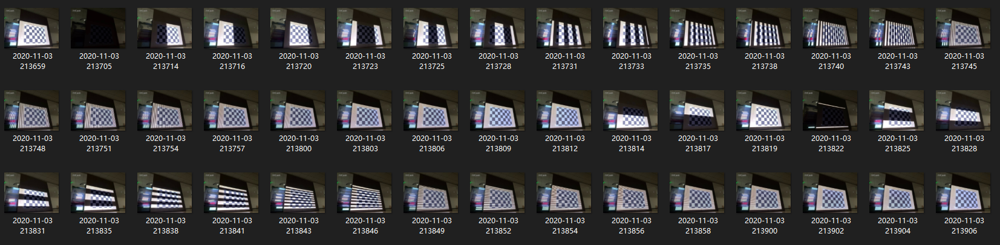

<center style="font-size:14px;color:#000000;">图11：11月3日21点摄于曹西</center>	

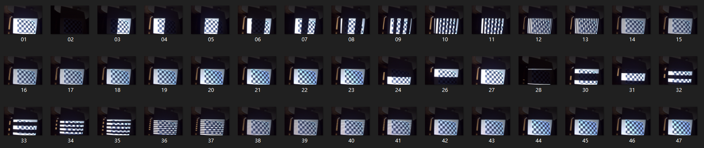

<center style="font-size:14px;color:#000000;">图12：11月4日凌晨1点摄于曹主</center>	

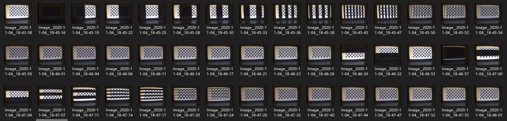

<center style="font-size:14px;color:#000000;">图13：11月4日18点摄于1舍</center>	

​		以上尝试均以失败告终。因为我们的实验方法为：固定相机和投影仪位置，改变棋盘格姿态，保证棋盘格全都在投影的结构光中，然后拍照片。我们还询问了另外一组，用他们所说的“固定棋盘直接拍三组照片”的方式，但也无法通过decode。

​		这次实验总的来说比较失败，尽管我们在上面花费了很多时间与精力，但仍没有取得满意的结果......