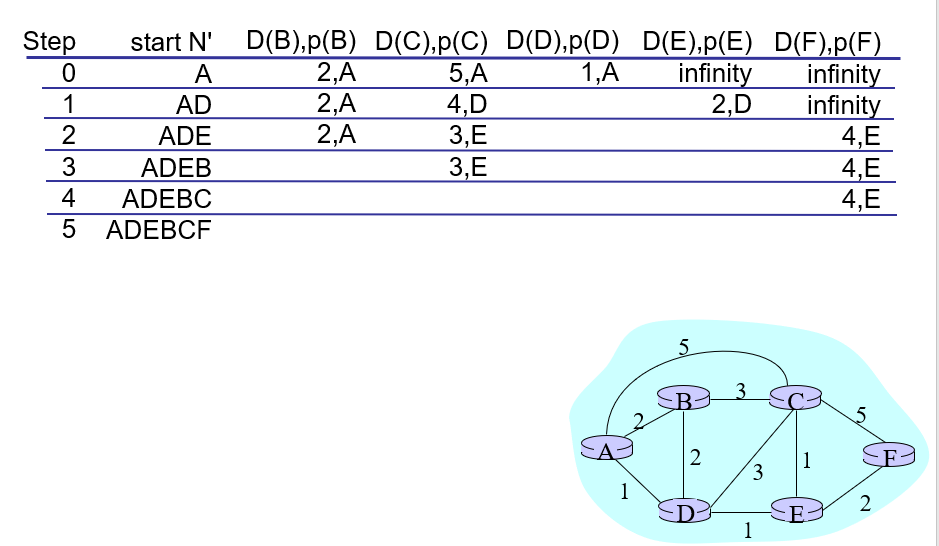

## Homework

​																																	王睿 3180103650

#### 1. Cryptography

##### a.

​	Symmetric cryptography uses the same key for the encryption and decryption. While the Asymmetric cryptography uses  a pair of keys: public keys for encryption and private key for decryption.

##### b.

​	Symmetric key algorithm is fast but not very secure, while the asymmetric key algorithm is secure enough but it takes too long to encrypt and decrypt messages. So normally we use asymmetric cryptography to pass the secret key of the symmetric cryptography, and use symmetric key algorithm to communicate.  

##### c.

​	The RSA algorithm involves 4 processes: key generation, key distribution, encryption and decryption.

- Key generation

  1) choose two distinct prime numbers $p$ and $q$.

  2) compute $n=pq$

  3) compute $\lambda(n) = \text{lcm}(p-1, q-1) $    

  4) choose an integer $e$, such that $e$ and $\lambda(n)$ are coprime.

  5) determine $d$ as $d \equiv e^{-1}(\text{mod  } \lambda(n))$

  > The public key consists of the modulus $n$ and the encryption exponent $e$.
  >
  > The private key consist of the decryption exponent $d$.

- Key distribution

  ​	Suppose $A$ send information to $B$ via RSA. Then $B$ needs to send his public key $(n, e)$ to $A$ and  $A$'s private key $(d)$ is never distributed.

- Encryption

  ​	Suppose $A$ want to send message $M$ to $B$. 

  ​	$A$ first converts $M$ into an integer $m$, such that $0\leq m<n$ by using an agreed-upon reversible protocol (padding scheme). 

  ​	Then he computes the ciphertext $c$ using $B$'s public key $e$, corresponding to $m^e\equiv c (\text{mod  } n)$

  ​	After that, $A$ transmits $c$ to $B$.

- Decryption

  ​	$B$ can recover $m$ from $c$ by using his private key exponent $d$ by computing: $c^d\equiv (m^e)^d \equiv m(\text{mod  }n)$

  ​	Given $m$, he can recover the original message $M$ by reversing the padding scheme.

#### 2. Cryptanalysis

##### a.

- Average trying time: $\frac {1+2^n}{2}$

- Details:

​	This question asks us to compute the expectation of cracking the password using brute force.

​	Suppose the password is $n$-bit, then the size of the password value space is $2^n$ (ranging from $0$ to $2^n-1$). As a result, for password valued $i$, we need to try $i+1$ times (from $0$ to $i$), so the expectation would be 
$$
E(X)=\frac{\Sigma_{i=0}^{2^n-1} (i+1)}{2^n}=\frac{(1+2^n)\cdot 2^n / 2}{2^n}=\frac {1+2^n}{2} 
$$

##### b.

​	Relay attack acts like this: suppose $A$ sends  encrypted message $m$ to $B$, upon receival $B$ will perform an specific behavior. The attacker $C$ observed this pattern, so he can simply relay message $m$ to $B$, so that $B$ will mistaken that this message is sent by $A$ so he will perform that behavior as usual.

​	To address this problem, we can use multiple methods like Limit Message Freshness, Timestamp and One-time session key, so that the receiver can verify if the message is sent by the specific sender or an attacker. 

##### c.

​	Man-in-the-middle attack acts like this: suppose $A$ and $B$ are communicating with each other. The attacker make independent connections with the victims and relays messages between them to make them believe they're talking directly to each other over a private connection, when in fact the entire conversation is controlled by the attacker.

​	To address this problem, we can use some authentication method like using a certificate authority (CA) or it is possible to use some latency examination to potentially detect the attack.

##### d.

​	A relay attack in wireless communication acts like this: the attacker relies on the data between the two legitimate parties without them knowing. The attacker imitates the two parties and makes them believe that the data is exchanged legitimately. 

​	Distance bounding algorithm ensures that the prover is within a given distance to the verifier. In this approach, the verifier and the prover each randomly generates a set of independent bits (i.e. a bitstream). The verifier sends its bitstream to the prover in a bit-by-bit fashion, after some arithmetic operations on scrambling each pair of bits at a time from the two bitstreams at the prover side (one is received from the verifier and the other is locally generated), the prover sends back the output bitstream in a bit-by-bit fashion followed by an authenticated message containing these two bitstreams signed by the prover. Then the verifier computes the round trip time (RTT) of each bits and deviation of these RTTs. These computed RTTs will be used to determine an upper bound with a given confidence interval of the distance from the prover and verifier. The verifier can reject a prover when the derived distance upper-bound is beyond a threshold even if the prover responses correctly to all challenges posed by a verifier.

#### 3. Secure Routing

##### a.

- unicast

  ​	unicast delivers a message to a single specific node.

- broadcast

  ​	broadcast delivers a message to all nodes in the network.

- multicast

  ​	multicast delivers a message to a group of nodes that have expressed interest in receiving the message.

- anycast

  ​	anycast delivers a message to any one out of a group of nodes, typically the one nearest to the srouce.

- geocast

  ​	geocast delivers a message to a group of nodes based on geographic location.

##### b.

​	Dijkstra's algorithm works likes this:

```pseudocode
function Dijkstra(Graph, source):
   create vertex set Q
   for each vertex v in Graph:            
       dist[v] ← INFINITY                 
       prev[v] ← UNDEFINED                
       add v to Q                     
	dist[source] ← 0                       
 
    while Q is not empty:
		u ← vertex in Q with min dist[u]                                          
        remove u from Q
   
        for each neighbor v of u:           // only v that are still in Q
            alt ← dist[u] + length(u, v)
            if alt < dist[v]:              
                dist[v] ← alt
                prev[v] ← u

	return dist[], prev[]
```

##### c.

​	The Bellman-Ford algorithm works as follows:

```pseudocode
function BellmanFord(list vertices, list edges, vertex source) is

    // This implementation takes in a graph, represented as
    // lists of vertices (represented as integers [0..n-1]) and edges,
    // and fills two arrays (distance and predecessor) holding
    // the shortest path from the source to each vertex

    distance := list of size n
    predecessor := list of size n

    // Step 1: initialize graph
    for each vertex v in vertices do
        distance[v] := inf             // Initialize the distance to all vertices to infinity
        predecessor[v] := null         // And having a null predecessor
    
    distance[source] := 0              // The distance from the source to itself is, of course, zero

    // Step 2: relax edges repeatedly
    repeat |V|−1 times:
        for each edge (u, v) with weight w in edges do
            if distance[u] + w < distance[v] then
                distance[v] := distance[u] + w
                predecessor[v] := u

    // Step 3: check for negative-weight cycles
    for each edge (u, v) with weight w in edges do
        if distance[u] + w < distance[v] then
            error "Graph contains a negative-weight cycle"

    return distance, predecessor
```

##### d.

​	Prefix hijacking is performed by configuring an edge router to announce prefixes that have not been assigned to it. If the malicious announcement is more specific than the legitimate one, or claims to offer a shorter path, the traffic may be directed to the IP hijacker. Internet hijacking attacks will frequently target unused prefixes to hijack in order to avoid getting identified by the legitimate owner.

​	By broadcasting false prefix announcements, the new compromised router may poison the Routing Information Base (RIB) of its peers and could propagate to other peers in a short period of time, to other ASes, and onto the Internet

##### e.

- How does RPKI work?

  ​	RPKI is an authentication method which is a certified mapping between IP prefixes and the ASes that own them. So we can check the RPKI of a router to see if it is a valid originator of the specific prefix and do the correction if it's not.

- Why is it insufficient for secure routing?

  ​	Because the router can behave maliciously to pretend to connect to the valid origin, under which RPKI would not be enough. 

#### 4. DDoS

##### a.

​	DoS attacks use only one attacking source, while DDoS attacks have many distributed sources, so it is impossible to stop the attack simply by blocking a single source. 

##### b.

​	TCP SYN Flood attack works like this: the attacker sends repeated SYN packets to every port on the targeted server, often using a fake IP address, the speed of sending connection requests is faster than the targeted machine can process them, causing network saturation.

##### c.

​	SYN cookies works like this: using cryptographic hashing, the server sends its SYN-ACK response with a sequence number that is constructed from the client IP address, port number, and possibly other unique identifying information. When the client responds, this hash is included in the ACK packet. The server verifies the ACK, and only then allocates memory for the connection. SYN cookies avoid state storage on server until 3-way handshake completes.

##### d.

- How does DNS Amplification Attack work?

  ​	DNS Amplification Attack uses 1 query and results the victim to receive many responses. It can be break down into following 4 steps:

  1. The attacker uses a compromised endpoint to send UDP packets with spoofed IP addresses to a DNS recursor. The spoofed address on the packets points to the real IP address of the victim.

  2. Each one of the UDP packets makes a request to a DNS resolver, often passing an argument such as “ANY” in order to receive the largest response possible.

  3. After receiving the requests, the DNS resolver, which is trying to be helpful by responding, sends a large response to the spoofed IP address.

  4. The IP address of the target receives the response and the surrounding network infrastructure becomes overwhelmed with the deluge of traffic, resulting in a denial-of-service. 

- How to defend against it?

  - reduce the total number of open DNS resolvers
  - source IP verification: stop spoofed packets leaving network.

#### 5. Blockchain

##### a.

​	Blockchain uses asymmetric cryptography. 

​	Suppose $A$ sends $B$ one bitcoin, this transaction need to reveal the identity of $A$ using digital signature. So the digital signature is the transaction encrypted by $A$'s private key while other's can verify this signature by decrypting using $A$'s public key.

##### b.

​	Double spending is addressed using a consensus mechanism known as proof-of-work (PoW).

​	Here're several conditions: 

-  if $A$ tries to spend the same bitcoin twice at different time, then the first transaction will be approved, while the latter will not be varified.
- if $A$ simultaneously pays the same bitcoin to different addresses, then the transaction with the highest number of confirmations will be included in the blockchain (i.e. choose the longest), and the other one will be discarded.
  - since it is possible for $A$ to relay the transaction to form a longer fork, block chain uses proof-of-work to make it hard to catch up.
  - 51% attack is possible, but the rapid growth of bitcoin has virtually insured that this type of attack is impossible.

##### c.

​	Proof of stake (PoS) is a type of algorithm by which a cryptocurrency blockchain network aims to achieve distributed consensus. In PoS-based cryptocurrencies the creator of the next block is chosen via various combinations of random selection and wealth or age (i.e., the stake).

​	Every participant joins blockchain by paying stake. When choosing creator of a block, more stake will results in high probability. And the creator gets stake reward if created block passes verification, otherwise creator will receive penalty.

​	Proof-of-stake makes sure there's only one creator per block, so there'll not be huge computation waste.

#### 6. Secure Connection

##### a.

​	DNS hijacking could be an attack on the DNS infrastructure itself, making it unavailable, or subverting the website's users to go to an alternative destination. (direct to a fake website)

##### b.

​	The protocol framework of HTTPS can be described as the following  steps:

- connection request

  ​	User type in a link in the address bar, and the IP address of the web server will be translated using DNS resolution. After that, user send a CLINET HELLO message to the server.

- server response

  ​	After receiving the user's request message, server will send back a response package containing SSL protocol version, session ID, selected cipher, server certificate (contains server's public key), and HELLO extensions...

- certificate verification

  ​	User needs to check if the certificate provided by the server is authentic. Certificate authority, certificate date, certificate revocation list and domain name need to be verified.

- key exchange

  ​	The encryption of the actual message data exchanged by the client and server will be done using a symmetric algorithm, the exact nature of which was already agreed during the Hello phase.

- secure communication

  ​	Then, user and the server can have a secure communication

##### c.

​	User first query locally built-in certificate store, and verify the integrity and authenticity of the public key and CA Signature. If verification succeed, then user will use the public key to verify the CA signature provided by the website server.

##### d.

- When is certificate chain required?

  ​	When the user want to verify the certificate, but the CA Signature is signed by a branch CA, not a root CA.

- How to authenticate a certificate chain?

   The user checks along the certificate chain, until reach the root CA. For each intermediate certificate, the client completes the same process: it verifies the issuer's name matches the certificate owner's name, and uses the signature and public key to verify that the certificate is properly signed.

  ​	Eventually, in a successful transaction, the client will come to a self-signed root certificate that the client implicitly trusts. At this point, the client has built a cryptographic chain of trust to the server, and the SSL/TLS handshake can proceed.

#### 7. Wi-Fi Security

##### a.

The factors are as follows:

- Broadcast Communication

  ​	Wireless networking typically involves broadcast communications, which is far more vulnerable than wired networks.

- Higher Mobility

  ​	Wireless communication is far more portable and mobile, thus resulting in a number of risks.

- Constrained Resource

  ​	Wireless communication uses complex OS but limited memory and processing resources to counter threats, including DoS and malware.

- Greater Accessibility

  ​	Wireless communication may be left unattached in remote and/or hostile locations, thus greatly increasing their vulnerability to physical attacks. 

##### b.

​	WEP stands for "Wired Equivalent Privacy", it makes the Wi-Fi network at least as secure as a wired LAN, but it's not intended to achieve strong security. It has several weakness, list as follows

- AP not authenticate to STA
- 24-bit IV in plaintext, not secure
- CRC is unkeyed function
- RC4 cipher: week seeds (IV) make more easily calculated keystreams

##### c.

​	WAP is an intermediate solution to WEP insecurities, and is a subset of the draft of IEEE 802.11i. So technically, IEEE 802.11i will be securer than WEP.

- IEEE 802.11i make use of AES block cipher, while WEP uses the RC4 stream cipher. AES is more complicate and secure than the RC4.
- IEEE 802.11i enforces the mutual authentication between AP and STA.
- During the Access Control period, IEE 802.11i enforces authentication, routes messages properly, and it facilitates key exchange
- IEEE 802.11i ensures the privacy with message integrity as well.

Owing to the above reasons, IEEE 802.11i provide a higher security guarantee then WEP.

#### 8. Anonymous Communication

##### a.

​	Because current Internet communication are based on some specific protocols like HTTPS, and in those protocols, IP addresses are usually fixed within a communication session. This can be used to infer critical privacy of users.

##### b.

Here are several conditions where users may need the anonymity:

- Unmonitored access to health and medical information
- Preservation of democracy
  - anonymous election/jury
- Censorship circumvention
  - anonymous access to otherwise restricted information

##### c.

- How to use proxies to secure communication anonymity?

  ​	Proxy acts as an intermediate between sender and receiver. Sender relays all traffic through proxy, encrypted destination and payload. While the receiver is not involved (or informed of) anonymity.

- What are the possible limitations?

  - Requires trusted third party
  - anonymity largely depends on the location of attacker

##### d.

​	Onion routing is a source-routing based anonymous overlay communication. The sender connect to Tor entry, and randomly select a series of Tors as communication path, messages are relayed across them. Tor exit relays messages to destination. Reply traffic from destination traverses the reverse path, so the Tor Nodes maintain a bidirectional persistent multi-hop path between source and destination. 

​	Onion routing uses layered encryption to ensure security. -> $\{\{\{\{\text{msg}\}_D\}_C\}_B\}_A$  And the leaked routing information will only be used in the neighborship.

##### e.

- Path Selection Attack

  ​	malicious relay reports very high bandwidth to increase selection probability. According to the Tor path selection algorithm, if it controls the first hop, then we de-anonymize the sender; if it controls the last hop, then we de-anonymize the receiver.

- Counting Attack

  ​	Correlate incoming and outgoing flows by counting the number of packets, then we can know the relation between specific sender and receiver.

- Low Latency Attack

  ​	Tor router assigns each anonymous circuit its own queue and dequeue one packet from each queue in round-robin fashion. As a result, new queue affects latencies of all other queues. Attacker cam send packets to one specific node which may connects to the sender, and measure the latency. Larger latency indicates sender's traffic.

- Cross Site Attack

  ​	 attackers can get the information of Tor routers by crawling or searching through the public websites.

#### 9. Authentication Efficiency

​	Suppose users' prime key in the database is $ID$, which has a fixed number of digits for all users. And the database itself has a public key $pk_d$, which is known by all. Also, database has a secret key $sk_d$

​	The database first sends a hello message to the user. And user would encode the message with his/her own secret key , denoted as $sk_u$, and appends his $ID$ encrypted with $pk$ to the previous encrypted message, in the form of 
$$
\{\text{msg} \}_{sk_u} \{ID \}_{pk_d}
$$
​	Since $ID$ is fixed digit, the right part of the message $\{ID\}_{pk_d}$ would also be fixed digits. So the database could first exact the $ID$ sent by the user by decrypting using the secret key of database $sk_d$. Then, database could simply compare the original hello message encrypted by that ID's secret key in the database with the left part of the user's reply message ($\{\text{msg}\}_{sk_u}$) , avoiding compare the whole irrelevant secret key.

#### 666. Some Thoughts

- project

  ​	Actually, I'm not very interested in Computer Network, and I have recognized that when I was taking the CN course last semester, especially with those protocols, which almost drove me crazy. And those attack methods are closely related with network protocols, so reading that kind of paper just bored me...

  ​	I have tried to devote into that, but it's just hard to stay focused. So I spent time just reproduce those attack without knowing why...

  ​	This project confirms me that I'm not suitable to study computer network further.

- exam questions 

  ​	examine the procedure of Dijkstra's algorithm, just fill in the blanks in the following table described in the PPT (lec05-routing)

  