## TSP问题解题报告

### 1. 摘要

​	旅行商问题（Travelling Salesman Problem）是一个NPC的问题，在计算机科学和运筹学中都相当重要。尽管该问题在计算上很困难，但很多启发式算法和近似算法是已知的。本文尝试从遗传算法和模拟退火算法的两个角度去近似解决TSP问题，并对两种算法进行了比较。


### 2. TSP问题概述

​	旅行商问题（TSP）是数学领域中著名问题之一。该问题假设有一个商人要摆放$N$个城市，必须使得拜访的过程中每个城市只能经过一次，且最后回到出发点。该问题的目标是使得最后的环路路径和最短。


<center style="font-size:14px;color:#000000;">Figure1: An Example of TSP</center>


### 3. 遗传算法求解TSP

#### 3.1 遗传算法

##### 3.1.1 基本算法

​	遗传算法（Genetic Algorithm）是受自然选择过程启发的一种元启发方法。遗传算法通过诸如突变、交叉和选择等受生物学启发的算子来生成优化和搜索问题的高质量解决方案。

​	该算法基于“物竞天择，适者生存”的原则，在每一代筛选生物个体，保存种群中最适合环境的个体。

​	遗传算法的基本算法描述如下：

 1. 初始化阶段

    - 初始化对象：种群规模，最大代数，交叉概率，变异概率
    - 初始化数据：读入数据源，进行处理得到邻接矩阵
    - 初始化种群：随机生成一个种群作为第一代。在TSP问题中，即随机生成$N$个路径序列，$N$为种群规模

	2. 计算种群适应度

    ​        我们用适应度函数来评价每一个个体，适应度越高则该个体越优秀。在TSP问题中，我们的目标是使路径和最短，则可以选择路径和的倒数作为适应度函数。

	3. 遗传算子作用

    - 选择算子：选择下一代的parent

    - 交叉算子：交叉产生后代时，子代会分别从父母那里得到部分基因。
    - 变异算子：后代的基因可能会产生变异。

5. 产生子代种群，返回2

- 整体算法流程图如下：

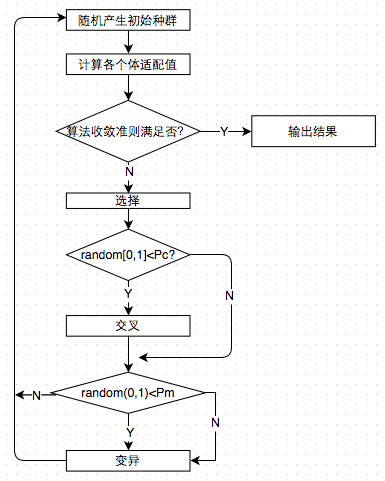

<center style="font-size:14px;color:#000000;">Figure2: Flow Chart of GA</center>

##### 3.1.2 重要算法实现

- 种群的生成

  ​        在TSP问题中，一个路径序列就是一个个体，因此生成个体可以直接采用matlab内置函数`randperm()`来实现。

  ​        产生规模为`popSize`，个体基因序列长度（即城市个数）为$N$的种群`pop`的具体实现如下：

  ```matlab
  pop = zeros(popSize,N);
  for k = 1:popSize
      pop(k,:) = randperm(N);
  end
  ```

- 选择算子

  ​	    在实现过程中，采用了锦标赛选择（tournament selection）算法，即从种群中随机选择4个个体作为一组，并选择该组中适应度最高的两个个体作为父母。重复此操作。在实现过程中，适应度函数直接采用了比较个体的路径和，选取最小的两个作为parent

  ​        假设`distSum`矩阵中保存了`pop`种群中各个体的路径和，`p`为该组个体在`pop`中的下标（已进行随机化），则选择过程如下：

  ```matlab
  %Tournament Selection
  for p = 1: 4: popSize - 4
      tempGroup = pop(p:p+3, :); 		  % 4 individual as a temp group
      groupDist = distSum(p:p+3, :);	  % the length of each individual of the group
      [ig, index] = sort(groupDist);    % sort according to length of each individual
      parent1 = tempGroup(index(1), :);
      parent2 = tempGroup(index(2), :);
  ```

- 交叉算子

  ​        选择了两个parent后，以概率$P_c$进行交叉（crossover）。我们采用了有序交叉。在有序交叉中，我们随机选择parent1的某一子集，然后在parent2中不改变其余元素的顺序，将parent1的该子集放到parent2的相同位置，举例如下：

  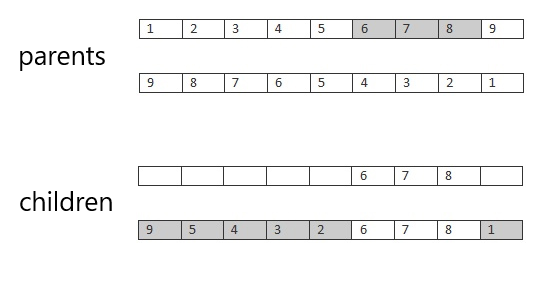

  <center style="font-size:14px;color:#000000;">Figure3: An Example of crossover</center>

  ​       在实现上，我们可以使用matlab的`any`函数配合矩阵索引将parent2中与parent1交叉部分相等的元素赋值为`[]`实现删去parent1中的交叉元素，再通过重新赋值实现交叉。假设`i`与`j`是parent1的交叉算子作用的两个端点的索引（如Figure3中parent1的6与8对应的下标），则具体过程如下：

```matlab
len = j- i+ 1;
p1 = parent1(i:j)';
p2 = parent2(i:j)';

child = parent2;
child(any(p1(:,ones(N,1)) == parent2(ones(len,1),:),1)) = [];
child = [child(1:i-1) parent1(i:j) child(i:N-len)];
```

- 变异算子

  ​        交叉后以概率$P_m$进行变异（mutation）。变异可以分为3种类型

  - swap

    ​        即将指定两个基因元素互换位置

    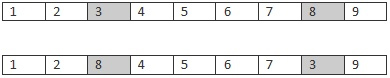

    <center style="font-size:14px;color:#000000;">Figure4: An Example of swap</center>

    ​	假设$i$与$j$是两元素下标，则具体实现如下：

    ```matlab
    pop(k,[i j]) = pop(k, [j i]);
    ```

  - flip

    ​        即将指定范围的基因元素逆序

    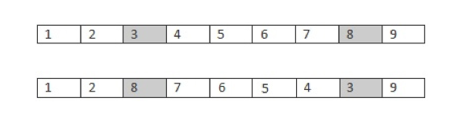

    <center style="font-size:14px;color:#000000;">Figure4: An Example of flip</center>

    ​	假设$i$与$j$为端点下标，则具体实现如下：

    ```matlab
    pop(k, i:j) = pop(k, j:-1:i);
    ```

  - slide

    ​        即将某一元素平移到指定位置

    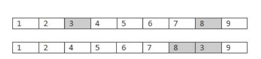

    <center style="font-size:14px;color:#000000;">Figure4: An Example of slide</center>

    ​	假设$i$和$j$为端点下标，则实现如下：

    ```matlab
    pop(k,i:j) = pop(k, [i+1:j i]);
    ```

    

#### 3.2 数据结构

- 输入

  ​	描述$N$个城市坐标的$2\times N$矩阵（如x500.mat中的cityXY）

- 输出

  ​	如下结构体，包含如下信息

  - position：输入的城市坐标
  - distMatrix：根据坐标计算出的邻接矩阵
  - popSize：种群大小
  - numIter：种群代数
  - optimalRoute：计算出的最优路径
  - minDist：最优路径的长度

  

#### 3.3 参数选取方式

- 种群规模$popSize$

  ​        群体规模太小，很明显会出现近亲交配，产生病态基因。而且造成有效等位基因先天缺失，即使采用较大概率的变异算子，生成具有竞争力高阶模式的可能性仍然核销，况且大概率变异算子对已有模式的破坏作用极大。同时，遗传算子存在随机误差（模式采样误差），妨碍小群体中有效模式的正确传播，使得种群进化不能按照模式定理产生所预期的期望数量。[ 1 ]

  ​        群体规模太大，结果难以收敛且浪费资源，稳健性下降。

  ​		因此一般选择在20~100之间。

- 中止进化代数$numIter$

  ​       进化代数太小，算法不容易收敛，种群还没有成熟；

  ​       进化代数太大，算法已经熟练或者种群过于早熟不可能再收敛，继续进化没有意义，只会增加时间开支和资源浪费。

  ​	 因此中止进化代数要根据输入进行调整

- 交叉概率 $P_c$

  ​       交叉概率太大容易破坏已有的有利模式，随机性增大，容易错失最优个体；而概率太小不能有效更新种群


- 变异概率 $P_m$

  ​        变异概率太小，种群的多样性下降太快，容易导致有效基因的迅速丢失且不容易修补； 变异概率太大，尽管种群的多样性可以得到保证，但是高阶模式被破坏的概率也随之增大。[ 2 ]


#### 3.4 结果分析（50个城市）

- 在$[0,10]\times [0,10]$间随机生成了一组城市坐标

  ​	其分布图如下：

  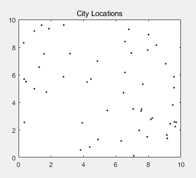

  <center style="font-size:14px;color:#000000;">Figure5: City Locations (50 cities)</center>

- 参设设置如下：

  - popSize  = 100;
  - numIter = 1e3;
  - Pc 	      = 0.5;
  - Pm         = 0.9;

- 结果如下：

  - 最短路径长：57.824    在478次迭代后就已基本稳定

    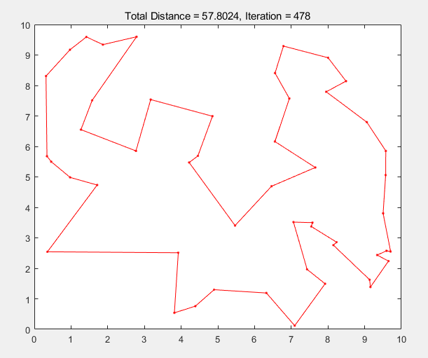

    <center style="font-size:14px;color:#000000;">Figure6: The Optimal Route for GA (50 cities)</center>

  - 迭代过程中的最优解变化情况

    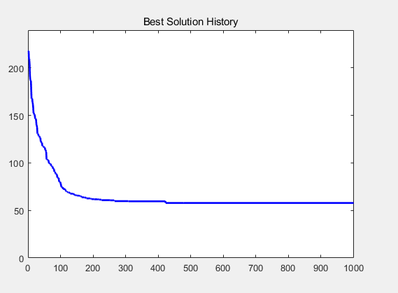

    <center style="font-size:14px;color:#000000;">Figure7: Best Solution History for GA (50 cities)</center>

  由该图可得出该算法确实收敛。

  

#### 3.5 参数设置及结果（500个城市）

- 参数设置

  - popSize = 100;
  - numIter = 1e5;
  - Pc           = 0.5;
  - Pm         = 0.9;

- 结果

  - 最短路径长：18.0698

  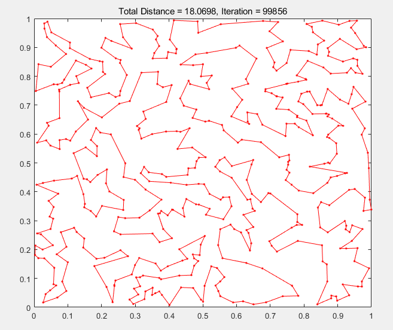

  <center style="font-size:14px;color:#000000;">Figure8: The Optimal Route for GA (500 cities)</center>

  - 迭代过程中的最优解变化情况

    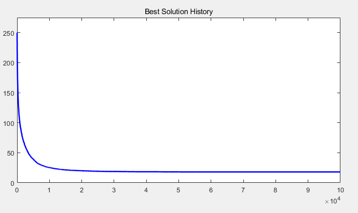

    <center style="font-size:14px;color:#000000;">Figure9: Best Solution History for GA (500 cities)</center>

    可以看出在1e4后结果已基本稳定


### 4. 模拟退火算法求解TSP

#### 4.1 模拟退火算法

##### 4.1.1 算法概述

​		模拟退火（Simulated Annealing）是一种概率技术，用于逼近给定函数的全局最优值。具体而言，在大搜索空间中针对优化问题近似全局优化是一种元启发法。对于在固定时间内找到近似全局最优比找到精确局部最优更为重要的问题，模拟退火可能比梯度下降等替代方法更为可取。

​		其名称和灵感来自冶金学中的退火，该技术涉及对材料进行加热和控制冷却以增加其晶体尺寸并减少其缺陷。模拟退火算法从某一较高初温出发，伴随温度参数的不断下降,结合概率突跳特性在解空间中随机寻找目标函数的全局最优解，即在局部最优解能概率性地跳出并最终趋于全局最优。

​		算法过程描述如下：

 	1. 初始化：
     - 初始温度$T_0$，
     - 初始解状态$S$，
     - 每个温度下的迭代次数$N$
	2. 对$k\in \{1,...,N\}$
    	1. 取$S$的随即领域$S'$作为新状态
    	2. 计算增量$\Delta T=Cost(S')-Cost(S)$，其中$Cost(S)$是评价函数
    	3. 若$\Delta T <0$则接受$S'$作为新状态；否则以概率$\exp(-\Delta T/T)$接受$S'$作为新的解状态
    	4. 判断是否满足终止条件，若满足则结束程序；否则返回2

该算法的基本伪代码如下：

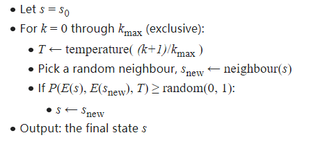

<center style="font-size:14px;color:#000000;">Figure10: Pseudocode for SA Algorithm</center>

##### 4.1.2 Metropolis算法解释

​	模拟退火算法用Metropolis算法产生组合优化问题解的序列。并由Metropolis准则对应的转移概率P：
$$
P(i,j)
\begin{cases}
1    & f(i)\leq f(j)\\
\exp(\frac{f(i)-f(j)}{t})   & otherwise

\end{cases}
$$
来确定是否接受从当前解 $i $ 到新解 $j $ 的转移。开始让 $t $ 取较大的值，在进行足够多的转移后，缓慢减小 $t$ 的值（初始温度乘以退火系数$\alpha$），如此重复直至满足某个停止准则时算法终止。模拟退火算法依据Metropolis准则接受新解，除接受优化解外，还在一个限定范围内接受恶化解。开始时 $t$ 值较大，可能接受较差的恶化解，随着 $t$ 值的减小，只能接受较好的恶化解；当 $t$ 值趋于零值时，就不再接受任何恶化解。这就使得算法可以跳出局部最优陷阱。在算法执行期间，随着控制参数 $t$ 值的减小，算法返回某个整体最优解得概率单调增大，返回某个非最优解的概率单调减小。


#### 4.2 数据结构

- 输入

  ​	描述$N$个城市坐标的$2\times N$矩阵（如x500.mat中的cityXY）

- 输出

  ​	如下结构体，包含如下信息

  - position：输入的城市坐标
  - optSolution：最优路径
  - minDist：最优路径的长度
  - distHistory：最优路径长度历史记录
  - Temperature：终止温度

  

#### 4.3 参数选取方式

- 起始温度$T_0$

  ​	一般取值较大。该值越大，则越容易接受差解，状态改变的随机性越大。

- 每个温度下的迭代次数$N$

  ​	该参数的设置应该视输入的问题规模而定。有文献指出对一些经典的TSP问题，$N$取值为1000000左右较为理想。 [ 3 ]

- 降温速度$\alpha$

  ​	$\alpha$越小则降温越快。若设置过小则算法来不及充分收敛。一般设置在

- 重复降温次数$MaxIter$

  ​     该值控制着算法寻找最优解的充分程度。该知道选取与输入的数据规模及复杂度有关，过大则增加开支，浪费了资源；太小则还未收敛。


#### 4.4 结果分析（50个城市）

- 输入数据与3.4节中的数据相同

- 参数设置

  - MaxIter = 5000;
  - N = 50;
  - T0 = 100;
  - alpha = 0.9;

- 结果分析

  - 最短路径长：56.3113

    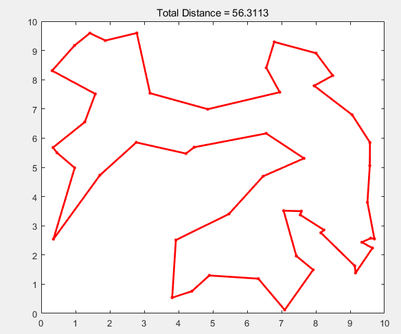

    <center style="font-size:14px;color:#000000;">Figure11: The Optimal Route for SA (50 cities)</center>

  - 迭代过程中最优解的变化情况

    

<center style="font-size:14px;color:#000000;">Figure12: Best Solution History for GA (50 cities)</center>

​			可以看到该算法确实收敛。


#### 4.5 参数设置及结果（500个城市）

- 参数设置

  - MaxIter：30000
  - N：50
  - T0：200
  - alpha：0.93

- 结果

  - 最短路径长：17.8557

    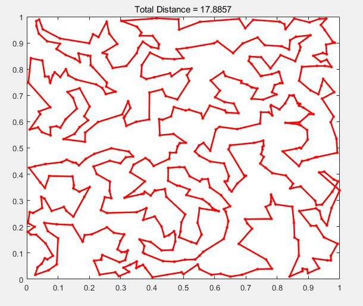

    <center style="font-size:14px;color:#000000;">Figure13: The Optimal Route for GA (500 cities)</center>

  - 迭代过程中最优解变化情况：

    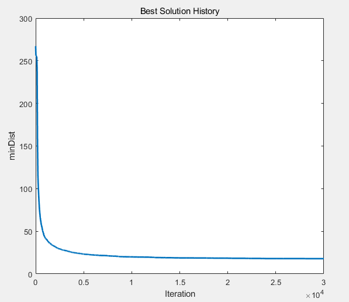

    <center style="font-size:14px;color:#000000;">Figure14: Best Solution History for GA (500 cities)</center>

### 5. 算法比较

- 遗传算法时钟维护着一组可能的解，并通过筛选和变异等手段获得更加优质的解；而模拟退火算法仅跟踪可能的解空间中的一个解，并在迭代过程中考虑是移至相邻解还是停留在当前解。从这个角度来看，模拟退火可以看成是遗传算法的种群大小为1的近似情况。

- 两个算法的思路很相似

  1. 对状态进行编码，构造代价函数
  2. 随即生成一个初始解，代入代价函数计算
  3. 根据返回值生成候选解（一个或一系列）
  4. 将候选解代入代价函数计算
  5. 重复3,4步骤直到满足中止条件

  二者最大的区别就在于生成候选解的方式不同。

- 运行时间：遗传算法的运算时间比模拟退火算法慢，当然这与参数设置有关。


### 6. 总结

​	通过本次project，我对TSP问题有了更加深刻的理解。同时也对组合优化的几个基本算法的认识从理论上升到了实践。感觉还是很有意义的，毕竟听老师讲对算法只能有一个感性的认识，而自己动手实践过后才意识到很多细节要处理，感觉还是很有意义的。

### 7. 参考文献

[ 1 ]:  Jihene Kaabi, Youssef Harrath. Permutation rules and genetic algorithm to solve the traveling salesman problem. Arab Journal of Basic and Applied Sciences, 2019, Volume 26: 283-291.

[ 2 ]: Ahmad Hassanat, Khalid Almohammadi. Choosing Mutation and Crossover Ratios for Genetic Algorithms. MDPI Information, 2019.

[ 3 ]: Liu Hongpu. Research on the Key Parameters in the Simulated Annealing Algorithm. COMPUTER ENGINEERING & SCIENCE, 2018, Vol 30(10).

 

### 8. 源代码附录

- 遗传算法

```matlab
function resultStruct = GA(position)
    position = position';
    distMatrix  = [];
    popSize     = 100;
    numIter     = 1e3;
    Pc          = 0.5;
    Pm          = 0.9;

    N = size(position,1);
    a = meshgrid(1:N);
    distMatrix = reshape(sqrt(sum((position(a,:)-position(a',:)).^2,2)),N,N);
    
    popSize     = 4*ceil(popSize/4);
    numIter     = max(1,round(real(numIter(1))));
    
    % Initialize the population
    pop = zeros(popSize,N);
    pop(1,:) = (1:N);
    for k = 2:popSize
        pop(k,:) = randperm(N);
    end

    globalMin = Inf;
    historyDist = zeros(1,numIter);
    tmpPop = zeros(4,N);
    newPop = zeros(popSize,N);

    figure('Name','TSP_ga | Current Best Solution','Numbertitle','off');
    hAx = gca;

    for iter = 1:numIter
        % Evaluate the length
        row = pop;
        col = pop(:,[2:N 1]);
        ind = N*(col-1) + row;
        totalDist = sum(distMatrix(ind),2);
              
        % Select the best
        [minDist,index] = min(totalDist);
        historyDist(iter) = minDist;
        if (minDist < globalMin)
            globalMin = minDist;
            optimalRoute = pop(index,:);
            % Plot the best route
            temp = optimalRoute([1:N 1]);
            plot(hAx,position(temp,1),position(temp,2),'r.-'); 
            title(hAx,sprintf('Total Distance = %1.4f, Iteration = %d',minDist,iter));
            drawnow;
        end
        
        randomOrder = randperm(popSize);
        for p = 4:4:popSize
            rtes = pop(randomOrder(p-3:p),:);
            dists = totalDist(randomOrder(p-3:p));
            if rand(1) < Pc % Use Cross Over and Mutation
                [ig,ord] = sort(dists); %#ok
                Parent1 = rtes(ord(1),:);
                Parent2 = rtes(ord(2),:);
                location = sort(ceil(N*rand(1,2)));
                i = location(1);
                j = location(2);
                len = j - i + 1;
                p1 = Parent1(i:j)';
                p2 = Parent2(i:j)';
     
                % Create Two Children From Two Best Parents
                child1 = Parent1;
                child1(any(p2(:,ones(N,1)) == Parent1(ones(len,1),:),1)) = [];
                child1 = [child1(1:i-1) Parent2(i:j) child1(i:N-len)];
                child2 = Parent2;
                child2(any(p1(:,ones(N,1)) == Parent2(ones(len,1),:),1)) = [];
                child2 = [child2(1:i-1) Parent1(i:j) child2(i:N-len)];
                
                if rand(1) < Pm
                    % Mutate child1
                    mutant = child1;
                    location = sort(ceil(N*rand(1,2)));
                    i = location(1);
                    j = location(2);
                    mutant(i:j) = mutant(j:-1:i);
                    newPop(p-3:p,:) = [Parent1; child1; child2; mutant];
                else
                    newPop(p-3:p,:) = [Parent1; child1; child2; Parent2];
                end
                elseif rand(1) < Pm % Use Mutation Only
                    [ig,idx] = min(dists); %#ok
                    bestOf4Route = rtes(idx,:);
                    location = sort(ceil(N*rand(1,2)));
                    i = location(1);
                    j = location(2);
                    for k = 1:4     % Mutate the best to get three new routes
                        tmpPop(k,:) = bestOf4Route;
                        switch k
                            case 2 % Flip
                                tmpPop(k,i:j) = tmpPop(k,j:-1:i);
                            case 3 % Swap
                                tmpPop(k,[i j]) = tmpPop(k,[j i]);
                            case 4 % Slide
                                tmpPop(k,i:j) = tmpPop(k,[i+1:j i]);
                            otherwise % Do nothing
                        end
                    end
                newPop(p-3:p,:) = tmpPop;
            else
                newPop(p-3:p,:) = pop(p-3:p,:);
            end

        end
        pop = newPop;    
    end
 
    % Format the optimal solution
    index = find(optimalRoute == 1,1);
    optimalSolution = [optimalRoute([index:N 1:index-1]) 1];
            
    % Plot the results
    figure('Name','TSP_ga | Results','Numbertitle','off');
    subplot(2,2,1);
    pclr = ~get(0,'DefaultAxesColor');
    plot(position(:,1),position(:,2),'.','Color',pclr); 
    title('City Locations');
    subplot(2,2,2);
    temp = optimalSolution;
     plot(position(temp,1),position(temp,2),'r.-'); 
    title(sprintf('Total Distance = %1.4f',minDist));
    subplot(2,2,3);
    plot(historyDist,'b','LineWidth',2);
    title('Best Solution History');
    set(gca,'XLim',[0 numIter+1],'YLim',[0 1.1*max([1 historyDist])]);
        

    % Save results in resultStruct
    resultStruct = struct( ...
        'position',          position, ...
        'distMatrix',        distMatrix, ...
        'popSize',     popSize, ...
        'numIter',     numIter, ...
        'optimalRoute',    optimalRoute, ...
        'optimalSolution', optimalSolution, ...
        'minDist',     minDist);    
end
```

- 模拟退火算法

  - SA.m

  ```matlab
  function resultStruct = SA(position)
  
      % Parameter
      MaxIter = 30000;     %Maximum Iteration
      N = 50;    %Maximum Iteration For Each Temperature
      T0 = 200;         %Initial Temperature
      alpha = 0.93;     %Temperature Reduction Rate
  
  
      temp = position';
  
      pos = [temp(:,1)'; temp(:,2)']';
      distMatrix = pdist2(pos,pos);
  
      cityStruct.X = temp(:,1)';
      cityStruct.Y = temp(:,2)';
      cityStruct.N = numel(temp(:,1)');
      cityStruct.distMatrix = distMatrix;
  
      CostFunction = @(tour) TourLenth(tour,cityStruct);
  
  
      % Initialation
  
      n = cityStruct.N;
      sol.Position = randperm(n);
  
      sol.Cost = CostFunction(sol.Position);          %Create initial Solution
  
      optSolution = sol;         %Initialize Best solution
      distHistory=zeros(MaxIter,1);    %Initialize Array To Hold Best Cost
  
      T = T0;     %Initialize Temperature
  
  
      % Main Loop
      for it = 1 : MaxIter
  
  
          for subIt = 1 : N
              newSol.Position = CreateNeighbor(sol.Position); %Create New Solution
              newSol.Cost = CostFunction(newSol.Position);
  
              if newSol.Cost <= sol.Cost % new solution better
                  sol = newSol;
  
              else
                  DELTA = (newSol.Cost - sol.Cost)/sol.Cost;
                  P = exp(-DELTA/T);
                  if rand <= P
                      sol = newSol;
                  end
              end
  
  
              if sol.Cost <= optSolution.Cost  %Update Best Solotion
                  optSolution = sol;
              end
  
          end
  
          distHistory(it) = optSolution.Cost; %Update Best Cost
  
          T = alpha*T;    %Update Temperature
          disp(['Iteration ' num2str(it) ' Temperature = ' num2str(T) ' And Best Cost Found = ' num2str(distHistory(it))]);
      end
  
  
      %print result
      figure;
      plot(distHistory,'LineWidth',2);
      xlabel('Iteration');
      ylabel('minDist');
      title('Best Solution History');
  
  
      figure;
      x = cityStruct.X;
      y = cityStruct.Y;
      BestSolotion = [optSolution.Position optSolution.Position(1)];
      plot(x(BestSolotion),y(BestSolotion),'r.-','MarkerSize',10,'MarkerFaceColor','y','LineWidth',2);
      title(sprintf('Total Distance = %1.4f',distHistory(MaxIter)));
  
  
      resultStruct = struct(...
          'position', position,...
          'optSolution', optSolution,...
          'minDist', distHistory(MaxIter),...
          'distHistory', distHistory,...
          'Temperature', T);
  
  end
  
  
  
  function len = TourLenth( tour , cityStruct )
      n = numel(tour);
      tour = [tour  tour (1)];
      len = 0;
      for k=1 : n
          i = tour(k);
          j = tour (k+1);
          
          len = len + cityStruct.distMatrix(i,j);
      end
  end
  
  ```

  - CreateNeighbor.m

  ```matlab
  function route2 = CreateNeighbor( route1 )
  
  	pSwap=0.4;
  	pReversion=0.4;
  	pInsertion = 1-pSwap-pReversion;
  
  
  	% Roulette Wheel Selection
      randNum = rand;
      p = cumsum([pSwap pReversion pInsertion]); 
      M = find(randNum <= p, 1, 'first');
  
  
  
  	switch M
  	    case 1
  	        route2=Swap(route1);       
  	    case 2
  	        route2 = Reversion(route1);     
  	    case 3
  	        route2 = Insertion(route1);      
  	end
  
  
  end
  
  
  function res = Swap(x)
  
  	N = numel(x);
  
  	i=randsample(N,2);
  	i1=i(1);
  	i2=i(2);
  
  	res=x;
  
  	res(i1)=x(i2);
  	res(i2)=x(i1);
  
  end
  
  function res = Reversion(x)
  
  	N = numel(x);
  
  	i=randsample(N,2);
  	i1=min(i);
  	i2=max(i);
  
  	res=x;
  	res(i1:i2)=x(i2:-1:i1);
  
  end
  
  function res = Insertion(x)
  
  	N = numel(x);
  
  	i=randsample(N,2);
  	i1=i(1);
  	i2=i(2);
  
  	if i1<i2
  	    res=x([1:i1-1 i1+1:i2 i1 i2+1:end]); 
  	else
  	    res=x([1:i2 i1 i2+1:i1-1 i1+1:end]);    
  	end
  
  end
  
  ```

  

[^ 1 ]: