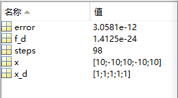
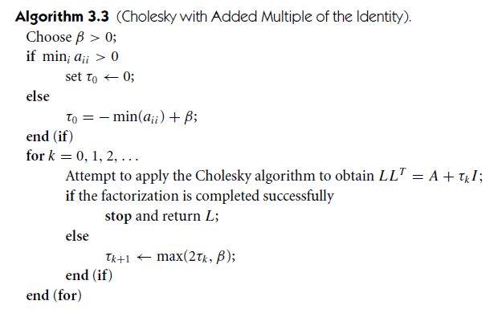
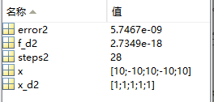

## Report

#### 一. 基于Wolfe条件的线搜索算法

- 算法设计思路: Wolfe条件有两个子条件：Armijo condition和 curvature condition，因此我们的算法也根据这两个条件分布设计。这个算法分为两步

  - 设置一个步长$\alpha$可以取到的最大值$\alpha_{max}$. 并在$(0,\alpha_{max})$中选取一个$\alpha_1$作为初值（代码实现中设置为1）。使得$\alpha_1$不断增加，直到满足以下两种情况之一
    - $\alpha$同时满足Armijo条件与curvature条件（即满足Wolfe条件）
    - 满足Wolfe条件的$\alpha$被包含在一个区间内
  - 如果是第一种情况，则直接输出；如果是第二种情况，则通过调用**zoom**函数来不断减小区间长度直到找到一个满足Wolfe条件的$\alpha$值

- Pseudocode

  


<div style="page-break-after:always;"></div>

- Source Code

  - LineSearch.m：用于寻找合适的步长
    - 评价当前步长，判断是否满足Armijo条件和下降条件，如果不满足说明最优解在之间，调用zoom算法找到合适的$\alpha$，结束。

    - 否则验证Curvature条件是否满足，如果满足则结束。

    - 如果不满足Curvature条件，并且当前梯度为正值时，与上一个步长构成区间调用zoom算法找到合适的$\alpha$ 结束。

    - 迭代求解下一个步长点

  ```matlab
  function alpha = LineSearch(x, p, method)
  % The line search algorithm based on strong Wolfe condition
  % 
  % OUTPUTS:
  % alpha: the step length fits the strong Wolfe condition
  %
  % INPUTS:
  % x: an n-d column vector(the current point)
  % p: the step direction
  
      c1 = 1e-4;
      if strcmp(method, 'Newton')
          c2 = 1;
      else
          c2 = 0.1;
      
       alpha_MAX = 100;
       alpha = 1;
       alpha_0 = 0;
       alpha_1 = alpha;
       
       f0 = Rosenbrock(x);
       
       fx = f0;
       iter = 1;
       
       while (1)
          
           xc = x + alpha_1 * p;
           f = Rosenbrock(xc);
  
          
           if ((f > f0 + c1 * alpha_1 * dfunc(x)' * p) || ((f >= fx)&& (iter > 1)))
              alpha = myZoom(x, p, dfunc(x)' * p, alpha_0, alpha_1, f0, fx, c1, c2);
              break;
           end
           
           if (abs(dfunc(xc)' * p) <= -c2 * dfunc(x)' * p )
               alpha = alpha_1;
               break;
           end
           
           if (dfunc(xc)' * p >= 0)
               alpha = myZoom(x, p, dfunc(x)' * p, alpha_1, alpha_0, f0, f, c1, c2);
               break;
           end
           
           alpha_0 = alpha_1;
           alpha_1 = min(alpha_MAX, alpha_1 * 2);
           fx = f;   
       end
  end
  ```

  

  - myZoom
    - 判断是否满足Armijo条件，如果不满足缩减区间。
    - 否则，判断是否满足Curvature条件 ，如果满足则返回
    -  判断是否是递增区间，如果是则进行调整，使其满足zoom输入条件。

  ```matlab
  function alpha = myZoom(x, p, slope_0, alpha_lo, alpha_hi, f0, fx, c1, c2)
  % the zoom function
  %
  % OUTPUT:
  % alpha: the step length got by successively decreasing the size of the interval 
  % until an acceptable step length is identified.
  %
  % INPUTS:
  % x: an n-d column vector(the current point)
  % p: the step direction
  % slope_0: gradient of function at x in direction p
  % alpha_lo: the lower bound for alpha
  % alpha_hi: the uppper bound for alpha
  % f0: the function value at x
  % fx: the function value at last point
  % c1: the parameter in the Armijo condition
  % c2: the parameter in the curvature condition
  
      while (1)
          alpha = alpha_lo + (alpha_hi - alpha_lo) / 2;
          xc = x + alpha * p;
          f = Rosenbrock(xc);
          
          if (f > f0 + c1 * alpha * slope_0 || f > fx)
              alpha_hi = alpha;
          else
              slope_c = dfunc(xc)' * p;
              if (abs(slope_c) <= -c2 * slope_0)
                  return;
              end
              if (slope_c * (alpha_hi - alpha_lo) >= 0)
                  alpha_hi = alpha_lo;
                  alpha_lo = alpha;
                  fx = f;
              end
          end
      end
  
  end
  ```

  

##### 1. 最速下降法

- Source code

```matlab
function [x_d, f_d, error, steps] = Steepest_descend(x, MAX_IT, tol)
    
    error = 1.0;
    steps = 0;
    convergent = 1;
    alpha = 1;
    x_d = x;
    
    while (error > tol) 
        f_d = Rosenbrock(x_d);
        g = dfunc(x_d);
        p = -g;
        
        alpha = LineSearch(x_d, p, 'Steepest_descend');
 
        x_d = x_d + alpha * p;
        steps = steps + 1;
        error = norm(g);
        
        if (steps > MAX_IT)
            convergent = 0;
            steps = -1;          
            break;
        end
    end
end 
```

- 计算结果

  - 初始坐标`x=[0,0,0,0,0]';`

    - 输入`[x_d, f_d, error, steps] = Steepest_descend(x, 1e10, 1e-6);`

    - 输出

      

      - 迭代次数`steps`: 18855
      - 最小值点`x_d`: $[1.000,1.000,1.000,1.000,1.000]^{T}$
      - 最小值点函数值`f_d`：$7.0318\times 10^{-13}$
      - 误差`error`：$9.9539\times 10^{-7}$

  - 初始坐标`x=[1,-1,1,-1,1,-1]';`

    - 输入`[x_d, f_d, error, steps] = Steepest_descend(x, 1e10, 1e-6);`

    - 输出

      

      - 迭代次数`steps`：22854
      - 最小值点`x_d`：$[1.000,1.000,1.000,1.000,1.000,1.000]^{T}$
      - 最小值点函数值`f_d`：$1.0022\times 10^{-12}$
      - 误差`error`：$9.9949\times 10^{-7}$

##### 2. Newton法

- Source code

  ```matlab
  function [x_d, f_d, error, steps] = Newton(x, MAX_ITER, tol)
  % Newton method
  % OUTPUTS:
  % x_d: the search result;
  % f_d: the value at the result point; 
  %error: the difference between the search result and the minimizer;
  % steps: the interation times.
  % INPUTS:
  % x: an n-d column vector;
  % MAX_ITER: the maximum iteration; 
  % tol: the allowed tolerance
  
      error = 1.0;
      steps = 0;
      convergent = 1;
      alpha = 1;
      x_d = x;
      
      while (error > tol)
          f_d = Rosenbrock(x_d);
          g = dfunc(x_d);
          G = d2func(x_d);
         
          p = -G\g;
          
          alpha = LineSearch(x_d, p, 'Newton');
          
          x_d = x_d + alpha * p;
          
          steps =  steps + 1;
          error = norm(g);
          
          if(steps > MAX_ITER)
              invergent = 0;
              steps = -1;
              break;
          end
            
      end
  end
  ```

- 计算结果

  - 初始坐标`x = [0,0,0,0,0]';`

    - 输入`[x_d, f_d, error, steps] = Newton(x, 1e10, 1e-6);`

    - 输出

      

      - 迭代次数`steps`：11
      - 最小值点`x_d`：$[1,1,1,1,1,1]^{T}$
      - 最小值点函数值`f_d`：$1.3857\times 10^{-19}$
      - 误差`error`：$1.4522\times 10^{-8}$

  - 初始坐标`x = [2,-2,2,-2,2,-2]';`

    - 输入`[x_d, f_d, error, steps] = Newton(x, 1e10, 1e-6);`

    - 输出

      

      - 迭代次数`steps`：19
      - 最小值点`x_d`：$[1,1,1,1.000,1.000,1.000]^{T}$
      - 最小值点函数值`f_d`：$4.2025\times 10^{-18}$
      - 误差`error`：$2.7474\times 10^{-8}$

  - 当初始坐标离全局最小值点较远时，寻找次数会很多，找最小值点较慢

    - 输入`x=[10,-10,10,-10,10]';`

    - 输出

      

    - 迭代次数`step`：98

#### 二. 基于单位增量的修正线搜索Newton法

- 算法思路：

  ​        因为当$x$距离最小值点较远时，$\nabla^2f(x_k)$不能保证充分正定，使得通过$\nabla^2f(x_k)\cdot p = \nabla f(x_k)$解得的方向$p$不一定充分下降。因此我们可以通过寻找一个常量$\tau>0$，使得$\nabla^2f(x_k)+\tau I$充分正定，让它来代替$\nabla^2f(x_k)$计算下降方向。

  ​		先设置一个$\tau$的初值，如果$\nabla^2f(x_k)$主对角线上的最小值为正，则$\tau_0=0$，否则$\tau_0=-min(a_{ii})+\beta$ （其中$\beta$是一个正常量，这样可以保证$\tau_0>0$）之后通过循环不断增大$\tau$的值，直到能对$\nabla^2f(x_k)+\tau_k I$进行完全的Cholesky分解。

  ​		这样，我们就找到了一个合适的相对较小的$\tau$. 算法的伪代码如下：

  

  在代码实现时(Cholesky.m)，我在对矩阵进行Cholesky分解时对无法正常分解的情况输出了零矩阵，方便主函数进行判断

- Source Code

  - 代码分为两部分：modified_Newton.m和Cholesky.m
  - Cholesky.m
    - 对矩阵进行Cholesky分解($LL^T=M$)，若分解完全则输出分解得到的矩阵$L$；否则输出零矩阵

  ```matlab
  function L = Cholesky(M)
  % M: n*n spd. matrix
  % L: the Cholesky factorization matrix
  
      n = length(M);
      L = zeros(n, n);
      for i = 1 : n
          if (M(i, i) - L(i, :) * L(i, :)') < 0
              L = zeros(n, n);
              break;
          else
              L(i, i) = sqrt(M(i, i) - L(i, :) * L(i, :)');
          end
          for j = (i + 1) : n
              L(j, i) = (M(j, i) - L(i, :) * L(j, :)') / L(i, i);
          end
      end
  end
  ```

  - modified_Newton.m
    - 与传统Newton法不同之处就在于计算下降方向$p$时对不一定正定的$\nabla^2f(x_k)$做了修正，使之一定充分正定。

  ```matlab
  function [x_d, f_d, error, steps] = modified_Newton(x, MAX_ITER, tol)
  % Newton method
  % OUTPUTS:
  % x_d: the search result;
  % f_d: the value at the result point; 
  %error: the difference between the search result and the minimizer;
  % steps: the interation times.
  % INPUTS:
  % x: an n-d column vector;
  % MAX_ITER: the maximum iteration; 
  % tol: the allowed tolerance
  
      error = 1.0;
      steps = 0;
      convergent = 1;
      alpha = 1;
      x_d = x;
      beta = 1e-3;
      tau = 0;
  
      
      while (error > tol)
          f_d = Rosenbrock(x_d);
          g = dfunc(x_d);
          G = d2func(x_d);
         
   %       p = -G\g;
          min_aii = min(diag(G));
          n = length(G);
          L = zeros(n, n);
          
          if  min_aii > 0
              tau = 0;
          else tau = -min_aii + beta;
          end
          
          while 1
              L = Cholesky(G + tau * eye(n));
              if L == zeros(n)
                  tau = max(2 * tau, beta);
              else
                  break;
              end      
          end
          
          p = -(L * L')\g;
          
          x_d = x_d + alpha * p;
          
          steps =  steps + 1;
          error = norm(g);
          
          if(steps > MAX_ITER)
              invergent = 0;
              steps = -1;
              break;
          end
            
      end
  end
  ```

- 初值依赖性

   		传统牛顿法对初值依赖性较高，当处理远离最小值点时迭代次数会显著增加，且不一定能收敛到最小值点上。而修正后的牛顿法则对初值依赖性较低，与之前传统牛顿法同样输入`x=[10,-10,10,-10,10]'`，传统牛顿法用了98次迭代，而修正后的牛顿法只用了28次迭代就找到了最小值点。

   

  ​                传统牛顿法                                             修正后的牛顿法	     

- 实际收敛阶

  ​		基于单位增量的修正线搜索牛顿法与拟牛顿法相似，都是用一个充分正定的矩阵代替$\nabla^2f(x_k)$来计算下降方向。基于单位增量的修正牛顿法用$\nabla^2f(x_k)+\tau I$来替代海森阵。
  
  ​										因为$lim_{k\rarr\infin} \frac{||((\nabla^2f(x_k)+\tau I)-\nabla^2f(x^*))p_k||}{||p_k||}=0$
  
  ​					由线搜索拟牛顿法超线性收敛的充要性知，基于单位增量的修正牛顿法也是超线性收敛。

