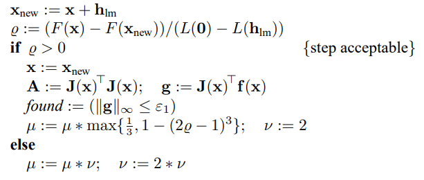
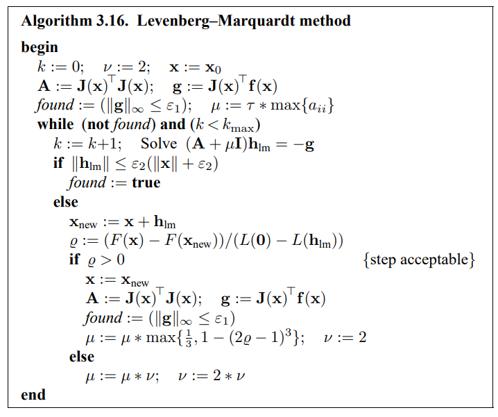
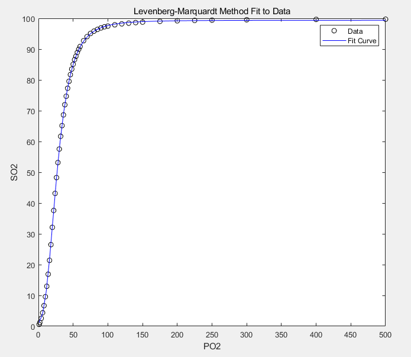

## 应用Levenberg-Marquardt Method解决肺功能测定问题

#### 1. 摘要

​	Levenberg-Marquardt Method是一种介于牛顿法与梯度下降法之间的一种非线性优化方法，对于过参数化问题不敏感，能有效处理冗余等问题，使代价函数陷入局部极小值的可能性大大减小，这使得其被应用于多个领域。	

​	本文介绍了将LM算法应用于解决肺功能测定问题，通过迭代回归已知模型的参数，并对回归结果进行了评估。

#### 2. 问题的应用背景与理论背景

##### 2.1 应用背景

​      近期，新型冠状病毒（COVID-19）在全球范围内大流行，截至目前已有超过350万确诊病例，死亡人数超过24.3万。新型冠状病毒感染者可能在暴露后的2-14天内出现发热、咳嗽、气短或呼吸困难等症状，严重程度因人而异。因其潜伏期长且症状与其他呼吸道疾病相似，所以现阶段没有很好的检测方法。人们目前对该新型病毒知之甚少，包括世界卫生组织（WHO）和美国疾病控制与预防中心（CDC）在内的各大公共卫生组织正在密切监视该疾病的发展趋势。

##### 2.2 理论背景

​      目前对新型冠状病毒的感染者一个重要观测指标是血氧分压（$PO_2$），但该指标除直接插管外很难直接测量。当前一种比较普遍的测量技术是先通过指尖对红外光的吸收率推算动脉血氧饱和度（$SO_2$），然后根据Du Toit和Gonin的工作[^ 1 ]，使用如下模型关系：
$$
\begin{equation}
\tilde{f}(x; t) = C_5C_1^{C_2^{{1-C_3^t}^{C_4}}},
\tag{1}
\end{equation}
$$
即可得出$PO_2$的值，其中
$$
C_i = \frac{1}{1 + e^{x_i}}, i = 1, 2, 3,
$$

$$
C_4 = 1 + e^{x_4},
$$

$$
C_5 = x_5.
$$

这里$t$表示$\mbox{PO}_2$，$\tilde{f}$表示$\mbox{SO}_2$。  

​	根据已有的数据，我们可以利用非线性最小二乘法对模型中的各参数进行回归，得到一个较准确的模型。

#### 3. 非线性最小二乘法简介

​      考虑一个实际问题，如果我们有$m$组实验数据$(t_j, y_j)$，同时根据理论和经验，这组实验数据应该符合规律$\phi(x;t)$，其中$x=(x_1,x_2,...,x_n)\in \R^n$是待定参数，则对于每一数据，我们有
$$
r_j(x)\overset{def}{=}\phi(x;t_j)-y_j
$$
称为模型的残量，显然，为了得到所谓“最优”的模型，我们希望通过调整待定参数来最小化残量。一种自然的做法是构建无约束优化问题，目标函数具有如下形式：
$$
f(x)=\frac 1{2}\sum\limits_{j=1}^{m}r_j^2(x) \tag{10.1}
$$
则相应优化问题称为*最小二乘问题*[^ 2 ]。其中$r_j$是$\R^n\rarr \R$的光滑函数。我们将$r_j$看作残量(residual)，并且通常假设$m\gg n$.

​      一开始，我想使用高斯牛顿法(Gauss-Newton Method)，但是当我写好代码后发现$J(x)$总是会变得数值奇异，这导致线搜索方向出现收敛失败[^ 3 ]。

​	  因此，我不得不采用Levenberg-Marquardt Method，这是一种通过引入信任域策略来解决$J(x)$变得数值奇异的方法。在每一次迭代过程中，我们都在解决
$$
\min\limits_{p}\frac 1{2} ||J_lp+r_k||^2,\ \ \ \text{s.t.}||p||\leq \Delta_k \tag{10.31}
$$
其中 $\Delta_k>0$是信任域半径，即我们选择的二次模型是
$$
m_k(p)=\frac 1{2}||r_k||^2 + p^TJ_k^Tr_k+\frac 1{2}p^TJ_k^Tp 
$$
​	因此，当Gauss-Newton法的解$p^{GN}$落在信任域半径内时，它也是$(10.31)$的解。否则，存在$\lambda>0$使得$p=p^{LM}$满足$||p||=\Delta$并且有$(J^TJ+\lambda J)p=-J^Tr$ [^ 3 ]

#### 4. 算法简介

​	在Levenberg Marquardt Method中，我们对高斯牛顿法中的下降方向做了修正，使得$h_{\text{lm}}$满足如下等式：
$$
(J^TJ + \mu I)h_{\text{lm}}=-g \ \ \ \ \ \text{with}\ g=J^Tr\ \text{and}\  \mu \geq 0    \tag{10.32}
$$

##### 4.1 参数$\mu$的选取与更新策略

​	等式中的参数$\mu$同时影响了下降方向与步长。$\mu$的初始值应该与已知数据的规模有关，因此我将其初始化为$\mu_0=\tau \cdot\max_{i}\{a_{ii}^{0}\} $，其中$a_{ii}$是$A_0=J(x_0)^TJ(x_0)$的对角元，$\tau$是由用户设置的参数。

​	根据我们在信任域策略中所学的知识，在迭代过程中，$\mu$会根据*gain ratio*而不断更新[^ 4 ]
$$
\rho = \frac{r(x)-r(x+h_{\text{lm}})}{L(0)-L(h_{\text{lm}})}
$$
式中，$L(x)$即为信任域的二次模型$m_k$, 因此分母可以根据线性模型得到：
$$
\begin{aligned}
L(0)-L(h_\text{lm}) &= -h_\text{lm}^TJ^Tr-\frac 1{2}h_\text{lm}^TJ^TJh_\text{lm} 
\\ & = \frac1 {2}h_\text{lm}^T(2g+(J^TJ+\mu I-\mu I)h_\text{lm}) 
\\&=\frac 1{2}h_\text{lm}^T(\mu h_\text{lm}-g) 

\end{aligned} \tag{10.33}
$$
​	当$\rho$较大时，表明$L(h_\text{lm})$是对$r(x+h_\text{lm})$的一个合适的近似，因此我们减小$\mu$使得step接近高斯牛顿法的step；当$\rho$较小时（甚至为负数），则表明用$L(h_\text{lm})$近似存在很大的误差，所以我们增大$\mu$使得下降方向接近最速下降方向，同时减小步长。

​	因此，$\mu$更新的伪代码如下：



##### 4.2 迭代终止条件

- 终止条件
  - 到达全局最小值点，即$r'(x^*)=g(x^*)=0$。此时我们可以用 $\parallel g\parallel_{\infin} \leq \varepsilon_1$ 来判断是否终止。其中，$\varepsilon_1$是一个用户输入的很小的正数。
  - 当 $\boldsymbol{x}$ 的改变量足够小。此时，我们可以用 $\parallel x_{\text{new}} - x\parallel\leq \varepsilon_2(\parallel x\parallel+\varepsilon_2)$ 来判断。该表达式给出了从 $\boldsymbol{x}$ 较大时的绝对步长逐步转变为 $\boldsymbol{x}$ 接近0时的相对步长的转变。其中，$\varepsilon_2$是一个用户输入的很小的正数。
  - 防止无限循环，有$\text{counter}\geq \text{MAX_counter}$
- 后两个条件在用户输入的$\varepsilon_1$很小，导致舍入误差有较大影响时发挥作用。

##### 4.3 算法总伪代码



#### 5. 结果

- 输入

  - $\varepsilon_1$ = 1e-15
  - $\varepsilon_2$ = 1e-15
  - MAX_counter = 100
  - $\tau$ = 1

- 输出

  - X = [4.59151715448106
    	    7.55323831717204
      		-4.22495792287868
      		-1.51492369710519
      		99.6051997413399];
  - mean square error: 0.0460

- 拟合曲线与原数据对比

  

#### 6. 结论分析与改进思路

​	对肺功能测定问题，使用Levenberg-Maquardt Method是比较合适的，拟合后的误差较小（由均方误差和拟合曲线可以看出）。但如果在实际使用中，因为对精确度要求较高，$\nabla^2f(x)$的第二项不应该被忽略，此时就不能使用Levenberg-Maquardt Method了。在这样的情况下可以使用混合（hybrid）法:当残量足够小时，采用Levenberg-Maquardt Method，当残量较大时，使用Newton法或拟Newton法。1999年Madsen提出了LM与拟牛顿结合的混合法，迭代开始时采用一系列的LM method，如果$r(x)$显著非零，则切换到拟牛顿法，实验证明该方法能够得到较好的结果。[^ 5 ]


[^ 1 ]:Du Toit, R. Gonin, "The Choice of an Appropriate Nonlinear Model for the Relationship between Certain Variables in Respiratory Physiology", south African Statist, J. (1984) 18, 161-176
[^ 2 ]: Jorge Nocedal, Stephen J. Wright, Numerical Optimization, Second Edition, ISBN-13: 978-0387-30303-1, page 246
[^ 3 ]: Jorge Nocedal, Stephen J. Wright, Numerical Optimization, Second Edition, ISBN-13: 978-0387-30303-1, page 258
[^ 4 ]: Jorge Nocedal, Stephen J. Wright, Numerical Optimization, Second Edition, ISBN-13: 978-0387-30303-1, page 68
[^ 5 ]:  K. Madsen. A combined Gauss-Newton and Quasi-Newton method for non-linear least squares. 1988.


#### 7. Appendix

> Source code in matlab

```matlab
function [X, iter, found, error, r] = test(eps1, eps2, maxIter, tau)
    syms X1 X2 X3 X4 X5;
  %  X0 = [-252;316;-131;-130;69];
   % X0 = [4, 7, -4, -1, 99]';
    X0 = [1; 1; 1; 1; 1];
    t = [X1; X2; X3; X4; X5];
    xdata = [1;2;4;6;8;10;12;14;16;18;20;22;24;26;28;30;32;34;36;38;40;42;44;46;48;50;52;54;56;58;60;65;70;75;80;85;90;95;100;110;120;130;140;150;175;200;225;250;300;400;500];
    ydata = [0.6;1.19;2.56;4.37;6.68;9.58;12.96;16.89;21.4;26.5;32.12;37.6;43.14;48.27;53.16;57.54;61.69;65.16;68.63;71.94;74.69;77.29;79.55;81.71;83.52;85.08;86.59;87.70;88.93;89.95;90.85;92.73;94.06;95.10;95.84;96.42;96.88;97.25;97.49;97.91;98.21;98.44;98.62;98.77;99.03;99.20;99.32;99.41;99.53;99.65;99.72];
    
    r = X5 * (1/(1+exp(X1))).^((1/(1+exp(X2))).^((1-(1/(1+exp(X3))).^xdata).^(1+exp(X4)))) - ydata;
    J = jacobian(r, t);

    
    v = 2;
    X = X0;
    iter = 0;

    j0 = double(subs(J, t, X));
    r0 = double(subs(r, t, X));
    A0 = j0' * j0;
    g = j0' * r0; 
    found = (norm(g, Inf) <= eps1);
    miu = tau * max(diag(A0));
    
    while(~found && iter < maxIter)
        iter = iter + 1;
        
        h_lm = (A0 + miu * diag(ones(5, 1))) \ (-g);
        if(norm(h_lm) <= (eps2 * (norm(X) + eps2)))
            found = 1;
            r_0 = double(subs(r, t, X));
            error = sum(r0.^2)/51;
            r = r0;
        else
            X_new = X + h_lm;
            r_new = double(subs(r, t, X_new));
            r_0 = double(subs(r, t, X));
            Q = (r_0' * r0 - r_new' * r_new) / 2 /...
                (0.5 * h_lm' * (miu * h_lm - g));
            if Q > 0
                X = X_new
                j0 = double(subs(J, t, X));
                r0 = double(subs(r, t, X));
                A0 = j0' * j0;
                g = j0' * r0; 
                found = (norm(g, Inf) <= eps1);
                miu = miu * max([1/3, 1 - (2 * Q - 1)^3]);
                v = 2;
            else
                miu = miu * v;
                v = 2 * v;
            end
        end
end
```

> 画图代码如下

```matlab
plot(xdata,ydata,'ko')
hold on
tlist = linspace(xdata(1),xdata(end));
plot(tlist,X(5) * (1/(1+exp(X(1)))).^((1/(1+exp(X(2)))).^((1-(1/(1+exp(X(3)))).^tlist).^(1+exp(X(4))))),'b-')
xlabel PO2
ylabel SO2
title('Levenberg-Marquardt Method Fit to Data')
legend('Data','Fit Curve')
hold off
```

